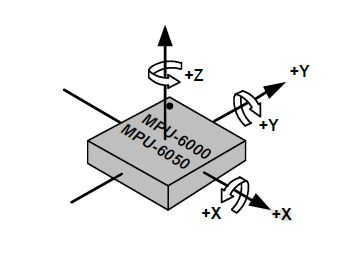
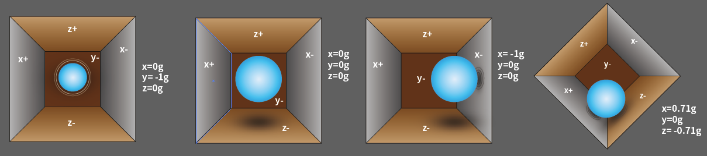
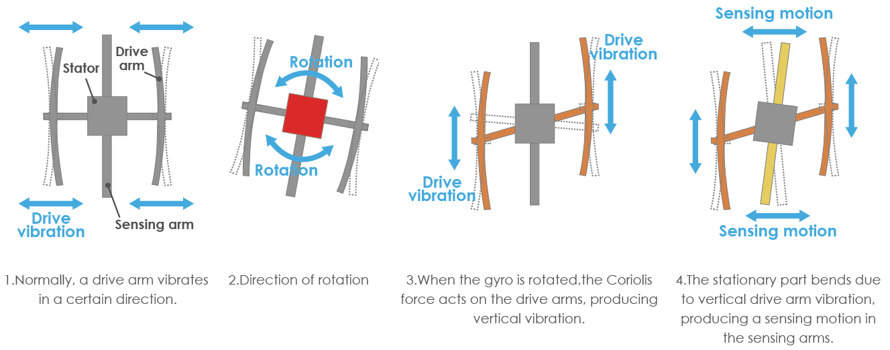

.. note::

    Bonjour et bienvenue dans la communauté des passionnés de Raspberry Pi, Arduino et ESP32 sur Facebook, animée par SunFounder ! Plongez plus profondément dans l'univers de Raspberry Pi, Arduino et ESP32 avec d'autres passionnés.

    **Pourquoi nous rejoindre ?**

    - **Support d'experts** : Résolvez vos problèmes après-vente et défis techniques grâce à l'aide de notre communauté et de notre équipe.
    - **Apprendre et partager** : Échangez des astuces et des tutoriels pour développer vos compétences.
    - **Aperçus exclusifs** : Bénéficiez d'un accès anticipé aux annonces de nouveaux produits et aperçus exclusifs.
    - **Réductions spéciales** : Profitez de réductions exclusives sur nos produits les plus récents.
    - **Promotions festives et concours** : Participez à des concours et promotions pendant les fêtes.

    👉 Prêt à explorer et créer avec nous ? Cliquez sur [|link_sf_facebook|] et rejoignez-nous dès aujourd'hui !
.. _cpn_mpu6050:

MPU6050 Module
===================

.. image:: img/mpu6050_pic.png
    :width: 300
    :align: center

Le MPU-6050 est un dispositif de suivi de mouvement à 6 axes (combinant un 
gyroscope à 3 axes et un accéléromètre à 3 axes).

Ses trois systèmes de coordonnées sont définis comme suit :

Placez le MPU6050 à plat sur la table, assurez-vous que le côté portant 
l'étiquette soit tourné vers le haut et qu'un point sur cette surface se 
trouve dans le coin supérieur gauche. Ensuite, la direction vers le haut 
est l'axe Z du module. La direction de gauche à droite est considérée comme 
l'axe X. En conséquence, la direction de l'arrière vers l'avant est définie 
comme l'axe Y.

**Accéléromètre à 3 axes**

L'accéléromètre fonctionne sur le principe de l'effet piézoélectrique, la 
capacité de certains matériaux à générer une charge électrique en réponse 
à une contrainte mécanique appliquée.

Imaginez ici une boîte cuboïdale contenant une petite bille, comme dans 
l'image ci-dessus. Les parois de cette boîte sont fabriquées avec des cristaux 
piézoélectriques. Chaque fois que vous inclinez la boîte, la bille est forcée 
de se déplacer dans la direction de l'inclinaison en raison de la gravité. 
La paroi contre laquelle la bille entre en contact génère de petits courants 
piézoélectriques. Il y a au total trois paires de parois opposées dans le 
cuboïde, chaque paire correspondant à un axe dans l'espace 3D : les axes 
X, Y et Z. En fonction du courant généré par les parois piézoélectriques, 
nous pouvons déterminer la direction et l'intensité de l'inclinaison.

Nous pouvons utiliser le MPU6050 pour détecter son accélération sur chaque axe 
de coordonnées (en position stationnaire sur le bureau, l'accélération sur l'axe 
Z est de 1 unité gravitationnelle, tandis que les axes X et Y sont à 0). Si le 
module est incliné ou dans une situation de poids zéro ou trop élevé, les lectures correspondantes changeront.

Il existe quatre plages de mesure qui peuvent être sélectionnées par programmation : 
+/-2g, +/-4g, +/-8g, et +/-16g (2g par défaut), correspondant à chaque niveau de précision. 
Les valeurs vont de -32768 à 32767.

La lecture de l'accéléromètre est convertie en valeur d'accélération en cartographiant 
la lecture de la plage de données à la plage de mesure.

Accélération = (Données brutes de l'axe de l'accéléromètre / 65536 * plage complète d'accélération) g

Prenons l'exemple de l'axe X. Lorsque les données brutes de l'axe X de l'accéléromètre sont 16384 et que la plage est définie à +/-2g :

**Accélération sur l'axe X = (16384 / 65536 * 4) g** **=1g**

**Gyroscope à 3 axes**

Les gyroscopes fonctionnent sur le principe de l'accélération de Coriolis. 
Imaginez une structure en forme de fourche qui effectue un mouvement constant 
de va-et-vient. Elle est maintenue en place grâce à des cristaux piézoélectriques. 
Chaque fois que vous tentez d'incliner cet agencement, les cristaux subissent 
une force dans la direction de l'inclinaison. Cela est dû à l'inertie de la 
fourche en mouvement. Les cristaux génèrent donc un courant en accord avec 
l'effet piézoélectrique, et ce courant est amplifié.

Le gyroscope dispose également de quatre plages de mesure : +/- 250, +/- 500, 
+/- 1000, +/- 2000. La méthode de calcul et celle de l'accélération sont essentiellement 
similaires.

La formule de conversion de la lecture en vitesse angulaire est la suivante :

Vitesse angulaire = (Données brutes de l'axe du gyroscope / 65536 * plage complète du gyroscope) °/s

Prenons l'exemple de l'axe X. Lorsque les données brutes de l'axe X de l'accéléromètre sont 16384 et que 
la plage est définie à +/-250°/s :

**Vitesse angulaire sur l'axe X = (16384 / 65536 \* 500)°/s** **=125°/s**

**Exemple**

* :ref:`ar_mpu6050` (Arduino Project)