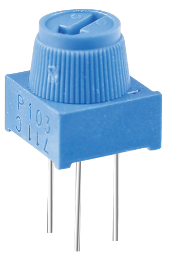
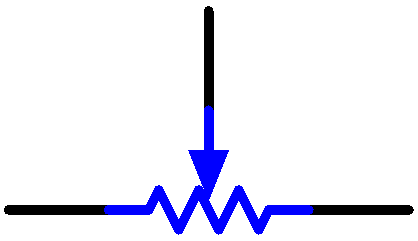

.. _cpn_potentiometer:

Potentiometer
===============

Das Potentiometer ist auch eine Widerstandskomponente mit 3 Anschlüssen und sein Widerstandswert kann entsprechend einer regelmäßigen Variation eingestellt werden.

Potentiometer gibt es in verschiedenen Formen, Größen und Werten, aber alle haben die folgenden Dinge gemeinsam:

* Sie haben drei Terminals (oder Verbindungspunkte).
* Sie haben einen Knopf, eine Schraube oder einen Schieber, der bewegt werden kann, um den Widerstand zwischen dem mittleren Anschluss und einem der äußeren Anschlüsse zu variieren.
* Der Widerstand zwischen dem mittleren Anschluss und einem der äußeren Anschlüsse variiert von 0 Ω bis zum maximalen Widerstand des Potis, wenn der Knopf, die Schraube oder der Schieber bewegt werden.

Hier ist das Schaltzeichen des Potentiometers.

Die Funktionen des Potentiometers in der Schaltung sind wie folgt:

#. Dient als Spannungsteiler

    Potentiometer ist ein stufenlos einstellbarer Widerstand. Wenn Sie die Welle oder den Schiebegriff des Potentiometers einstellen, gleitet der bewegliche Kontakt auf dem Widerstand. An diesem Punkt kann eine Spannung ausgegeben werden, abhängig von der an das Potentiometer angelegten Spannung und dem Winkel, um den sich der bewegliche Arm gedreht hat, oder von dem Weg, den er zurückgelegt hat.

#. Dient als Rheostat

    Wenn das Potentiometer als Rheostat verwendet wird, verbinden Sie den mittleren Pin und einen der anderen 2 Pins im Stromkreis. So erhalten Sie innerhalb des Bewegungswegs des beweglichen Kontakts einen sanft und kontinuierlich geänderten Widerstandswert.

#. Dient als Stromregler

    Wenn das Potentiometer als Stromregler fungiert, muss die Schleifkontaktklemme als eine der Ausgangsklemmen angeschlossen werden.

Wenn Sie mehr über Potentiometer wissen möchten, lesen Sie: `Potentiometer - Wikipedia <https://en.wikipedia.org/wiki/Potentiometer.>`_

**Beispiel**

* :ref:`ar_potentiometer` (Arduino-Projekt)
* :ref:`moving_mouse` (Scratch-Projekt)
* :ref:`breakout_clone` (Scratch-Projekt)

