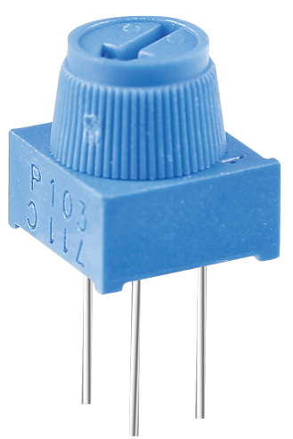

.. note::

    Bonjour et bienvenue dans la communauté des passionnés de Raspberry Pi, Arduino et ESP32 sur Facebook, animée par SunFounder ! Explorez plus en profondeur l'univers du Raspberry Pi, Arduino et ESP32 avec d'autres passionnés.

    **Pourquoi nous rejoindre ?**

    - **Support d'experts** : Résolvez vos problèmes après-vente et défis techniques grâce à l'aide de notre communauté et de notre équipe.
    - **Apprendre et partager** : Échangez des astuces et des tutoriels pour développer vos compétences.
    - **Aperçus exclusifs** : Bénéficiez d'un accès anticipé aux annonces de nouveaux produits et aperçus exclusifs.
    - **Réductions spéciales** : Profitez de réductions exclusives sur nos produits les plus récents.
    - **Promotions festives et concours** : Participez à des concours et promotions pendant les fêtes.

    👉 Prêt à explorer et créer avec nous ? Cliquez sur [|link_sf_facebook|] et rejoignez-nous dès aujourd'hui !

Potentiomètre
===============

Le potentiomètre est un composant résistant à trois bornes dont la valeur de résistance peut être ajustée en fonction de certaines variations régulières.

Les potentiomètres existent sous différentes formes, tailles et valeurs, mais ils ont tous les caractéristiques suivantes :

* Ils possèdent trois bornes (ou points de connexion).
* Ils comportent un bouton, une vis ou un curseur qui peut être déplacé pour modifier la résistance entre la borne centrale et l'une des bornes extérieures.
* La résistance entre la borne centrale et l'une des bornes extérieures varie de 0 Ω à la résistance maximale du potentiomètre, selon la position du bouton, de la vis ou du curseur.

Voici le symbole électronique du potentiomètre.

.. image:: img/potentiometer_symbol.png
    :align: center
    :width: 400

Les fonctions du potentiomètre dans un circuit sont les suivantes :

#. Servir de diviseur de tension

    Le potentiomètre est une résistance réglable en continu. Lorsque vous ajustez l'arbre ou la poignée coulissante du potentiomètre, le contact mobile glisse sur la résistance. À ce moment-là, une tension peut être sortie en fonction de la tension appliquée au potentiomètre et de l'angle ou du déplacement effectué par le bras mobile.

#. Servir de rhéostat

    Lorsqu'il est utilisé comme rhéostat, le potentiomètre doit connecter la borne centrale à l'une des autres bornes du circuit. Vous obtiendrez ainsi une valeur de résistance qui varie de manière fluide et continue, selon le déplacement du contact mobile.

#. Servir de contrôleur de courant

    Lorsqu'il est utilisé comme contrôleur de courant, la borne de contact mobile doit être connectée à l'une des bornes de sortie du circuit.

Pour en savoir plus sur le potentiomètre, consultez : `Potentiometer - Wikipedia <https://en.wikipedia.org/wiki/Potentiometer.>`_

**Exemple**

* :ref:`ar_potentiometer` (Arduino Project)
* :ref:`moving_mouse` (Scratch Project)
* :ref:`breakout_clone` (Scratch Project)

