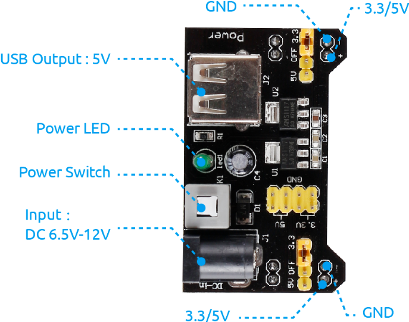

.. note:: 

    Hola, bienvenido a la comunidad de entusiastas de SunFounder Raspberry Pi, Arduino y ESP32 en Facebook. Profundiza en Raspberry Pi, Arduino y ESP32 junto a otros entusiastas.

    **¿Por qué unirse?**

    - **Soporte experto**: Resuelve problemas posventa y desafíos técnicos con ayuda de nuestra comunidad y equipo.
    - **Aprende y comparte**: Intercambia consejos y tutoriales para mejorar tus habilidades.
    - **Avances exclusivos**: Accede anticipadamente a anuncios de nuevos productos y adelantos.
    - **Descuentos especiales**: Disfruta de descuentos exclusivos en nuestros productos más recientes.
    - **Promociones y sorteos festivos**: Participa en sorteos y promociones especiales por festividades.

    👉 ¿Listo para explorar y crear con nosotros? Haz clic en [|link_sf_facebook|] y únete hoy mismo.

.. _cpn_power_module:

Módulo de Alimentación
=========================

Cuando necesitamos una corriente elevada para alimentar un componente, esto puede interferir gravemente con el funcionamiento normal de la Raspberry Pi. Por lo tanto, utilizamos este módulo para suministrar energía de manera independiente al componente, asegurando que funcione de manera segura y estable.

Puedes conectarlo directamente en la protoboard para proporcionar energía. Ofrece un voltaje de 3.3V y 5V, y puedes seleccionar entre ellos mediante un puente incluido.

**Características y especificaciones**

* Voltaje de entrada: 6.5 - 12V
* Dos canales independientes
* Voltaje de salida: 5V, 3.3V (ajustable mediante puentes: configuración de 0V, 3.3V y 5V)
* Corriente de salida: Corriente máxima de salida 700mA
* Cabecera tipo berg macho para salida GND, 5V, 3.3V
* Interruptor de encendido y apagado disponible.
* Entrada USB (tipo A) disponible.
* Entrada mediante conector tipo barril DC disponible.
* Indicador LED de encendido integrado
* Dimensiones: 53mm x 33mm (L x A)

**Ejemplo**

* :ref:`ar_motor` (Proyecto Arduino)
* :ref:`ar_stepper_motor` (Proyecto Arduino)
