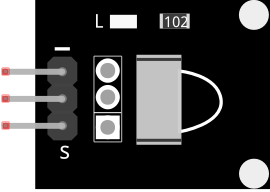
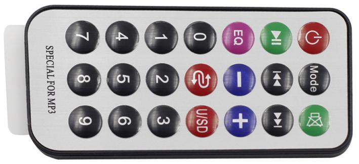

.. _cpn_receive:

IR-Empfängermodul
===========================

**IR-Empfängermodul**

* S: Signalausgang
* +：VCC
* -: GND

Ein Infrarotempfänger ist eine Komponente, die Infrarotsignale empfängt und unabhängig Infrarotstrahlen empfangen und mit TTL-Pegel kompatible Signale ausgeben kann. Er ist ähnlich groß wie ein normaler kunststoffverpackter Transistor und eignet sich für alle Arten von Infrarotfernsteuerungen und Infrarotübertragungen.

Infrarot- oder IR-Kommunikation ist eine beliebte, kostengünstige und einfach zu verwendende drahtlose Kommunikationstechnologie. Infrarotlicht hat eine etwas längere Wellenlänge als sichtbares Licht und ist daher für das menschliche Auge nicht wahrnehmbar – ideal für drahtlose Kommunikation. Ein übliches Modulationsschema für die Infrarotkommunikation ist die 38-kHz-Modulation.

* Angenommener HX1838 IR-Empfängersensor, hohe Empfindlichkeit
* Kann zur Fernbedienung verwendet werden
* Stromversorgung: 5V
* Schnittstelle: Digital
* Modulationsfrequenz: 38 kHz
* Pin-Definitionen: (1) Ausgang (2) Vcc (3) GND
* Größe: 23,5 mm x 21,5 mm

**Fernbedienung**

Dies ist eine dünne Mini-Infrarot-Funkfernbedienung mit 21 Funktionstasten und einer Übertragungsreichweite von bis zu 8 Metern, die für die Bedienung einer Vielzahl von Geräten im Kinderzimmer geeignet ist.

* Größe: 85 x 39 x 6 mm
* Reichweite der Fernbedienung: 8-10m
* Batterie: 3-V-Lithium-Mangan-Knopfbatterie
* Infrarot-Trägerfrequenz: 38 kHz
* Oberflächenpastenmaterial: 0,125 mm PET
* Effektive Lebensdauer: mehr als 20.000 Mal

**Beispiel**

* :ref:`ar_receive` (Arduino-Projekt)
* :ref:`ar_guess_number` (Arduino-Projekt)