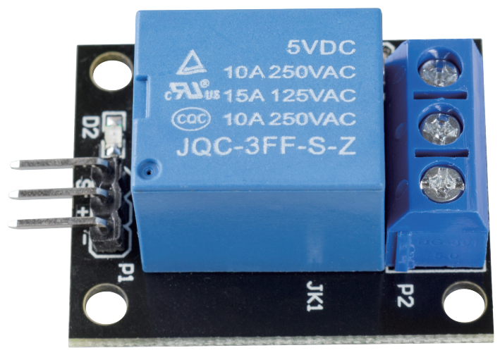
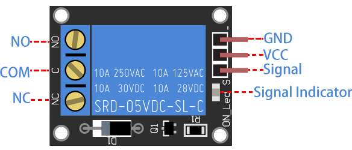

.. _cpn_relay:

Relay Module
==========================================

The relay module is a module consisting of a relay and a simple circuit that can be used to control large voltage devices, such as household appliances, by outputting a low voltage such as 3.3V from the control board.

FEATURES
-----------------------

* Output: 250VAC-10A, 125VAC-10A, 30VDC-10A, 28VDC-10A.
* Operating voltage 5V, suction current about 70mA.
* With signal indicator
* Input high and the relay closes, input low and the relay opens.
* Using 8050 transistor to drive the relay action
* With mounting screw holes
* PCB size: 1.8cm*4.0cm*1.9cm, weight 15g

PINS OUT
----------------

**INPUT**

It has a 1×3 (2.54mm pitch) pin header for connecting power (5V and 0V), and for controlling the relay. The pins are marked on the PCB:

* **-**: GND
* **+**: VCC
* **S**: Signal pin, used to control this relay. Input high and the relay closes, input low and the relay opens.

**OUTPUT**

The 1 channel relay module could be considered like a series switches: 1 normally Open (NO), 1 normally closed (NC) and 1 common Pins (COM).

* **COM** - Common pin
* **NC** - Normally Closed, in which case NC is connected with COM when pin **S** is set low and disconnected when pin **S** is high.
* **NO** - Normally Open, in which case NO is disconnected with COM when pin **S** is set low and connected when pin **S** is high.

HOW RELAY WORKS?
-----------------------

As we may know, relay is a device which is used to provide connection
between two or more points or devices in response to the input signal
applied. In other words, relays provide isolation between the controller
and the device as devices may work on AC as well as on DC. However, they
receive signals from a microcontroller which works on DC hence requiring
a relay to bridge the gap. Relay is extremely useful when you need to
control a large amount of current or voltage with small electrical
signal.

There are 5 parts in every relay:

.. image:: img/relay142.jpeg

**Electromagnet** - It consists of an iron core wounded by coil of
wires. When electricity is passed through, it becomes magnetic.
Therefore, it is called electromagnet.

**Armature** - The movable magnetic strip is known as armature. When
current flows through them, the coil is it energized thus producing a
magnetic field which is used to make or break the normally open (N/O) or
normally close (N/C) points. And the armature can be moved with direct
current (DC) as well as alternating current (AC).

**Spring** - When no currents flow through the coil on the
electromagnet, the spring pulls the armature away so the circuit cannot
be completed.

Set of electrical **contacts** - There are two contact points:

-  Normally open - connected when the relay is activated, and disconnected when it is inactive.

-  Normally close - not connected when the relay is activated, and connected when it is inactive.

**Molded frame** - Relays are covered with plastic for protection.

The working principle of relay is simple. When power is supplied to the
relay, currents start flowing through the control coil; as a result, the
electromagnet starts energizing. Then the armature is attracted to the
coil, pulling down the moving contact together thus connecting with the
normally open contacts. So the circuit with the load is energized. Then
breaking the circuit would a similar case, as the moving contact will be
pulled up to the normally closed contacts under the force of the spring.
In this way, the switching on and off of the relay can control the state
of a load circuit.

**Example**

* :ref:`ar_relay` (Arduino Project)
* :ref:`ar_overheat_monitor` (Arduino Project)