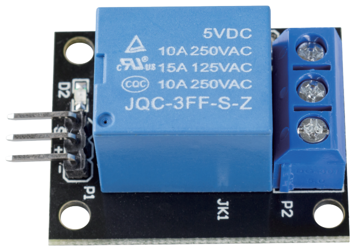
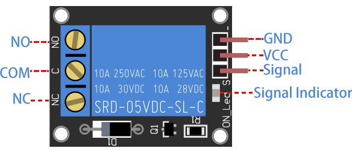

.. note::

    Ciao, benvenuto nella community di appassionati di SunFounder Raspberry Pi, Arduino ed ESP32 su Facebook! Approfondisci Raspberry Pi, Arduino ed ESP32 insieme ad altri appassionati.

    **Perché unirsi?**

    - **Supporto esperto**: Risolvi problemi post-vendita e sfide tecniche con l'aiuto della nostra community e del nostro team.
    - **Impara e condividi**: Scambia suggerimenti e tutorial per migliorare le tue competenze.
    - **Anteprime esclusive**: Accedi in anteprima agli annunci di nuovi prodotti.
    - **Sconti speciali**: Approfitta di sconti esclusivi sui nostri prodotti più recenti.
    - **Promozioni e omaggi festivi**: Partecipa a omaggi e promozioni speciali durante le festività.

    👉 Pronto per esplorare e creare con noi? Clicca [|link_sf_facebook|] e unisciti oggi stesso!

.. _cpn_relay:

Modulo Relè
==========================================

Il modulo relè è un modulo composto da un relè e un circuito semplice che può essere utilizzato per controllare dispositivi a tensione elevata, come elettrodomestici, mediante l'uscita di una bassa tensione, come 3,3V, dalla scheda di controllo.

**CARATTERISTICHE**
-----------------------

* Uscita: 250VAC-10A, 125VAC-10A, 30VDC-10A, 28VDC-10A.
* Tensione operativa: 5V, corrente di assorbimento circa 70mA.
* Con indicatore di segnale.
* Ingresso alto: il relè si chiude; ingresso basso: il relè si apre.
* Utilizzo del transistor 8050 per guidare l'azione del relè.
* Con fori per viti di montaggio.
* Dimensioni PCB: 1,8cm x 4,0cm x 1,9cm, peso 15g.

**PIN OUT**
----------------

**INGRESSO**

Il modulo dispone di un'intestazione a 3 pin (passo 2,54mm) per collegare l'alimentazione (5V e 0V) e controllare il relè. I pin sono contrassegnati sul PCB:

* **-**: GND
* **+**: VCC
* **S**: Pin del segnale, utilizzato per controllare il relè. Ingresso alto: il relè si chiude; ingresso basso: il relè si apre.

**USCITA**

Il modulo relè a 1 canale può essere considerato come una serie di interruttori: 1 normalmente aperto (NO), 1 normalmente chiuso (NC) e 1 pin comune (COM).

* **COM** - Pin comune.
* **NC** - Normalmente chiuso, collegato a COM quando il pin **S** è impostato su basso e disconnesso quando **S** è alto.
* **NO** - Normalmente aperto, scollegato da COM quando il pin **S** è impostato su basso e collegato quando **S** è alto.

COME FUNZIONA IL RELÈ?
-----------------------------

Come sappiamo, il relè è un dispositivo utilizzato per fornire connessione 
tra due o più punti o dispositivi in risposta al segnale di ingresso applicato. 
In altre parole, i relè forniscono isolamento tra il controller e il dispositivo, 
poiché i dispositivi possono funzionare sia in corrente alternata (AC) sia in 
corrente continua (DC). Tuttavia, ricevono segnali da un microcontrollore che 
funziona in DC, richiedendo quindi un relè per colmare il divario. Il relè è 
estremamente utile quando è necessario controllare una grande quantità di 
corrente o tensione con un piccolo segnale elettrico.

Ogni relè è composto da 5 parti:

.. image:: img/relay142.jpeg

**Elettromagnete** - Consiste in un nucleo di ferro avvolto da una bobina di 
fili. Quando l'elettricità passa, diventa magnetico, quindi chiamato elettromagnete.

**Armatura** - La striscia magnetica mobile è nota come armatura. Quando la corrente 
fluisce, la bobina si energizza, producendo un campo magnetico che viene utilizzato 
per aprire o chiudere i contatti normalmente aperti (N/O) o normalmente chiusi (N/C).

**Molla** - Quando non c'è corrente attraverso la bobina, la molla tira indietro 
l'armatura, impedendo il completamento del circuito.

**Set di contatti elettrici** - Ci sono due punti di contatto:

- Normalmente aperto - Connesso quando il relè è attivato e disconnesso quando è inattivo.
- Normalmente chiuso - Non connesso quando il relè è attivato e connesso quando è inattivo.

**Struttura incapsulata** - I relè sono coperti con plastica per protezione.

Il principio di funzionamento del relè è semplice. Quando l'alimentazione viene 
fornita al relè, la corrente inizia a fluire attraverso la bobina di controllo; 
di conseguenza, l'elettromagnete si energizza. L'armatura viene quindi attratta 
dalla bobina, collegando il contatto mobile con i contatti normalmente aperti. 
Così il circuito con il carico si energizza. Interrompendo il circuito, il 
contatto mobile torna ai contatti normalmente chiusi grazie alla forza della 
molla. In questo modo, il relè può controllare lo stato di un circuito di carico.

**Esempio**

* :ref:`ar_relay` (Progetto Arduino)
* :ref:`ar_overheat_monitor` (Progetto Arduino)
