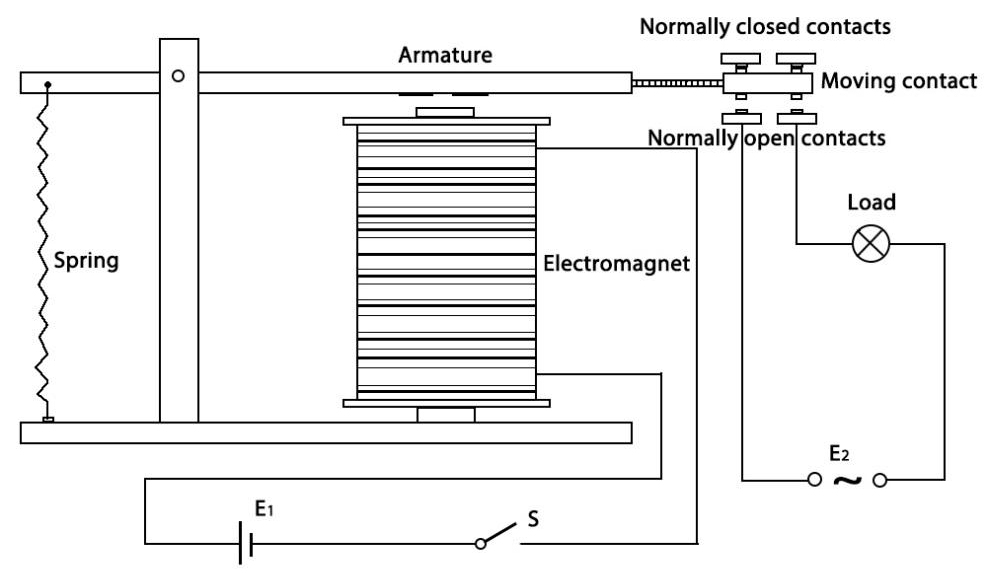

.. _cpn_relay:

Relaismodul
=====================

.. image:: img/relay_module.png
    :width: 400
    :align: center

Das Relaismodul ist ein Modul, das aus einem Relais und einer einfachen Schaltung besteht. Es kann zur Steuerung von Geräten mit hoher Spannung, wie z. B. Haushaltsgeräten, verwendet werden, indem es eine niedrige Spannung, z. B. 3,3 V, von der Steuerplatine ausgibt.

MERKMALE
-----------------------

* Ausgang: 250VAC-10A, 125VAC-10A, 30VDC-10A, 28VDC-10A.
* Betriebsspannung 5V, Saugstrom ca. 70mA.
* Mit Signalanzeige
* Eingang hoch und das Relais schließt, Eingang niedrig und das Relais öffnet.
* Mit 8050-Transistor zur Ansteuerung des Relais
* Mit Befestigungslöchern
* Platinengröße: 1,8cm*4,0cm*1,9cm, Gewicht 15g

PINS OUT
----------------

.. image:: img/relay_pinout.jpg

**EINGABE**

Sie hat eine 1×3 (2,54mm Raster) Stiftleiste für den Anschluss der Stromversorgung (5V und 0V) und für die Steuerung des Relais. Die Stifte sind auf der Platine markiert:

* **-**: GND
* **+**: VCC
* **S**: Signal-Pin, der zur Steuerung dieses Relais dient. Eingang high und das Relais schließt sich, Eingang low und das Relais öffnet sich.

**OUTPUT**

Das 1-Kanal-Relaismodul kann wie ein Serienschalter betrachtet werden: 1 Öffner (NO), 1 Schließer (NC) und 1 gemeinsamer Pin (COM).

* **COM** - Gemeinsamer Anschluss
* **NC** - Normalerweise geschlossen, in diesem Fall ist NC mit COM verbunden, wenn Pin **S** auf low steht und getrennt, wenn Pin **S** auf high steht.
* **NO** - Normalerweise offen, in diesem Fall ist NO von COM getrennt, wenn Pin **S** niedrig eingestellt ist, und verbunden, wenn Pin **S** hoch ist.

WIE FUNKTIONIERT DAS RELAIS?
-------------------------------

Wie wir vielleicht wissen, ist ein Relais ein Gerät, das verwendet wird, um eine Verbindung zwischen zwei oder mehr Punkten oder Geräten als Reaktion auf das angelegte Eingangssignal herzustellen. Mit anderen Worten, Relais sorgen für eine Isolierung zwischen dem Controller und dem Gerät, da Geräte sowohl mit Wechselstrom als auch mit Gleichstrom arbeiten können. Sie empfangen jedoch Signale von einem Mikrocontroller, der mit Gleichstrom arbeitet, und benötigen daher ein Relais, um die Lücke zu schließen. Relais sind äußerst nützlich, wenn Sie eine große Menge an Strom oder Spannung mit einem kleinen elektrischen Signal steuern müssen.

Es gibt 5 Teile in jedem Relais:

#. **Elektromagnet** - Er besteht aus einem Eisenkern, der mit einer Drahtspule umwickelt ist. Wenn Strom durchgeleitet wird, wird er magnetisch. Daher wird es als Elektromagnet bezeichnet.

#. **Anker** - Der bewegliche Magnetstreifen wird als Anker bezeichnet. Wenn Strom durch sie fließt, wird die Spule erregt, wodurch ein Magnetfeld erzeugt wird, das verwendet wird, um die normalerweise offenen (N/O) oder normalerweise geschlossenen (N/C) Punkte herzustellen oder zu unterbrechen. Und der Anker kann sowohl mit Gleichstrom (DC) als auch mit Wechselstrom (AC) bewegt werden.

#. **Feder** - Wenn kein Strom durch die Spule des Elektromagneten fließt, zieht die Feder den Anker weg, sodass der Stromkreis nicht geschlossen werden kann.

#. **Satz elektrischer Kontakte** - Es gibt zwei Kontaktpunkte:

    * **Normalerweise offen** - verbunden, wenn das Relais aktiviert ist, und getrennt, wenn es inaktiv ist.

    * **Normalerweise geschlossen** - nicht verbunden, wenn das Relais aktiviert ist, und verbunden, wenn es inaktiv ist.

#. **Geformter Rahmen** - Relais sind zum Schutz mit Kunststoff überzogen.

Das Funktionsprinzip des Relais ist einfach. Wenn das Relais mit Strom versorgt wird, beginnen Ströme durch die Steuerspule zu fließen; Als Ergebnis beginnt der Elektromagnet zu erregen. Dann wird der Anker von der Spule angezogen und zieht den beweglichen Kontakt zusammen nach unten, wodurch eine Verbindung mit den normalerweise offenen Kontakten hergestellt wird. Der Stromkreis mit der Last wird also bestromt. Dann wäre das Unterbrechen des Stromkreises ein ähnlicher Fall, da der bewegliche Kontakt unter der Kraft der Feder zu den normalerweise geschlossenen Kontakten gezogen wird. Auf diese Weise kann das Ein- und Ausschalten des Relais den Zustand eines Lastkreises steuern.

**Example**

* :ref:`ar_relay` (Arduino Project)
* :ref:`ar_overheat_monitor` (Arduino Project)