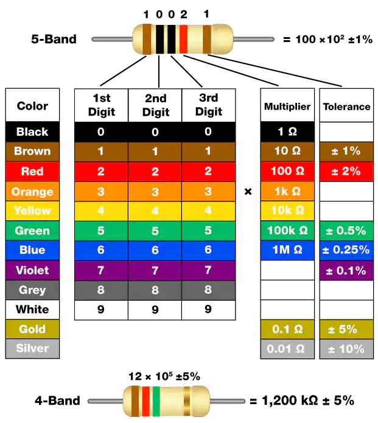
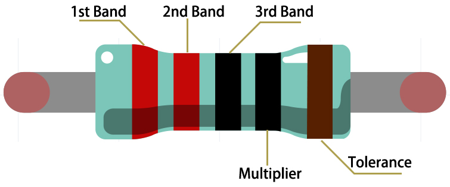

.. note::

    Ciao, benvenuto nella community di appassionati di SunFounder Raspberry Pi, Arduino ed ESP32 su Facebook! Approfondisci Raspberry Pi, Arduino ed ESP32 insieme ad altri appassionati.

    **Perché unirsi?**

    - **Supporto esperto**: Risolvi problemi post-vendita e sfide tecniche con l'aiuto della nostra community e del nostro team.
    - **Impara e condividi**: Scambia suggerimenti e tutorial per migliorare le tue competenze.
    - **Anteprime esclusive**: Accedi in anteprima agli annunci di nuovi prodotti.
    - **Sconti speciali**: Approfitta di sconti esclusivi sui nostri prodotti più recenti.
    - **Promozioni e omaggi festivi**: Partecipa a omaggi e promozioni speciali durante le festività.

    👉 Pronto per esplorare e creare con noi? Clicca [|link_sf_facebook|] e unisciti oggi stesso!

.. _cpn_resistor:

Resistenza
=============

La resistenza è un componente elettronico che può limitare la corrente in un circuito. 
Una resistenza fissa è un tipo di resistenza il cui valore non può essere modificato, mentre un potenziometro o una resistenza variabile possono essere regolati.

Due simboli circuitali comunemente usati per le resistenze. Normalmente, il valore della resistenza è segnato su di essa. Quindi, se vedi questi simboli in un circuito, indicano una resistenza.

.. image:: img/resistor_symbol.png
    :width: 400

**Ω** è l'unità di misura della resistenza e le unità maggiori includono KΩ, MΩ, ecc. 
La relazione tra queste unità è la seguente: 1 MΩ=1000 KΩ, 1 KΩ = 1000 Ω. Normalmente, il valore della resistenza è segnato sulla resistenza stessa.

Per utilizzare una resistenza, è necessario conoscerne il valore. Ecco due metodi: puoi osservare le bande colorate sulla resistenza oppure utilizzare un multimetro per misurare la resistenza. Ti consigliamo di usare il primo metodo, poiché è più pratico e veloce.

Come mostrato nella tabella, ogni colore rappresenta un numero.

.. list-table::

   * - Nero
     - Marrone
     - Rosso
     - Arancione
     - Giallo
     - Verde
     - Blu
     - Viola
     - Grigio
     - Bianco
     - Oro
     - Argento
   * - 0
     - 1
     - 2
     - 3
     - 4
     - 5
     - 6
     - 7
     - 8
     - 9
     - 0.1
     - 0.01

Le resistenze a 4 e 5 bande sono le più utilizzate e presentano rispettivamente 4 e 5 bande cromatiche.

Normalmente, quando hai una resistenza, potresti trovare difficile decidere da quale estremità iniziare a leggere i colori. 
Il trucco è osservare il divario tra la 4ª e la 5ª banda: sarà relativamente più grande.

Pertanto, puoi osservare il divario tra le bande cromatiche a un'estremità della resistenza; 
se è maggiore rispetto agli altri spazi, puoi iniziare a leggere dal lato opposto.

Vediamo come leggere il valore di una resistenza a 5 bande, come mostrato di seguito.

Per questa resistenza, il valore deve essere letto da sinistra a destra. 
Il formato sarà: 1ª Banda 2ª Banda 3ª Banda x 10^Moltiplicatore (Ω) e l'errore tollerabile è ±Tolleranza%. 
Quindi il valore della resistenza è 2(rosso) 2(rosso) 0(nero) x 10^0(nero) Ω = 220 Ω, 
e l'errore tollerabile è ± 1% (marrone).

.. list-table::Common resistor color band
    :header-rows: 1

    * - Resistenza 
      - Bande Cromatiche  
    * - 10Ω   
      - marrone nero nero argento marrone
    * - 100Ω   
      - marrone nero nero nero marrone
    * - 220Ω 
      - rosso rosso nero nero marrone
    * - 330Ω 
      - arancione arancione nero nero marrone
    * - 1kΩ 
      - marrone nero nero marrone marrone
    * - 2kΩ 
      - rosso nero nero marrone marrone
    * - 5,1kΩ 
      - verde marrone nero marrone marrone
    * - 10kΩ 
      - marrone nero nero rosso marrone 
    * - 100kΩ 
      - marrone nero nero arancione marrone 
    * - 1MΩ 
      - marrone nero nero verde marrone 

Puoi approfondire il funzionamento delle resistenze su Wiki: `Resistenza - Wikipedia <https://en.wikipedia.org/wiki/Resistor>`_.
