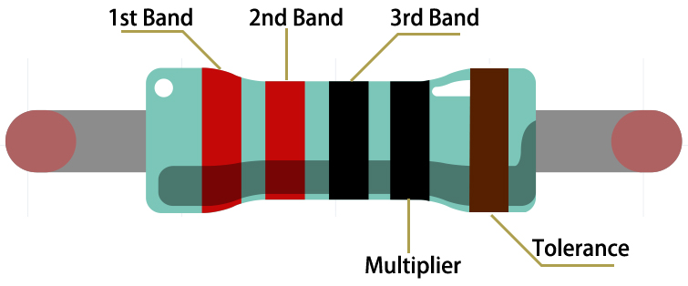

.. _cpn_resistor:

Widerstand
============

Der Widerstand ist ein elektronisches Element, das den Abzweigstrom begrenzen kann. Ein Festwiderstand ist eine Art Widerstand, dessen Widerstandswert nicht geändert werden kann, während der eines Potentiometers oder eines variablen Widerstands eingestellt werden kann.

Zwei allgemein gebräuchliche Schaltzeichen für Widerstände. Normalerweise ist der Widerstand darauf markiert. Wenn Sie also diese Symbole in einem Schaltkreis sehen, steht es für einen Widerstand.

.. image:: img/resistor_symbol.png
    :width: 400

**Ω** ist die Einheit des Widerstands und die größeren Einheiten umfassen KΩ, MΩ usw. Ihre Beziehung kann wie folgt dargestellt werden: 1 MΩ = 1000 KΩ, 1 KΩ = 1000 Ω. Normalerweise ist der Widerstandswert darauf vermerkt.

Wenn wir einen Widerstand verwenden, müssen wir zuerst seinen Widerstandswert kennen. Hier sind zwei Methoden: Sie können die Bänder auf dem Widerstand beobachten oder den Widerstand mit einem Multimeter messen. Es wird empfohlen, die erste Methode zu verwenden, da sie bequemer und schneller ist.

.. image:: img/resistance_card.jpg

Wie in der Karte gezeigt, steht jede Farbe für eine Zahl.

.. list-table::

   * - Black
     - Brown
     - Red
     - Orange
     - Yellow
     - Green
     - Blue
     - Violet
     - Grey
     - White
     - Gold
     - Silver
   * - 0
     - 1
     - 2
     - 3
     - 4
     - 5
     - 6
     - 7
     - 8
     - 9
     - 0.1
     - 0.01

Häufig werden die 4- und 5-Band-Widerstände verwendet, auf denen es 4- und 5-Farbbänder gibt.

Wenn Sie einen Widerstand erhalten, fällt es Ihnen normalerweise schwer zu entscheiden, an welchem ​​​​Ende Sie mit dem Lesen der Farbe beginnen sollen. Der Tipp ist, dass der Abstand zwischen dem 4. und 5. Band vergleichsweise größer sein wird.

Daher können Sie die Lücke zwischen den beiden chromatischen Bändern an einem Ende des Widerstands beobachten; Wenn es größer ist als alle anderen Bandlücken, können Sie von der gegenüberliegenden Seite lesen.

Sehen wir uns an, wie man den Widerstandswert eines 5-Band-Widerstands liest, wie unten gezeigt.

Für diesen Widerstand sollte der Widerstand also von links nach rechts gelesen werden. Der Wert sollte folgendes Format haben: 1. Band 2. Band 3. Band x 10^Multiplikator (Ω) und der zulässige Fehler ist ±Toleranz %. Der Widerstandswert dieses Widerstands ist also 2 (rot) 2 (rot) 0 (schwarz) x 10^0 (schwarz) Ω = 220 Ω, und der zulässige Fehler beträgt ± 1 % (braun).

.. list-table:: Common resistor color band
    :header-rows: 1

    * - Resistor 
      - Color Band  
    * - 10Ω   
      - brown black black silver brown
    * - 100Ω   
      - brown black black black brown
    * - 220Ω 
      - red red black black brown
    * - 330Ω 
      - orange orange black black brown
    * - 1kΩ 
      - brown black black brown brown
    * - 2kΩ 
      - red black black brown brown
    * - 5.1kΩ 
      - green brown black brown brown
    * - 10kΩ 
      - brown black black red brown 
    * - 100kΩ 
      - brown black black orange brown 
    * - 1MΩ 
      - brown black black green brown 

Weitere Informationen zum Widerstand finden Sie im Wiki: `Resistor - Wikipedia <https://en.wikipedia.org/wiki/Resistor>`_.
