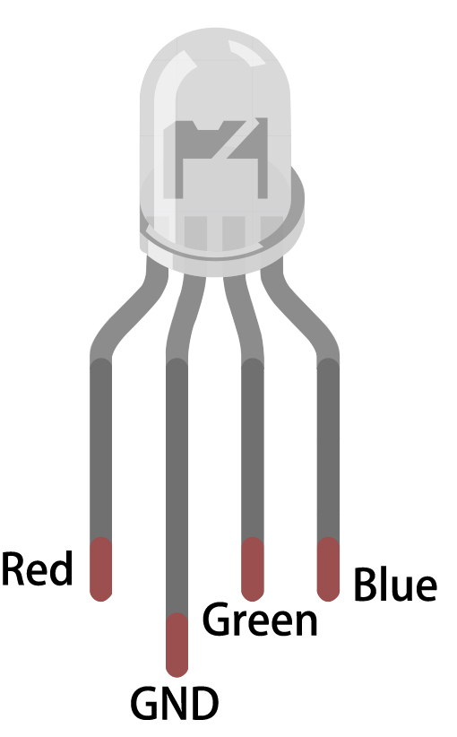

.. note::

    Ciao, benvenuto nella community di appassionati di SunFounder Raspberry Pi, Arduino ed ESP32 su Facebook! Approfondisci Raspberry Pi, Arduino ed ESP32 insieme ad altri appassionati.

    **Perché unirsi?**

    - **Supporto esperto**: Risolvi problemi post-vendita e sfide tecniche con l'aiuto della nostra community e del nostro team.
    - **Impara e condividi**: Scambia suggerimenti e tutorial per migliorare le tue competenze.
    - **Anteprime esclusive**: Accedi in anteprima agli annunci di nuovi prodotti.
    - **Sconti speciali**: Approfitta di sconti esclusivi sui nostri prodotti più recenti.
    - **Promozioni e omaggi festivi**: Partecipa a omaggi e promozioni speciali durante le festività.

    👉 Pronto per esplorare e creare con noi? Clicca [|link_sf_facebook|] e unisciti oggi stesso!

.. _cpn_rgb:

LED RGB
=================

.. image:: img/rgb_led.png
    :width: 100
    
I LED RGB emettono luce in vari colori. Un LED RGB racchiude tre LED di colore rosso, verde e blu in un involucro di plastica trasparente o semi-trasparente. È possibile visualizzare diversi colori variando la tensione in ingresso dei tre pin e sovrapponendoli, il che, secondo le statistiche, consente di creare fino a 16.777.216 colori differenti.

.. image:: img/rgb_light.png
    :width: 600

I LED RGB possono essere classificati in due tipi: anodo comune e catodo comune. In questo kit viene utilizzato il secondo tipo. Il **catodo comune** (o CC) significa collegare i catodi dei tre LED. Dopo averlo collegato a GND e inserito i tre pin, il LED emetterà la luce del colore corrispondente.

Il simbolo del circuito è mostrato nella figura seguente.

.. image:: img/rgb_symbol.png
    :width: 300

Un LED RGB ha 4 pin: il più lungo è GND, mentre gli altri tre corrispondono a Rosso, Verde e Blu. Tocca l'involucro di plastica e noterai un'incisione: il pin più vicino a questa incisione è il primo, contrassegnato come Rosso, seguito da GND, Verde e Blu.

**Esempio**

* :ref:`ar_rgb` (Progetto Arduino)
* :ref:`ar_overheat_monitor` (Progetto Arduino)
