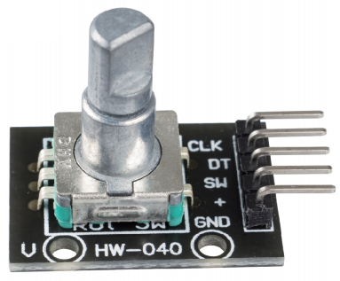
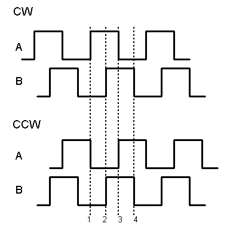

.. _cpn_rotary:

Drehgebermodul
=============================

Das Drehgebermodul zählt die Anzahl der während der Drehung in Vorwärts- und Rückwärtsrichtung ausgegebenen Impulse. Im Gegensatz zu einem Potentiometer ist diese Anzahl der Umdrehungen unbegrenzt und die Anzahl der Impulse pro Zyklus beträgt 20. Drücken Sie die Taste (SW) auf dem Drehgeber, um mit dem Zählen bei Null zu beginnen.

Es gibt hauptsächlich zwei Arten von Drehgebern: absolute und inkrementale (relative) Drehgeber. In diesem Kit wird eine inkrementelle verwendet.

Inkrementalgeber geben zweiphasige Rechteckwellen aus, ihre Phasendifferenz beträgt 90, üblicherweise als A-Kanal und B-Kanal bezeichnet.

Wie rechts gezeigt, wenn Kanal A von High-Pegel auf Low-Pegel wechselt, wenn Kanal B High-Pegel ist, zeigt dies an, dass sich der Drehgeber im Uhrzeigersinn (CW) dreht; Wenn in diesem Moment Kanal B auf niedrigem Pegel ist, bedeutet dies, dass er sich gegen den Uhrzeigersinn (CCW) dreht. Wenn wir also den Wert von Kanal B lesen, wenn Kanal A auf niedrigem Pegel ist, können wir wissen, in welche Richtung sich der Drehgeber dreht.

**Beispiel**

* :ref:`ar_rotary_encoder` (Arduino-Projekt)