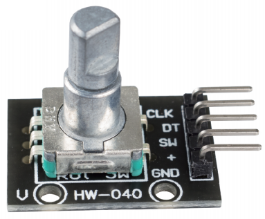

.. note::

    Ciao, benvenuto nella community di appassionati di SunFounder Raspberry Pi, Arduino ed ESP32 su Facebook! Approfondisci Raspberry Pi, Arduino ed ESP32 insieme ad altri appassionati.

    **Perché unirsi?**

    - **Supporto esperto**: Risolvi problemi post-vendita e sfide tecniche con l'aiuto della nostra community e del nostro team.
    - **Impara e condividi**: Scambia suggerimenti e tutorial per migliorare le tue competenze.
    - **Anteprime esclusive**: Accedi in anteprima agli annunci di nuovi prodotti.
    - **Sconti speciali**: Approfitta di sconti esclusivi sui nostri prodotti più recenti.
    - **Promozioni e omaggi festivi**: Partecipa a omaggi e promozioni speciali durante le festività.

    👉 Pronto per esplorare e creare con noi? Clicca [|link_sf_facebook|] e unisciti oggi stesso!

.. _cpn_rotary:

Modulo Encoder Rotativo
=============================

Il modulo encoder rotativo conta il numero di impulsi in uscita durante la rotazione in avanti e indietro. A differenza di un potenziometro, il conteggio della rotazione è illimitato e il numero di impulsi per ciclo è 20. Premendo il pulsante (SW) sull'encoder rotativo, il conteggio inizia da zero.

Esistono principalmente due tipi di encoder rotativi: encoder assoluti e incrementali (relativi). In questo kit viene utilizzato un encoder incrementale.

Gli encoder incrementali producono onde quadre a due fasi, con una differenza di fase di 90 gradi, solitamente chiamate canale A e canale B.

Come mostrato nella figura a destra, quando il canale A cambia da livello alto 
a livello basso, se il canale B è a livello alto, ciò indica che l'encoder rotativo 
ruota in senso orario (CW); se in quel momento il canale B è a livello basso, 
significa che ruota in senso antiorario (CCW). Pertanto, leggendo il valore del 
canale B quando il canale A è a livello basso, possiamo determinare in quale 
direzione ruota l'encoder rotativo.

.. image:: img/image206.png
    :width: 600
    :align: center

**Esempio**

* :ref:`ar_rotary_encoder` (Progetto Arduino)
