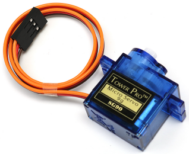
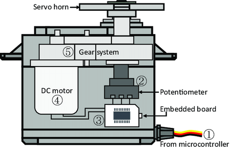

.. note::

    Ciao, benvenuto nella community di appassionati di SunFounder Raspberry Pi, Arduino ed ESP32 su Facebook! Approfondisci Raspberry Pi, Arduino ed ESP32 insieme ad altri appassionati.

    **Perché unirsi?**

    - **Supporto esperto**: Risolvi problemi post-vendita e sfide tecniche con l'aiuto della nostra community e del nostro team.
    - **Impara e condividi**: Scambia suggerimenti e tutorial per migliorare le tue competenze.
    - **Anteprime esclusive**: Accedi in anteprima agli annunci di nuovi prodotti.
    - **Sconti speciali**: Approfitta di sconti esclusivi sui nostri prodotti più recenti.
    - **Promozioni e omaggi festivi**: Partecipa a omaggi e promozioni speciali durante le festività.

    👉 Pronto per esplorare e creare con noi? Clicca [|link_sf_facebook|] e unisciti oggi stesso!

.. _cpn_servo:

Servo
===========

Un servo è generalmente composto dalle seguenti parti: involucro, albero, sistema di ingranaggi, potenziometro, motore DC e scheda integrata.

Funziona in questo modo: il microcontrollore invia segnali PWM al servo, e la scheda integrata nel servo riceve i segnali tramite il pin del segnale e controlla il motore interno per farlo girare. Di conseguenza, il motore aziona il sistema di ingranaggi, che a sua volta muove l'albero dopo la decelerazione. L'albero e il potenziometro del servo sono collegati tra loro. Quando l'albero ruota, aziona il potenziometro, che invia un segnale di tensione alla scheda integrata. La scheda determina la direzione e la velocità della rotazione in base alla posizione corrente, consentendo al servo di fermarsi esattamente nella posizione definita e mantenerla.

L'angolo è determinato dalla durata di un impulso applicato al filo di controllo. Questo processo è chiamato Modulazione di Larghezza di Impulso (PWM). Il servo si aspetta di ricevere un impulso ogni 20 ms. La lunghezza dell'impulso determinerà quanto gira il motore. Ad esempio, un impulso di 1,5 ms farà ruotare il motore alla posizione di 90 gradi (posizione neutrale). 
Quando si invia al servo un impulso inferiore a 1,5 ms, l'albero del servo ruota in senso antiorario di un certo numero di gradi rispetto al punto neutrale. Quando l'impulso è più ampio di 1,5 ms, si verifica il contrario. La larghezza minima e massima dell'impulso che comanda il servo a girare in una posizione valida dipende da ciascun servo. Generalmente, l'impulso minimo è di circa 0,5 ms e l'impulso massimo è di 2,5 ms.

.. image:: img/servo_duty.png
    :width: 600
    :align: center

**Esempio**

* :ref:`ar_servo` (Progetto Arduino)
* :ref:`pendulum` (Progetto Scratch)
