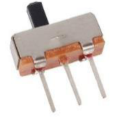
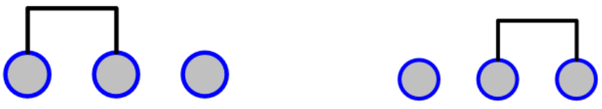
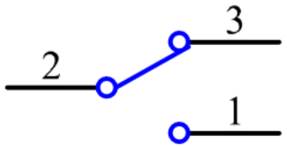

.. _cpn_slide:

Schiebeschalter
==========================

Ein Schiebeschalter dient, wie der Name schon sagt, dazu, die Schalterleiste zu verschieben, um den Stromkreis zu verbinden oder zu unterbrechen, und weitere Stromkreise umzuschalten. Die am häufigsten verwendeten Typen sind SPDT, SPTT, DPDT, DPTT usw. Der Schiebeschalter wird häufig in Niederspannungsschaltungen verwendet. Es hat die Eigenschaften Flexibilität und Stabilität und findet breite Anwendung in elektrischen Instrumenten und elektrischem Spielzeug. Wie es funktioniert: Stellen Sie den mittleren Stift als den festen ein. Wenn Sie den Schieber nach links ziehen, werden die beiden linken Pins verbunden; Wenn Sie es nach rechts ziehen, werden die beiden Stifte auf der rechten Seite verbunden. Somit funktioniert es als Schalter, der Stromkreise verbindet oder trennt. Siehe folgende Abbildung:

Das Schaltsymbol des Schiebeschalters ist unten dargestellt. Pin2 in der Abbildung bezieht sich auf den mittleren Pin.

**Beispiel**

* :ref:`ar_slide` (Arduino-Projekt)

