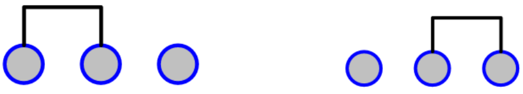

.. note::

    Bonjour et bienvenue dans la communauté des passionnés de Raspberry Pi, Arduino et ESP32 sur Facebook, animée par SunFounder ! Explorez plus en profondeur l'univers du Raspberry Pi, Arduino et ESP32 avec d'autres passionnés.

    **Pourquoi nous rejoindre ?**

    - **Support d'experts** : Résolvez vos problèmes après-vente et défis techniques grâce à l'aide de notre communauté et de notre équipe.
    - **Apprendre et partager** : Échangez des astuces et des tutoriels pour développer vos compétences.
    - **Aperçus exclusifs** : Bénéficiez d'un accès anticipé aux annonces de nouveaux produits et aperçus exclusifs.
    - **Réductions spéciales** : Profitez de réductions exclusives sur nos produits les plus récents.
    - **Promotions festives et concours** : Participez à des concours et promotions pendant les fêtes.

    👉 Prêt à explorer et créer avec nous ? Cliquez sur [|link_sf_facebook|] et rejoignez-nous dès aujourd'hui !

.. _cpn_slide:

Switch à glissière
==================

.. image:: img/slide_switch.png
    :width: 150
    :align: center

Comme son nom l'indique, un switch à glissière permet de connecter ou de déconnecter un circuit en faisant glisser le curseur, et de commuter d'autres circuits. Les types les plus courants sont SPDT, SPTT, DPDT, DPTT, etc. Le switch à glissière est principalement utilisé dans les circuits basse tension. Il présente des caractéristiques de flexibilité et de stabilité, et il est largement utilisé dans les instruments électroniques et les jouets électriques.

Fonctionnement : Le pin central est fixe. Lorsque vous déplacez le curseur vers la gauche, les deux broches à gauche sont connectées ; lorsque vous le déplacez vers la droite, les deux broches à droite sont connectées. Ainsi, il fonctionne comme un interrupteur qui connecte ou déconnecte des circuits. Voir l'illustration ci-dessous :

Le symbole du switch à glissière est montré ci-dessous. Le pin2 dans l'illustration correspond à la broche centrale.

.. image:: img/slide_symbol.png
    :width: 200
    :align: center

**Exemple**

* :ref:`ar_slide` (Arduino Project)

