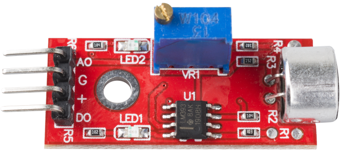

.. _cpn_sound:

Sound Sensor Module
====================

A sound sensor is defined as a module that detects sound waves through its intensity and converting it to electrical signals.

This module can be used for security, switch, and monitoring applications. Its accuracy can be easily adjusted for the convenience of usage.

It uses a microphone which supplies the input to an amplifier, peak detector and buffer. When the sensor detects a sound, it processes an output signal voltage which is sent to a micro-controller then performs necessary processing.

This module has two outputs:

* **AO**: analog output, real-time output voltage signal of microphone.
* **DO**: when the intensity of the sound reaches a certain threshold, the output is a high or low level signal. The threshold sensitivity can be achieved by adjusting the potentiometer.

**Example**

* :ref:`ar_sound` (Arduino Project)
* :ref:`blow_ball` (Scratch Project)