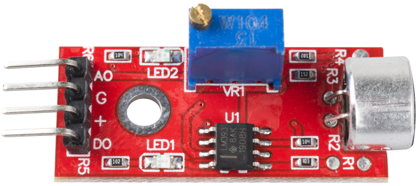

.. note::

    Hallo und willkommen in der SunFounder Raspberry Pi & Arduino & ESP32 Enthusiasten-Gemeinschaft auf Facebook! Tauchen Sie tiefer ein in die Welt von Raspberry Pi, Arduino und ESP32 mit anderen Enthusiasten.

    **Warum beitreten?**

    - **Expertenunterstützung**: Lösen Sie Nachverkaufsprobleme und technische Herausforderungen mit Hilfe unserer Gemeinschaft und unseres Teams.
    - **Lernen & Teilen**: Tauschen Sie Tipps und Anleitungen aus, um Ihre Fähigkeiten zu verbessern.
    - **Exklusive Vorschauen**: Erhalten Sie frühzeitigen Zugang zu neuen Produktankündigungen und exklusiven Einblicken.
    - **Spezialrabatte**: Genießen Sie exklusive Rabatte auf unsere neuesten Produkte.
    - **Festliche Aktionen und Gewinnspiele**: Nehmen Sie an Gewinnspielen und Feiertagsaktionen teil.

    👉 Sind Sie bereit, mit uns zu erkunden und zu erschaffen? Klicken Sie auf [|link_sf_facebook|] und treten Sie heute bei!

.. _cpn_sound:

Schallsensormodul
====================

Ein Schallsensor ist definiert als ein Modul, das Schallwellen anhand ihrer Intensität erkennt und in elektrische Signale umwandelt.

Dieses Modul kann für Sicherheits-, Schalter- und Überwachungsanwendungen verwendet werden. Seine Genauigkeit kann leicht für die Bequemlichkeit der Verwendung eingestellt werden.

Es verwendet ein Mikrofon, das den Eingang zu einem Verstärker, Spitzendetektor und Puffer liefert. Wenn der Sensor ein Geräusch erkennt, verarbeitet er eine Ausgangssignalspannung, die an einen Mikrocontroller gesendet wird und dann die erforderliche Verarbeitung durchführt.

Dieses Modul hat zwei Ausgänge:

* **AO**: Analogausgang, Echtzeit-Ausgangsspannungssignal des Mikrofons.
* **DO**: Wenn die Intensität des Tons einen bestimmten Schwellenwert erreicht, ist die Ausgabe ein Signal mit hohem oder niedrigem Pegel. Die Schwellenempfindlichkeit kann durch Einstellen des Potentiometers erreicht werden.

**Beispiel**

* :ref:`ar_sound` (Arduino-Projekt)
* :ref:`blow_ball` (Scratch-Projekt)