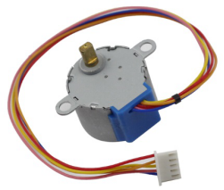
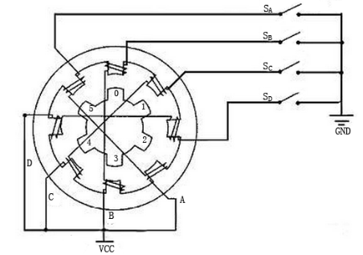
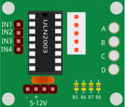
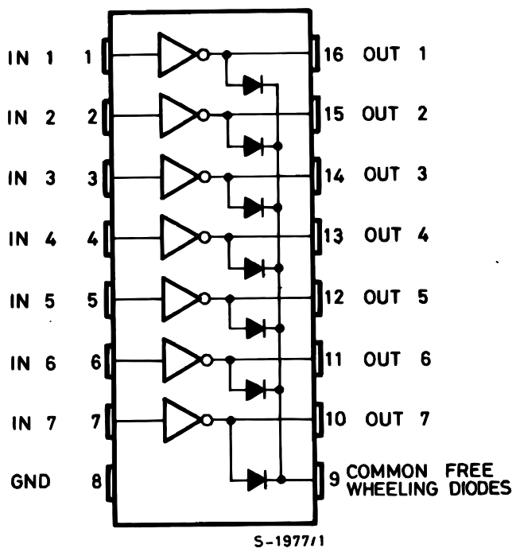

.. note::

    Ciao, benvenuto nella community di appassionati di SunFounder Raspberry Pi, Arduino ed ESP32 su Facebook! Approfondisci Raspberry Pi, Arduino ed ESP32 insieme ad altri appassionati.

    **Perché unirsi?**

    - **Supporto esperto**: Risolvi problemi post-vendita e sfide tecniche con l'aiuto della nostra community e del nostro team.
    - **Impara e condividi**: Scambia suggerimenti e tutorial per migliorare le tue competenze.
    - **Anteprime esclusive**: Accedi in anteprima agli annunci di nuovi prodotti.
    - **Sconti speciali**: Approfitta di sconti esclusivi sui nostri prodotti più recenti.
    - **Promozioni e omaggi festivi**: Partecipa a omaggi e promozioni speciali durante le festività.

    👉 Pronto per esplorare e creare con noi? Clicca [|link_sf_facebook|] e unisciti oggi stesso!

.. _cpn_stepper_motor:

Motore Passo-Passo
=========================

I motori passo-passo, grazie al loro design unico, possono essere controllati 
con un alto grado di precisione senza meccanismi di feedback. L'albero di un 
motore passo-passo, dotato di una serie di magneti, è controllato da una serie 
di bobine elettromagnetiche che vengono caricate positivamente e negativamente 
in una sequenza specifica, facendolo avanzare o arretrare in piccoli "passi".

**Principio di Funzionamento**

Esistono due tipi di motori passo-passo: unipolari e bipolari, ed è molto 
importante sapere con quale tipo si sta lavorando. In questo esperimento 
utilizzeremo un motore passo-passo unipolare.

Il motore passo-passo è a quattro fasi, alimentato da una sorgente DC unipolare. 
Finché si alimentano tutte le fasi del motore seguendo una sequenza di temporizzazione 
appropriata, è possibile farlo ruotare passo dopo passo. Lo **schema elettrico** 
di un motore passo-passo reattivo a quattro fasi:

**Come funziona un motore passo-passo a 4 fasi:**

Nella figura, al centro del motore si trova un rotore, un magnete 
permanente a forma di ingranaggio. Attorno al rotore, da 0 a 5 ci 
sono i denti. Più esternamente, ci sono 8 poli magnetici, con ogni 
coppia opposta collegata da un avvolgimento di bobina. In questo modo, 
si formano quattro coppie, da A a D, che vengono chiamate fasi. Il motore
dispone di quattro fili di collegamento da connettere agli interruttori SA, 
SB, SC e SD. Pertanto, le quattro fasi sono collegate in parallelo nel circuito, 
mentre i due poli magnetici di una fase sono in serie.

All'inizio, l'interruttore SB è acceso, mentre gli interruttori SA, SC e SD 
sono spenti, e i poli magnetici della fase B si allineano con i denti 0 e 3 
del rotore. Allo stesso tempo, i denti 1 e 4 formano una configurazione sfalsata 
con i poli delle fasi C e D. I denti 2 e 5 formano una configurazione sfalsata 
con i poli delle fasi D e A. Quando l'interruttore SC è acceso, mentre SB, SA e 
SD sono spenti, il rotore ruota sotto l'influenza del campo magnetico dell'avvolgimento 
della fase C e tra i denti 1 e 4. I denti 1 e 4 si allineano quindi con i poli magnetici 
dell'avvolgimento della fase C. Contemporaneamente, i denti 0 e 3 formano una configurazione 
sfalsata con i poli delle fasi A e B, e i denti 2 e 5 con i poli delle fasi A e D. 
Questo schema si ripete continuamente. Alimentando le fasi A, B, C e D in sequenza, 
il rotore ruoterà nell'ordine A, B, C e D.

Il motore passo-passo a quattro fasi ha tre modalità operative: quattro passi 
singoli, quattro passi doppi e otto passi. L'angolo di passo per le modalità a 
quattro passi singoli e doppi è lo stesso, ma la coppia di azionamento per i 
quattro passi singoli è inferiore. L'angolo di passo della modalità a otto passi 
è la metà di quello delle modalità a quattro passi singoli e doppi. Pertanto, 
la modalità operativa a otto passi consente di mantenere una coppia di azionamento 
elevata e di migliorare la precisione del controllo. In questo esperimento, facciamo 
funzionare il motore passo-passo in modalità a otto passi.

**Modulo ULN2003**

Per applicare il motore al circuito, è necessario utilizzare una 
scheda driver. Il Driver per Motore Passo-Passo ULN2003 è un circuito 
inverter a 7 canali. In pratica, quando l'ingresso è a livello alto, 
l'uscita dell'ULN2003 è a livello basso, e viceversa. Se forniamo un 
livello alto a IN1 e un livello basso a IN2, IN3 e IN4, allora l'uscita 
OUT1 sarà a livello basso e tutte le altre uscite saranno a livello alto. 
In questo modo, il LED D1 si accende, l'interruttore SA è attivo e il 
motore passo-passo ruota di un passo. Questo schema si ripete continuamente. 
Pertanto, fornendo al motore passo-passo una sequenza temporale specifica, 
esso ruoterà passo dopo passo. L'ULN2003 viene utilizzato qui per fornire 
sequenze temporali specifiche per il motore passo-passo.

**Esempio**

* :ref:`ar_stepper_motor` (Progetto Arduino)
* :ref:`ar_access_system` (Progetto Arduino)
