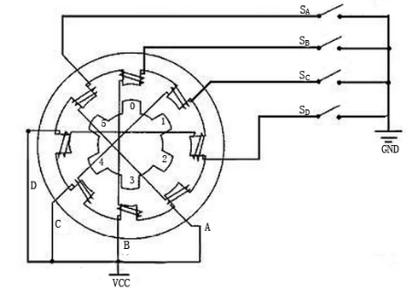

.. _cpn_stepper_motor:

Schrittmotor
=========================

.. image:: img/stepper129.png
    :align: center

Schrittmotoren können aufgrund ihres einzigartigen Designs ohne Rückkopplungsmechanismen mit hoher Genauigkeit gesteuert werden. Die Welle eines Steppers, die mit einer Reihe von Magneten montiert ist, wird von einer Reihe elektromagnetischer Spulen gesteuert, die in einer bestimmten Reihenfolge positiv und negativ geladen werden, wodurch sie in kleinen „Schritten“ präzise vorwärts oder rückwärts bewegt werden.

**Prinzip**

Es gibt zwei Arten von Steppern, unipolare und bipolare, und es ist sehr wichtig zu wissen, mit welcher Art Sie arbeiten. In diesem Experiment verwenden wir einen unipolaren Stepper.

Der Schrittmotor ist ein Vierphasenmotor, der eine unipolare Gleichstromversorgung verwendet. Solange Sie alle Phasenwicklungen des Motors durch eine geeignete Zeitfolge elektrifizieren, können Sie ihn Schritt für Schritt drehen lassen. Das Schema eines reaktiven Vierphasen-Schrittmotors:

**So funktioniert ein 4-Phasen-Schrittmotor**:

In der Abbildung befindet sich in der Mitte des Motors ein Rotor – ein zahnradförmiger Permanentmagnet. Um den Rotor herum sind 0 bis 5 Zähne. Dann gibt es weiter außen 8 Magnetpole, von denen jeweils zwei gegenüberliegende durch Spulenwicklungen verbunden sind. Sie bilden also vier Paare von A nach D, was als Phase bezeichnet wird. Es hat vier Anschlussdrähte, die mit den Schaltern SA, SB, SC und SD verbunden werden. Daher sind die vier Phasen in der Schaltung parallel und die zwei Magnetpole in einer Phase in Reihe geschaltet.

Zu Beginn ist der Schalter SB eingeschaltet, die Schalter SA, SC und SD ausgeschaltet, und die Magnetpole der B-Phase sind mit den Zähnen 0 und 3 des Rotors ausgerichtet. Gleichzeitig erzeugen Zahn 1 und 4 versetzte Zähne mit C- und D-Phasenpolen. Zahn 2 und 5 erzeugen versetzte Zähne mit D- und A-Phasenpolen. Wenn der Schalter SC eingeschaltet ist, die Schalter SB, SA und SD ausgeschaltet sind, dreht sich der Rotor unter dem Magnetfeld der C-Phasenwicklung und dem zwischen Zahn 1 und 4. Dann richten sich Zahn 1 und 4 mit den Magnetpolen von C- aus. Phasenwicklung. Während Zahn 0 und 3 versetzte Zähne mit A- und B-Phasenpolen erzeugen, erzeugen Zahn 2 und 5 versetzte Zähne mit den Magnetpolen von A- und D-Phasenpolen. Die ähnliche Situation geht weiter und weiter. Schalten Sie nacheinander die Phasen A, B, C und D ein, und der Rotor dreht sich in der Reihenfolge A, B, C und D.

Der Vierphasen-Schrittmotor hat drei Betriebsarten: Einzel-Vierschritt, Doppel-Vierschritt und Achtschritt. Die Schrittwinkel für den Einfach-Viertakt und den Doppel-Viertakt sind gleich, aber das Antriebsmoment für den Einfach-Viertakt ist kleiner. Der Schrittwinkel des Achterschritts ist halb so groß wie der des einfachen Viererschritts und des doppelten Viererschritts. Somit kann der achtstufige Betriebsmodus ein hohes Antriebsdrehmoment aufrechterhalten und die Steuergenauigkeit verbessern. In diesem Experiment lassen wir den Schrittmotor im Acht-Stufen-Modus arbeiten.

**ULN2003-Modul**

.. image:: img/uln2003.png
    :align: center

.. image:: img/uln338.png

Um den Motor in der Schaltung einzusetzen, muss eine Treiberplatine verwendet werden. Schrittmotortreiber-ULN2003 ist eine 7-Kanal-Wechselrichterschaltung. Das heißt, wenn das Eingangsende auf High-Pegel ist, ist das Ausgangsende von ULN2003 auf Low-Pegel und umgekehrt. Wenn wir IN1 einen hohen Pegel und IN2, IN3 und IN4 einen niedrigen Pegel zuführen, dann ist das Ausgangsende OUT1 auf einem niedrigen Pegel und alle anderen Ausgangsenden sind auf einem hohen Pegel. D1 leuchtet also auf, Schalter SA ist eingeschaltet und der Schrittmotor dreht sich um einen Schritt. Der ähnliche Fall wiederholt sich immer weiter. Geben Sie dem Schrittmotor daher einfach eine bestimmte Zeitfolge, er dreht sich Schritt für Schritt. Der ULN2003 wird hier verwendet, um bestimmte Timing-Sequenzen für den Schrittmotor bereitzustellen.

**Beispiel**

* :ref:`ar_stepper_motor` (Arduino-Projekt)
* :ref:`ar_access_system` (Arduino-Projekt)