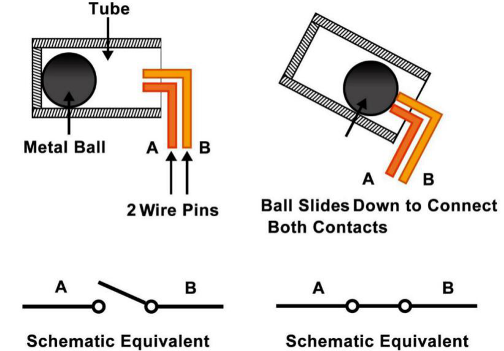

.. note:: 

    Bonjour et bienvenue dans la communauté des passionnés de Raspberry Pi, Arduino et ESP32 sur Facebook ! Explorez davantage le monde du Raspberry Pi, de l'Arduino et de l'ESP32 avec d'autres passionnés.

    **Pourquoi rejoindre ?**

    - **Support d'experts** : Résolvez vos problèmes après-vente et défis techniques avec l'aide de notre communauté et de notre équipe.
    - **Apprendre et partager** : Échangez des astuces et des tutoriels pour améliorer vos compétences.
    - **Aperçus exclusifs** : Accédez en avant-première aux annonces de nouveaux produits et découvrez des aperçus exclusifs.
    - **Réductions spéciales** : Profitez de réductions exclusives sur nos produits les plus récents.
    - **Promotions festives et cadeaux** : Participez à nos jeux concours et promotions saisonnières.

    👉 Prêt à explorer et à créer avec nous ? Cliquez sur [|link_sf_facebook|] et rejoignez-nous dès aujourd'hui !

.. _cpn_tilt:

Interrupteur à inclinaison
================================

.. image:: img/tilt_switch.png
    :width: 80
    :align: center

L'interrupteur à inclinaison utilisé ici est un modèle à bille métallique à l'intérieur. Il sert à détecter les inclinaisons à faible angle.

Le principe est très simple. Lorsque l'interrupteur est incliné à un certain angle, la bille à l'intérieur roule et entre en contact avec les deux bornes reliées aux broches extérieures, activant ainsi le circuit. Dans le cas contraire, la bille reste éloignée des contacts, coupant ainsi le circuit.

* `Fiche technique de l'interrupteur à inclinaison SW520D <https://www.tme.com/Document/f1e6cedd8cb7feeb250b353b6213ec6c/SW-520D.pdf>`_

**Exemple**

* :ref:`ar_tilt` (Arduino Project)
* :ref:`tumbler` (Scratch Project)