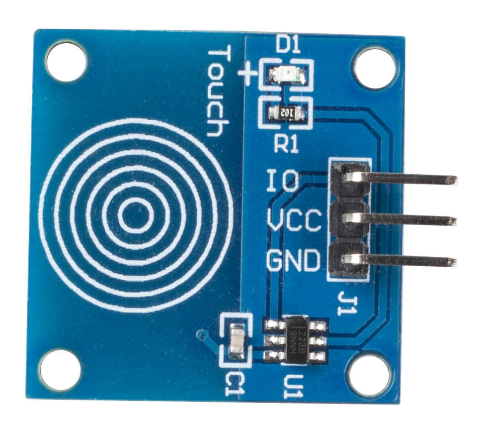
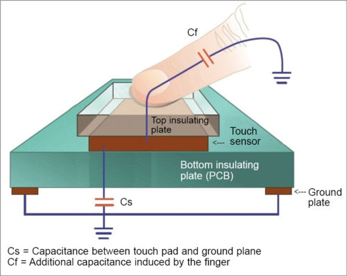

.. _cpn_touch:

Touch-Switch-Modul
==================================

* **IO**: Signalstift, normalerweise niedriger Pegel, gibt nach Berührung einen hohen Pegel aus.
* **VCC**: Stromversorgung, 3.3 ~ 5V DC.
* **GND**: Masse.

Dieses Modul ist ein kapazitives Berührungsschaltermodul basierend auf einem Berührungssensor-IC (TTP223B). Im Normalzustand gibt das Modul einen niedrigen Pegel bei geringem Stromverbrauch aus; Wenn ein Finger die entsprechende Position berührt, gibt das Modul einen High-Pegel aus und wird nach dem Loslassen des Fingers wieder Low-Pegel.

So funktioniert der kapazitive Berührungsschalter:

Ein kapazitiver Berührungsschalter hat verschiedene Schichten – die obere isolierende Frontplatte, gefolgt von der Berührungsplatte, einer weiteren isolierenden Schicht und dann der Erdungsplatte.

In der Praxis kann ein kapazitiver Sensor auf einer doppelseitigen Leiterplatte hergestellt werden, indem eine Seite als Berührungssensor und die gegenüberliegende Seite als Masseplatte des Kondensators betrachtet wird. Wenn Strom über diese Platten angelegt wird, werden die beiden Platten aufgeladen. Im Gleichgewichtszustand haben die Platten die gleiche Spannung wie die Stromquelle.

Die Berührungsdetektorschaltung weist einen Oszillator auf, dessen Frequenz von der Kapazität des Touchpads abhängt. Wenn ein Finger in die Nähe des Touchpads bewegt wird, bewirkt eine zusätzliche Kapazität, dass sich die Frequenz dieses internen Oszillators ändert. Die Detektorschaltung verfolgt die Oszillatorfrequenz in zeitlich festgelegten Intervallen, und wenn die Verschiebung die Schwellenänderung überschreitet, löst die Schaltung ein Tastendruckereignis aus.

**Beispiel**

* :ref:`ar_touch` (Arduino-Projekt)
* :ref:`balloon` (Scratch-Projekt)