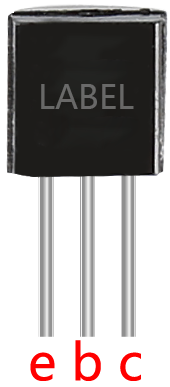

.. _cpn_transistor:

Transistor
============

.. image:: img/npn_pnp.png
    :width: 300

Transistor ist ein Halbleiterbauelement, das Strom für Strom steuert. Es funktioniert durch Verstärkung eines schwachen Signals zu einem Signal mit größerer Amplitude und wird auch für berührungslose Schalter verwendet.

Ein Transistor ist eine dreischichtige Struktur, die aus Halbleitern vom P-Typ und N-Typ besteht. Sie bilden intern die drei Regionen. Je dünner in der Mitte ist der Basisbereich; die anderen beiden sind beide vom N-Typ oder vom P-Typ – der kleinere Bereich mit intensiven Majoritätsladungsträgern ist der Emitterbereich, während der andere der Kollektorbereich ist. Diese Zusammensetzung ermöglicht, dass der Transistor ein Verstärker ist. Aus diesen drei Bereichen werden jeweils drei Pole erzeugt, nämlich Basis (b), Emitter (e) und Kollektor (c). Sie bilden zwei PN-Übergänge, nämlich den Emitterübergang und den Sammelübergang. Die Richtung des Pfeils im Transistorschaltkreissymbol zeigt die des Emitterübergangs an.

* `P–N-Kreuzung – Wikipedia <https://en.wikipedia.org/wiki/P-n_junction>`_

Basierend auf dem Halbleitertyp können Transistoren in zwei Gruppen eingeteilt werden, die NPN- und PNP-Transistoren. Anhand der Abkürzung können wir erkennen, dass ersterer aus zwei N-Typ-Halbleitern und einem P-Typ besteht und dass letzterer das Gegenteil ist. Siehe die Abbildung unten.

.. note::
    s8550 ist ein PNP-Transistor und der s8050 ist der NPN-Transistor. Sie sehen sehr ähnlich aus, und wir müssen sorgfältig prüfen, um ihre Etiketten zu sehen.

.. image:: img/transistor_symbol.png
    :width: 600

Wenn ein Signal mit hohem Pegel durch einen NPN-Transistor geht, wird er erregt. Aber ein PNP benötigt ein Signal mit niedrigem Pegel, um es zu verwalten. Beide Transistortypen werden häufig für kontaktlose Schalter verwendet, so wie in diesem Experiment.

Legen Sie die Etikettenseite zu uns und die Stifte nach unten. Die Pins von links nach rechts sind Emitter (e), Basis (b) und Kollektor (c).

* `Datenblatt des S8050-Transistors <https://datasheet4u.com/datasheet-pdf/WeitronTechnology/S8050/pdf.php?id=576670>`_
* `Datenblatt des S8550-Transistors <https://www.mouser.com/datasheet/2/149/SS8550-118608.pdf>`_

