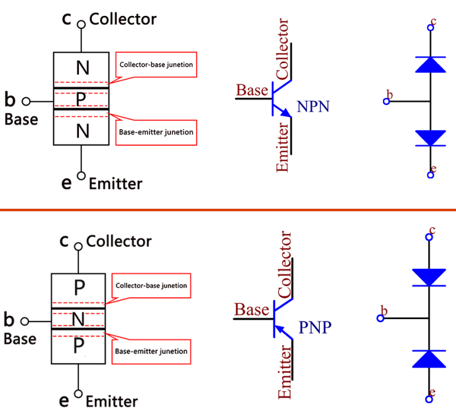

.. note::

    Ciao, benvenuto nella Community SunFounder per appassionati di Raspberry Pi, Arduino ed ESP32 su Facebook! Approfondisci le tue conoscenze su Raspberry Pi, Arduino ed ESP32 insieme ad altri appassionati.

    **Perché unirti a noi?**

    - **Supporto esperto**: Risolvi problemi post-vendita e sfide tecniche con l'aiuto della nostra comunità e del nostro team.
    - **Impara e condividi**: Scambia consigli e tutorial per migliorare le tue competenze.
    - **Anteprime esclusive**: Ottieni accesso anticipato agli annunci di nuovi prodotti e anticipazioni.
    - **Sconti speciali**: Goditi sconti esclusivi sui nostri prodotti più recenti.
    - **Promozioni festive e omaggi**: Partecipa a concorsi e promozioni durante le festività.

    👉 Pronto per esplorare e creare con noi? Clicca [|link_sf_facebook|] e unisciti oggi stesso!

.. _cpn_transistor:

Transistor
============

.. image:: img/npn_pnp.png
    :width: 300

Un transistor è un dispositivo semiconduttore che controlla la corrente tramite un'altra corrente. Funziona amplificando segnali deboli in segnali di ampiezza maggiore ed è spesso utilizzato come interruttore senza contatto.

Il transistor è una struttura a tre strati composta da semiconduttori di tipo P e N. Questi formano tre regioni interne. Quella più sottile al centro è la base; le altre due sono di tipo N o P. La regione più piccola con una maggiore concentrazione di portatori è l'emettitore, mentre l'altra è il collettore. Questa composizione permette al transistor di funzionare come amplificatore. 
Da queste tre regioni derivano tre terminali: base (b), emettitore (e) e collettore (c). Formano due giunzioni P-N, chiamate rispettivamente giunzione emettitore e giunzione collettore. La direzione della freccia nel simbolo del circuito indica quella della giunzione emettitore.

* `P–N junction - Wikipedia <https://en.wikipedia.org/wiki/P-n_junction>`_

In base al tipo di semiconduttore, i transistor si dividono in due gruppi: NPN e PNP. Dal nome possiamo intuire che il primo è costituito da due semiconduttori di tipo N e uno di tipo P, mentre il secondo è l'opposto. Vedi la figura seguente.

.. note::
    Il modello s8550 è un transistor PNP mentre il modello s8050 è di tipo NPN. Si assomigliano molto, quindi è importante controllare attentamente le etichette.

Quando un segnale di alto livello attraversa un transistor NPN, questo si attiva. Per un transistor PNP è invece necessario un segnale di basso livello. Entrambi i tipi di transistor sono frequentemente utilizzati come interruttori senza contatto, come in questo esperimento.

Con il lato dell'etichetta rivolto verso di noi e i pin rivolti verso il basso, i pin da sinistra a destra sono emettitore (e), base (b) e collettore (c).

.. image:: img/ebc.png
    :width: 150

* `S8050 Transistor Datasheet <https://datasheet4u.com/datasheet-pdf/WeitronTechnology/S8050/pdf.php?id=576670>`_
* `S8550 Transistor Datasheet <https://www.mouser.com/datasheet/2/149/SS8550-118608.pdf>`_
