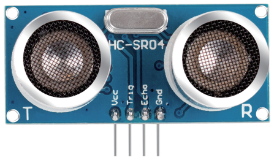
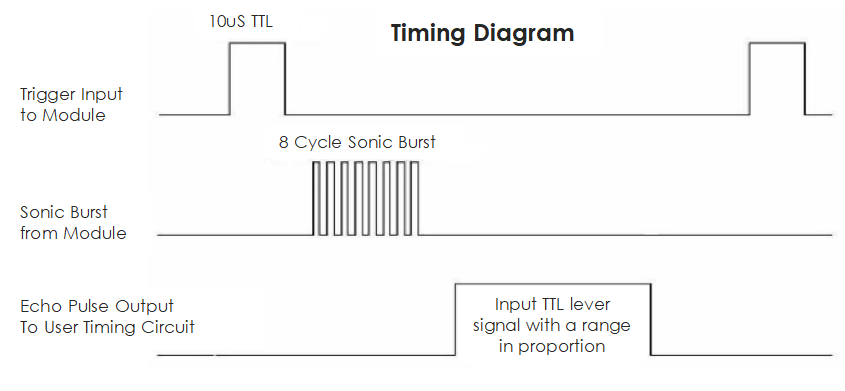

.. _cpn_ultrasonic:

Ultraschallmodul
================================

Das Ultraschall-Entfernungsmodul bietet eine berührungslose Messfunktion von 2 cm bis 400 cm, und die Entfernungsgenauigkeit kann bis zu 3 mm erreichen. Es kann sicherstellen, dass das Signal innerhalb von 5 m stabil ist und das Signal nach 5 m allmählich schwächer wird, bis die 7-m-Position verschwindet.

Das Modul umfasst Ultraschallsender, Empfänger und Steuerkreis. Die Grundprinzipien sind wie folgt:

Verwenden Sie ein IO-Flip-Flop, um ein Signal mit hohem Pegel von mindestens 10 us zu verarbeiten.

* Das Modul sendet automatisch acht 40-kHz-Signale und erkennt, ob ein Impulssignal zurückkommt.
* Wenn das Signal zurückkehrt und den hohen Pegel passiert, ist die IO-Dauer des hohen Ausgangs die Zeit von der Übertragung der Ultraschallwelle bis zu ihrer Rückkehr. Hier Testdistanz = (Hochzeit x Schallgeschwindigkeit (340 m/s) / 2.
* Das Zeitdiagramm ist unten dargestellt.

The timing diagram is shown below. 

Sie müssen nur einen kurzen 10-us-Impuls für den Triggereingang liefern, um die Entfernungsmessung zu starten, und dann sendet das Modul einen 8-Zyklus-Ultraschallstoß mit 40 kHz aus und erhöht sein Echo. Sie können die Reichweite durch das Zeitintervall zwischen dem Senden des Triggersignals und dem Empfangen des Echosignals berechnen.

Formel: ``us / 58 = Zentimeter`` oder ``us / 148 = Zoll``; oder: ``die Reichweite = High-Level-Zeit * Geschwindigkeit (340 M/S) / 2``; Es wird empfohlen, einen Messzyklus von über 60 ms zu verwenden, um Signalkollisionen des Triggersignals und des Echosignals zu vermeiden.

**Beispiel**

* :ref:`ar_ultrasonic` (Arduino-Projekt)
* :ref:`ar_reversing_aid` (Arduino-Projekt)
* :ref:`parrot` (Scratch-Projekt)
