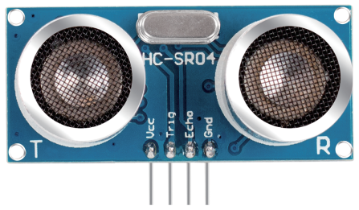

.. note:: 

    Hola, bienvenido a la comunidad de entusiastas de SunFounder Raspberry Pi, Arduino y ESP32 en Facebook. Profundiza en Raspberry Pi, Arduino y ESP32 junto a otros entusiastas.

    **¿Por qué unirse?**

    - **Soporte experto**: Resuelve problemas posventa y desafíos técnicos con ayuda de nuestra comunidad y equipo.
    - **Aprende y comparte**: Intercambia consejos y tutoriales para mejorar tus habilidades.
    - **Avances exclusivos**: Accede anticipadamente a anuncios de nuevos productos y adelantos.
    - **Descuentos especiales**: Disfruta de descuentos exclusivos en nuestros productos más recientes.
    - **Promociones y sorteos festivos**: Participa en sorteos y promociones especiales por festividades.

    👉 ¿Listo para explorar y crear con nosotros? Haz clic en [|link_sf_facebook|] y únete hoy mismo.

.. _cpn_ultrasonic:

Módulo Ultrasónico
================================

El módulo de rango ultrasónico proporciona una medición sin contacto de 2 cm a 400 cm, con una precisión de hasta 3 mm. 
Puede garantizar una señal estable dentro de los 5 m, y la señal se debilita gradualmente después de los 5 m, hasta desaparecer alrededor de los 7 m.

El módulo incluye transmisores ultrasónicos, receptor y circuito de control. Los principios básicos son los siguientes:

#. Utiliza un flip-flop IO para procesar una señal de nivel alto de al menos 10 us.

#. El módulo envía automáticamente ocho pulsos ultrasónicos de 40 kHz y detecta si hay un retorno de señal de pulso.

#. Si la señal regresa, el nivel alto del IO de salida representa la duración desde la transmisión de la onda ultrasónica hasta su retorno. Aquí, la distancia se calcula como: **distancia de prueba = (tiempo alto x velocidad del sonido (340 m/s) / 2)**.

El diagrama de tiempos se muestra a continuación. 

.. image:: img/ultrasonic228.png

Solo necesitas suministrar un pulso corto de 10 us a la entrada del disparador 
para iniciar la medición. El módulo enviará una ráfaga de ultrasonido de 8 ciclos 
a 40 kHz y generará su eco. Puedes calcular el rango mediante el intervalo de 
tiempo entre el envío de la señal de disparo y la recepción de la señal de eco.

Fórmula: **us / 58 = centímetros** o **us / 148 = pulgadas**; 
también: **rango = tiempo de nivel alto \* velocidad (340 m/s) / 2**. 
Se sugiere usar un ciclo de medición mayor a 60 ms para evitar 
colisiones entre la señal de disparo y la señal de eco.

**Ejemplo**

* :ref:`ar_ultrasonic` (Proyecto Arduino)
* :ref:`ar_reversing_aid` (Proyecto Arduino)
* :ref:`parrot` (Proyecto Scratch)
