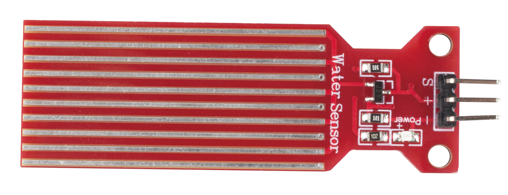

.. _cpn_water:

Water Level Sensor Module
===================================

* **S**: Signal pin, the more water the sensor is immersed in, the greater the output value.
* **+**: Power supply, 3.3 ~ 5V DC.
* **-**: Ground.

The Water Level Sensor module is an easy-to-use, compact and cost effective water level/drop detection sensor that measures the water level by a series of exposed parallel wire traces to determine the size of the water drop/volume.

The water level sensor has ten exposed copper traces, five for the Power traces and five for the Sensor traces, which are crossed and bridged by water when flooded.
The circuit board has a power LED that lights up when the board is energized.

The combination of these traces acts like a variable resistor, changing the resistance value according to the water level.
To be more precise, the more water the sensor is immersed in, the better the conductivity and the lower the resistance. Conversely, the less conductive it is, the higher the resistance.
Next, the sensor will process the output signal voltage which will be sent to the microcontroller, thus helping us to determine the water level.

.. warning:: 
    The sensor cannot be fully submerged in water, please only leave the part where the ten traces are located in contact with water. In addition, energizing the sensor in a humid environment will speed up the corrosion of the probe and cut the life of the sensor, so we recommend that you only supply power when taking readings.

**Example**

* :ref:`ar_water` (Arduino Project)
* :ref:`starfish` (Scratch Project)