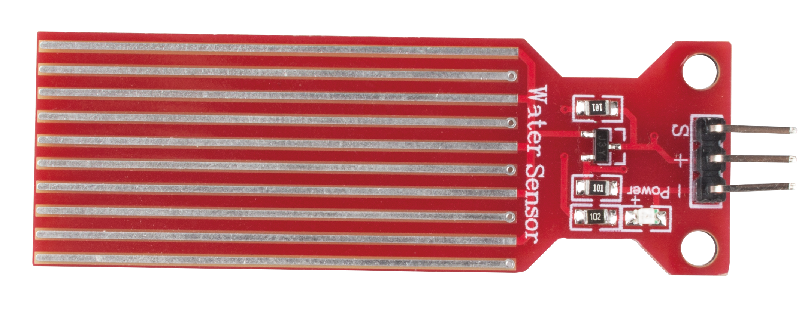

.. note::

    Ciao, benvenuto nella Community SunFounder per appassionati di Raspberry Pi, Arduino ed ESP32 su Facebook! Approfondisci le tue conoscenze su Raspberry Pi, Arduino ed ESP32 insieme ad altri appassionati.

    **Perché unirti a noi?**

    - **Supporto esperto**: Risolvi problemi post-vendita e sfide tecniche con l'aiuto della nostra comunità e del nostro team.
    - **Impara e condividi**: Scambia consigli e tutorial per migliorare le tue competenze.
    - **Anteprime esclusive**: Ottieni accesso anticipato agli annunci di nuovi prodotti e anticipazioni.
    - **Sconti speciali**: Goditi sconti esclusivi sui nostri prodotti più recenti.
    - **Promozioni festive e omaggi**: Partecipa a concorsi e promozioni durante le festività.

    👉 Pronto per esplorare e creare con noi? Clicca [|link_sf_facebook|] e unisciti oggi stesso!

.. _cpn_water:

Modulo Sensore di Livello dell'Acqua
======================================

* **S**: Pin del segnale; più il sensore è immerso nell'acqua, maggiore sarà il valore in uscita.
* **+**: Alimentazione, 3.3 ~ 5V DC.
* **-**: Terra (GND).

Il modulo sensore di livello dell'acqua è un sensore compatto, facile da usare ed economico per rilevare il livello o la presenza di gocce d'acqua. Misura il livello dell'acqua tramite una serie di tracce parallele esposte che determinano la quantità di acqua o volume presente.

Il sensore ha dieci tracce di rame esposte: cinque per l'alimentazione e cinque per il rilevamento. Quando il sensore è immerso, l'acqua crea un ponte tra queste tracce.
La scheda del circuito ha un LED di alimentazione che si illumina quando la scheda è in tensione.

La combinazione di queste tracce funziona come una resistenza variabile, modificando il valore di resistenza in base al livello dell'acqua.
Più il sensore è immerso, migliore è la conducibilità e minore è la resistenza. Al contrario, meno è immerso, maggiore sarà la resistenza.
Il sensore elabora poi il segnale di uscita, che viene inviato al microcontrollore per determinare il livello dell'acqua.

.. warning:: 
    Il sensore non deve essere completamente sommerso in acqua; lasciare in contatto con l'acqua solo la parte in cui si trovano le dieci tracce. Inoltre, alimentare il sensore in un ambiente umido accelera la corrosione della sonda, riducendone la durata. Si consiglia di alimentare il sensore solo durante la lettura dei dati.

**Esempio**

* :ref:`ar_water` (Progetto Arduino)
* :ref:`starfish` (Progetto Scratch)
