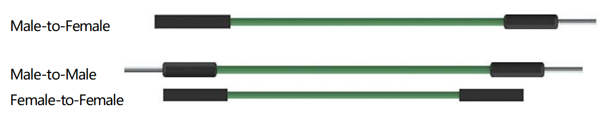

.. _cpn_wires:

Überbrückungsdrähte
=====================

Drähte, die zwei Anschlüsse verbinden, werden als Jumper-Drähte bezeichnet. Es gibt verschiedene Arten von Schaltdrähten. Hier konzentrieren wir uns auf diejenigen, die in Steckbrettern verwendet werden. Unter anderem werden sie verwendet, um elektrische Signale von überall auf dem Steckbrett zu den Ein-/Ausgangspins eines Mikrocontrollers zu übertragen.

Schaltdrähte werden montiert, indem ihre „Endverbinder“ in die dafür vorgesehenen Schlitze des Steckbretts gesteckt werden, unter dessen Oberfläche sich einige Sätze paralleler Platten befinden, die die Schlitze je nach Bereich in Reihen- oder Spaltengruppen verbinden. Die „Endverbinder“ werden ohne Löten in die Steckplätze des Steckbretts gesteckt, die im jeweiligen Prototypen verbunden werden müssen.

Es gibt drei Arten von Überbrückungskabeln: Buchse-zu-Buchse, Stecker-zu-Stecker und Stecker-zu-Buchse. Der Grund, warum wir es Male-to-Female nennen, ist, dass es die hervorragende Spitze an einem Ende sowie ein versenktes weibliches Ende hat. Male-to-Male bedeutet, dass beide Seiten männlich sind und Female-to-Female bedeutet, dass beide Enden weiblich sind.

In einem Projekt kann mehr als ein Typ davon verwendet werden. Die Farbe der Schaltdrähte ist anders, aber das bedeutet nicht, dass ihre Funktion entsprechend anders ist; Es ist nur so konzipiert, dass die Verbindung zwischen den einzelnen Schaltkreisen besser identifiziert werden kann.