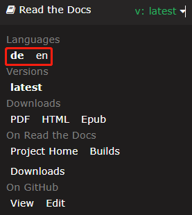

SunFounder Vincent Kit for Arduino
======================================

Thanks for choosing our Vincent Kit.

.. note::
    This document is available in the following languages.

        * |link_german_tutorials|
        * |link_en_tutorials|
    
    Please click on the respective links to access the document in your preferred language.

Dieses umfassende Lernset dreht sich um den Mega2560 als Hauptsteuerplatine und bietet eine perfekte Mischung aus wesentlichen Komponenten, Modulen und einer Vielzahl grundlegender Elemente wie Widerständen, Kondensatoren und Transistoren. 

Ob Sie ein Anfänger sind, der seine ersten Schritte in der Arduino-Welt macht, oder ein versierter Lernender, der sein Wissen vertiefen möchte, dieses Kit ist auf Ihre Bedürfnisse zugeschnitten.

* :download:`SunFounder Vincent Kit for Arduino <https://github.com/sunfounder/sunfounder_vincent_kit_for_arduino/archive/refs/heads/master.zip>`

* Oder sehen Sie sich den Code bei `Vincent Kit for Arduino - GitHub <https://github.com/sunfounder/sunfounder_vincent_kit_for_arduino>`_

Wenn Sie Fragen haben, senden Sie bitte eine E-Mail an service@sunfounder.com, und wir werden so schnell wie möglich antworten.

**Über die Anzeigesprache**

Dieses Dokument ist auch in anderen Sprachen verfügbar. Um die Anzeigesprache zu ändern, klicken Sie bitte auf das Read the Docs-Symbol in der linken unteren Ecke der Seite.

.. toctree::
    :maxdepth: 2

    About this Kit <self>
    components/component_list
    arduino/play_with_arduino
    pictoblox/play_with_scratch
    thank-learning
    other_language

Urheberrechtshinweis
----------------------

Alle Inhalte, einschließlich, aber nicht beschränkt auf Texte, Bilder und Code in diesem Handbuch, sind Eigentum der SunFounder Company. Sie sollten es nur zu persönlichen Studien-, Nachforschungs-, Unterhaltungs- oder anderen nichtkommerziellen oder gemeinnützigen Zwecken gemäß den entsprechenden Vorschriften und Urheberrechtsgesetzen verwenden, ohne die gesetzlichen Rechte des Autors und der relevanten Rechteinhaber zu verletzen. Das Unternehmen behält sich das Recht vor, rechtliche Schritte gegen Einzelpersonen oder Organisationen einzuleiten, die diese ohne Genehmigung zu kommerziellen Zwecken nutzen.
