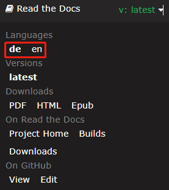

.. note:: 

    Bonjour, bienvenue dans la communauté des passionnés de Raspberry Pi, Arduino et ESP32 sur Facebook, créée par SunFounder ! Explorez en profondeur les univers de Raspberry Pi, Arduino et ESP32 avec d'autres passionnés.

    **Pourquoi rejoindre ?**

    - **Support d'experts** : Résolvez vos problèmes après-vente et vos défis techniques grâce à l'aide de notre communauté et de notre équipe.
    - **Apprendre et partager** : Échangez des astuces et des tutoriels pour améliorer vos compétences.
    - **Aperçus exclusifs** : Accédez en avant-première aux annonces de nouveaux produits et obtenez des aperçus exclusifs.
    - **Réductions spéciales** : Profitez de réductions exclusives sur nos produits les plus récents.
    - **Promotions festives et tirages au sort** : Participez à des concours et à des promotions spéciales pendant les fêtes.

    👉 Prêt à explorer et à créer avec nous ? Cliquez sur [|link_sf_facebook|] et rejoignez-nous dès aujourd'hui !

SunFounder |link_Vincent_Kit| pour Arduino Mega 2560
==========================================================

* |link_Vincent_Ultimate_Kit|

Merci d'avoir choisi notre |link_Vincent_Kit|.

.. note::
    Ce document est disponible dans les langues suivantes.

        * |link_german_tutorials|
        * |link_en_tutorials|
        * |link_fr_tutorials|
        * |link_es_tutorials|
        * |link_it_tutorials|
    
    Veuillez cliquer sur les liens correspondants pour accéder au document dans la langue de votre choix.

Ce kit d'apprentissage complet se concentre sur la Mega2560 comme 
carte de contrôle principale, offrant un mélange parfait de composants essentiels, 
de modules et d'une large gamme d'éléments de base tels que des résistances, des condensateurs 
et des transistors. Que vous soyez débutant dans le monde d'Arduino ou un apprenant expérimenté cherchant à approfondir vos connaissances, ce kit est conçu pour répondre à vos besoins.

Téléchargez le code correspondant à partir du lien ci-dessous.

* :download:`SunFounder Vincent Kit for Arduino <https://github.com/sunfounder/sunfounder_vincent_kit_for_arduino/archive/refs/heads/master.zip>`

* Ou consultez le code sur `Vincent Kit for Arduino - GitHub <https://github.com/sunfounder/sunfounder_vincent_kit_for_arduino>`_

Si vous avez des questions, veuillez envoyer un e-mail à service@sunfounder.com et nous vous répondrons dans les plus brefs délais.

**À propos de la langue d'affichage**

Ce document est également disponible dans d'autres langues. Pour changer la langue d'affichage, cliquez simplement sur l'icône **Read the Docs** située en bas à gauche de la page.

.. toctree::
    :maxdepth: 2
    
    About this Kit <self>
    components/component_list
    arduino/play_with_arduino
    pictoblox/play_with_scratch
    thank-learning

Avis de droit d'auteur
----------------------------

Tous les contenus, y compris mais sans s'y limiter, les textes, images et codes de ce manuel sont la propriété de la société SunFounder. Vous ne devez les utiliser que pour un usage personnel, des études, de la recherche, du loisir ou d'autres fins non commerciales ou à but non lucratif, conformément aux réglementations et lois sur les droits d'auteur, sans enfreindre les droits légaux de l'auteur et des détenteurs de droits. Pour toute utilisation commerciale de ces éléments sans autorisation, la société se réserve le droit d'engager des actions légales.
