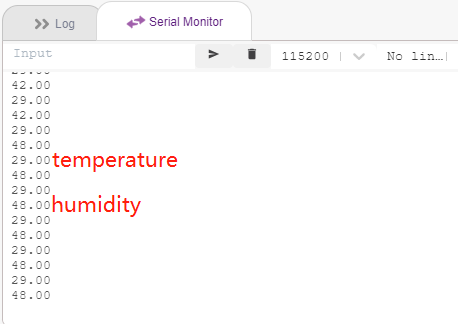
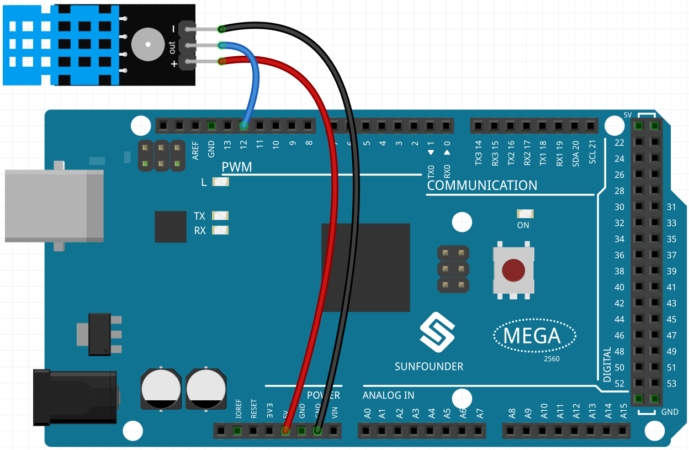
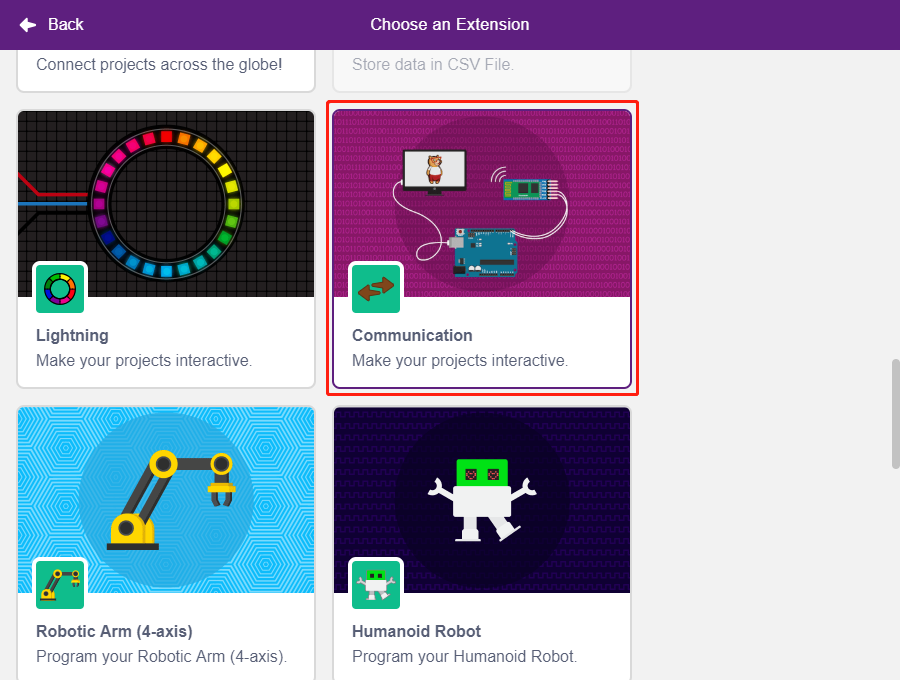
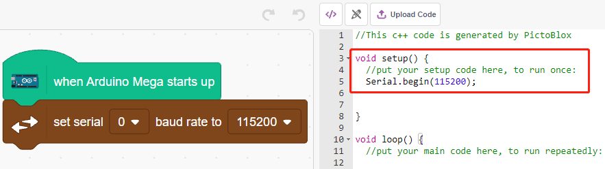
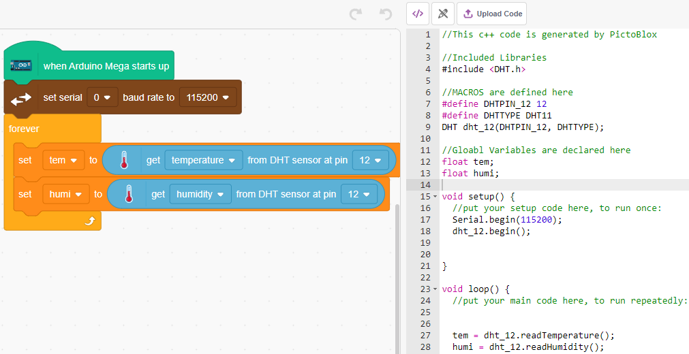
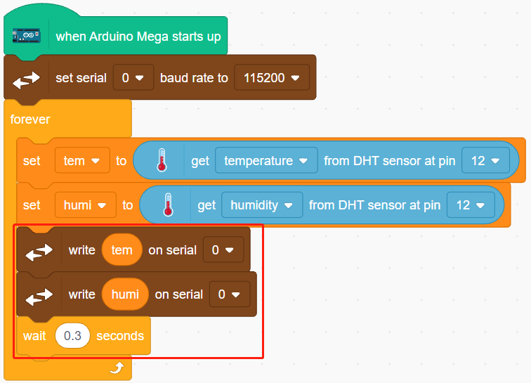
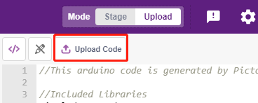

.. _humiture:

2.10 Temperatur und Luftfeuchtigkeit ablesen
=================================================

Frühere Projekte haben den Stage-Modus verwendet, aber einige Funktionen sind nur im Upload-Modus verfügbar, wie z.B. die serielle Kommunikationsfunktion. 
In diesem Projekt werden wir die Temperatur und Luftfeuchtigkeit des DHT11 mit Hilfe des seriellen Monitors im :ref:`upload_mode` ausgeben.

Sie werden lernen
---------------------

- Die Temperatur und Luftfeuchtigkeit des DHT11-Moduls abfragen
- Serieller Monitor für :ref:`upload_mode`
- Hinzufügen der Erweiterung

Die Schaltung aufbauen
-----------------------

Der digitale Temperatur- und Feuchtigkeitssensor DHT11 ist ein zusammengesetzter Sensor, der einen kalibrierten digitalen Signalausgang für Temperatur und Feuchtigkeit enthält.

Baue nun die Schaltung nach dem folgenden Schema auf.

* :ref:`cpn_breadboard`
* :ref:`cpn_humiture` 

Programmierung
------------------

**1. Hinzufügen von Erweiterungen**

Wechseln Sie in den Modus **Upload**, klicken Sie auf die Schaltfläche **Add Extension** in der linken unteren Ecke und wählen Sie dann **Communication**, um sie hinzuzufügen.

**2. Initialisierung des Arduino Mega und des seriellen Monitors**

Starten Sie den Arduino Mega im **Upload**-Modus und stellen Sie dann die Baudrate der seriellen Schnittstelle ein.

* [wenn Arduino Mega gestartet wird]: Im **Upload**-Modus Arduino Mega starten.
* [Serielle Baudrate einstellen]: Aus der **Communication**-Palette, um die Baudrate der seriellen Schnittstelle 0 einzustellen, Standard ist 115200. Wenn Sie den Mega2560 verwenden, können Sie die Baudrate für den seriellen Port 0~3 einstellen.

**3. Temperatur und Luftfeuchtigkeit auslesen**

Erstellen Sie 2 Variablen **tem** und **humi**, um die Temperatur bzw. die Luftfeuchtigkeit zu speichern. Der Code erscheint auf der rechten Seite, wenn Sie den Block ziehen und ablegen.

**4. Drucken Sie sie auf dem seriellen Monitor**

Schreiben Sie die abgelesene Temperatur und Luftfeuchtigkeit auf den seriellen Monitor. Um zu vermeiden, dass die Übertragung zu schnell erfolgt und der PictoBlox blockiert, verwenden Sie den Block [wait seconds], um ein gewisses Zeitintervall für den nächsten Druck hinzuzufügen.

**5. Code hochladen**

Im Gegensatz zum **Stage**-Modus muss der Code im **Upload**-Modus über die Schaltfläche **Upload Code** auf das Arduino-Board hochgeladen werden, um den Effekt zu sehen. So kann man auch das USB-Kabel abziehen und das Programm trotzdem laufen lassen.

**6. Schalten Sie den seriellen Monitor ein**

Öffnen Sie nun den **Serial Monitor**, um die Temperatur und die Luftfeuchtigkeit zu sehen.

