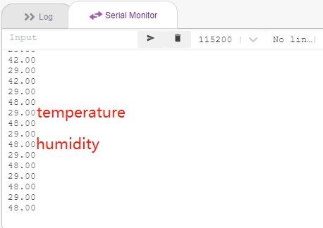
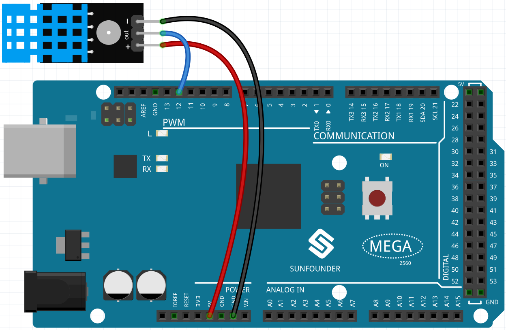
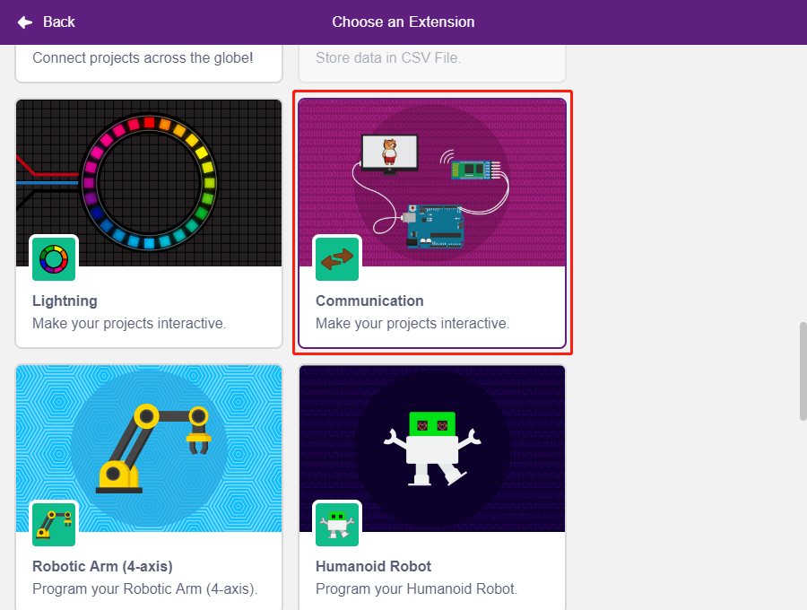
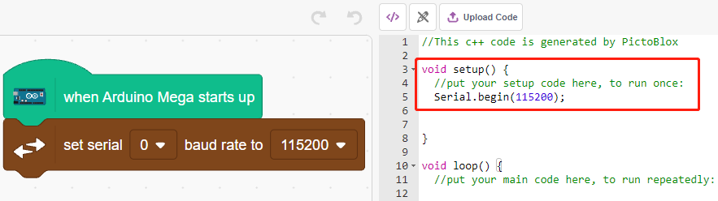
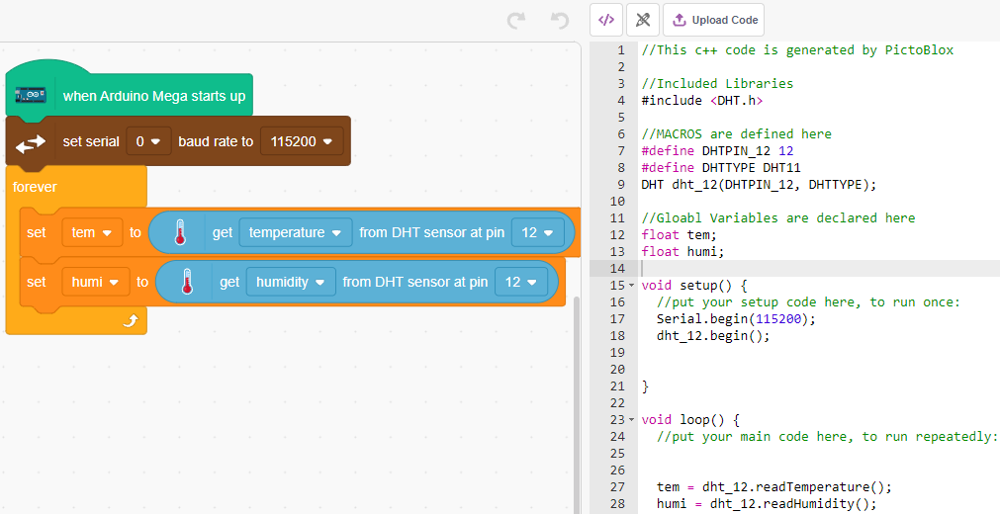
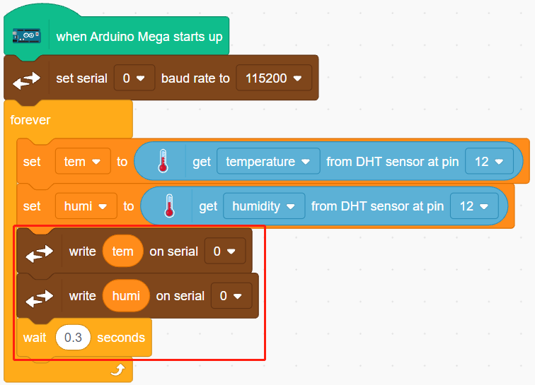
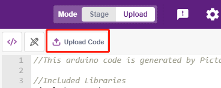

.. note:: 

    Bonjour, bienvenue dans la communauté des passionnés de SunFounder Raspberry Pi, Arduino et ESP32 sur Facebook ! Explorez en profondeur Raspberry Pi, Arduino et ESP32 avec d'autres passionnés.

    **Pourquoi nous rejoindre ?**

    - **Support d'experts** : Résolvez les problèmes post-vente et les défis techniques avec l'aide de notre communauté et de notre équipe.
    - **Apprendre et partager** : Échangez des astuces et des tutoriels pour améliorer vos compétences.
    - **Aperçus exclusifs** : Profitez de l'accès anticipé aux nouvelles annonces de produits et aux aperçus.
    - **Réductions spéciales** : Bénéficiez de réductions exclusives sur nos nouveaux produits.
    - **Promotions festives et concours** : Participez à des concours et promotions festives.

    👉 Prêt à explorer et à créer avec nous ? Cliquez sur [|link_sf_facebook|] et rejoignez-nous dès aujourd'hui !

.. _humiture:

2.10 Lecture de la Température et de l'Humidité
====================================================

Les projets précédents utilisaient le mode scène, mais certaines fonctions ne sont disponibles qu'en mode téléchargement, comme la fonction de communication série.
Dans ce projet, nous allons afficher la température et l'humidité du DHT11 en utilisant le Moniteur Série en :ref:`Mode Téléchargement`.

Vous Apprendrez
---------------------

- Obtenir la température et l'humidité depuis le module DHT11
- Utiliser le Moniteur Série en :ref:`Mode Téléchargement`
- Ajouter une extension

Construire le Circuit
-----------------------

Le capteur numérique de température et d'humidité DHT11 est un capteur composite qui fournit un signal de sortie numérique calibré pour la température et l'humidité.

Construisez le circuit en suivant le schéma ci-dessous.

* :ref:`cpn_breadboard`
* :ref:`cpn_humiture`

Programmation
------------------

**1. Ajouter des Extensions**

Passez en mode **Téléchargement**, cliquez sur le bouton **Ajouter une Extension** en bas à gauche, puis sélectionnez **Communication** pour l'ajouter, et elle apparaîtra à la fin de la zone de palette.

**2. Initialisation de l'Arduino Mega et du Moniteur Série**

En mode **Téléchargement**, démarrez l'Arduino Mega puis réglez le débit de la connexion série.

* [lorsque Arduino démarre] : En mode **Téléchargement**, démarre l'Arduino Mega.
* [définir le débit en bauds à] : Depuis la palette **Communications**, utilisé pour définir le débit en bauds du port série 0, par défaut à 115200. Si vous utilisez la Mega2560, vous pouvez choisir de définir le débit pour le port série de 0 à 3.

**3. Lecture de la température et de l'humidité**

Créez deux variables **tem** et **humi** pour stocker respectivement la température et l'humidité ; le code apparaîtra sur la droite au fur et à mesure que vous glissez et déposez les blocs.

**4. Affichez-les sur le Moniteur Série**

Écrivez les valeurs de température et d'humidité lues dans le Moniteur Série. Pour éviter un transfert trop rapide qui pourrait causer un ralentissement de PictoBlox, utilisez le bloc [attendre secondes] pour ajouter un intervalle de temps avant la prochaine impression.

**5. Téléchargement du code**

Contrairement au mode **Scène**, le code en mode **Téléchargement** doit être chargé sur la carte Arduino en utilisant le bouton **Télécharger le Code** pour voir l'effet. Cela permet également de débrancher le câble USB tout en laissant le programme s'exécuter.

**6. Activer le Moniteur Série**

Ouvrez maintenant le **Moniteur Série** pour voir la température et l'humidité.

