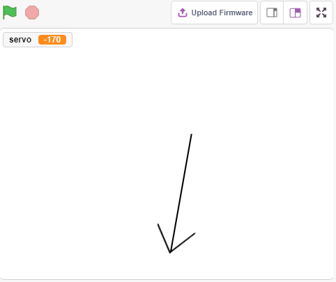
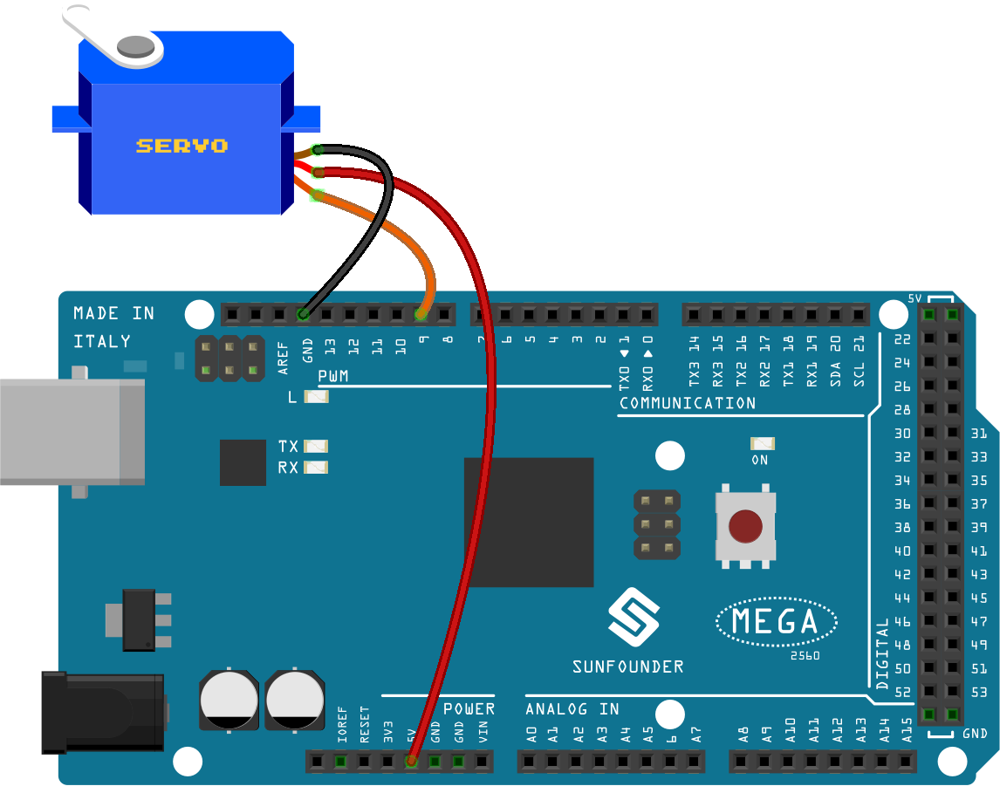
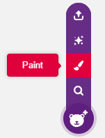
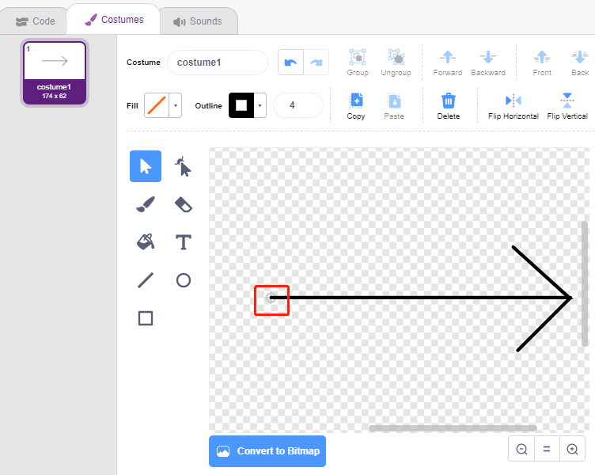
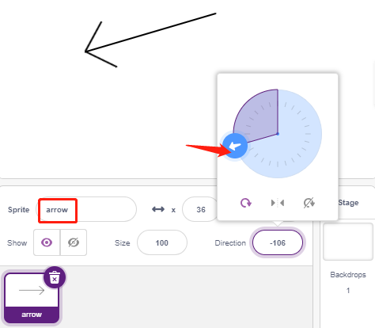
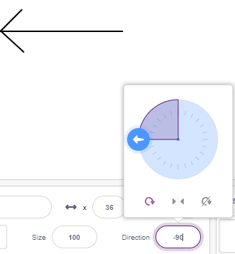
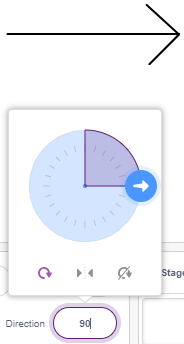
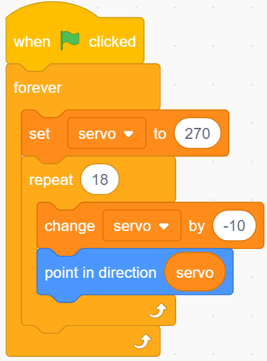
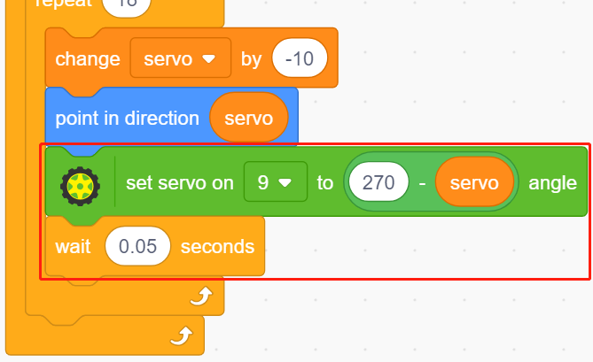
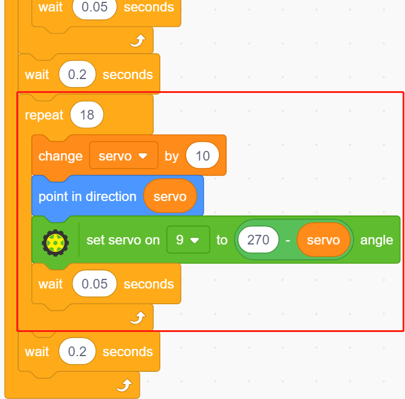

.. note:: 

    Hola, bienvenido a la comunidad de entusiastas de SunFounder Raspberry Pi, Arduino y ESP32 en Facebook. Profundiza en Raspberry Pi, Arduino y ESP32 junto a otros entusiastas.

    **¿Por qué unirse?**

    - **Soporte experto**: Resuelve problemas posventa y desafíos técnicos con ayuda de nuestra comunidad y equipo.
    - **Aprende y comparte**: Intercambia consejos y tutoriales para mejorar tus habilidades.
    - **Avances exclusivos**: Accede anticipadamente a anuncios de nuevos productos y adelantos.
    - **Descuentos especiales**: Disfruta de descuentos exclusivos en nuestros productos más recientes.
    - **Promociones y sorteos festivos**: Participa en sorteos y promociones especiales por festividades.

    👉 ¿Listo para explorar y crear con nosotros? Haz clic en [|link_sf_facebook|] y únete hoy mismo.

.. _pendulum:

2.11 Péndulo
=====================

En este proyecto, crearemos un péndulo de flecha mientras el servo sigue la rotación.

Lo que aprenderás
-------------------

- Cómo funciona el servo y su rango de ángulos.
- Dibujar un sprite y colocar el punto central en la cola.

Construir el Circuito
-------------------------

Un servo es un motor con engranajes que solo puede girar 180 grados. 
Se controla enviando pulsos eléctricos desde tu placa de circuito. 
Estos pulsos indican al servo a qué posición debe moverse.

El servo tiene tres cables: el cable marrón es GND, el rojo es VCC (conectado a 3.3V) y el naranja es el cable de señal. El rango de ángulo es de 0-180.

Construye el circuito según el siguiente diagrama.

* :ref:`cpn_breadboard`
* :ref:`cpn_servo`

Programación
---------------

**1. Dibuja un sprite**

Elimina el sprite predeterminado, selecciona el botón Sprite y haz clic en **Paint**. Aparecerá un sprite en blanco llamado **Sprite1**.

En la página **Costumes**, usa la herramienta **Line** para dibujar una flecha.

.. note::

    * Asegúrate de comenzar a dibujar la flecha desde el centro del lienzo hacia afuera para que la flecha gire en círculo con el punto central como origen.
    * Mantén presionada la tecla Shift para que el ángulo de la línea sea recto o de 45 grados.

Después de dibujar, el sprite **arrow** se mostrará en el escenario. Nómbralo **arrow**. Luego haz clic en el número después de **Direction**, aparecerá un dial circular. Ahora arrastra esta flecha y verifica si el sprite **arrow** en el escenario gira con la cola como origen.

Para que el sprite **arrow** oscile de izquierda a derecha, el rango de ángulo es de -90 a -180, 180 a 90.

**2. Crea una variable**

Crea una variable llamada **servo**, que almacenará el valor del ángulo y configura su valor inicial en 270.

**3. Oscila de izquierda a derecha**

Ahora haz que el sprite **arrow** oscile desde la posición -90 grados a la derecha hasta 90 grados.

Con el bloque [repeat], suma -10 a la variable cada vez, y alcanzarás los 90 grados en 18 iteraciones. Luego usa el bloque [point in direction] para hacer que el sprite flecha gire a estos ángulos.

Dado que el rango de rotación del sprite es de -180 ~ 180, los ángulos fuera de este rango se convierten bajo las siguientes condiciones:

* Si ángulo > 180, entonces ángulo -360.

**4. Gira el Servo**

Cuando hagas clic en la bandera verde, verás que la flecha gira rápidamente hacia la derecha y luego regresa hacia la izquierda. Usa un bloque [wait seconds] aquí para ralentizar la rotación. También utiliza el bloque [set servo on to angle] para hacer que el servo conectado a la placa Arduino gire a un ángulo específico.

**5. Oscila de derecha a izquierda**

De la misma manera, haz que el servo y el sprite **arrow** roten lentamente de derecha a izquierda.

* Si ángulo > 180, entonces ángulo -360.

