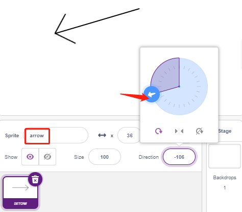

.. _pendulum:

2.11 Pendel
=====================

In diesem Projekt werden wir ein Pfeilpendel herstellen, während das Servo der Drehung folgt.

.. image:: img/12_pun.png

Sie werden lernen
---------------------

- Wie das Servo funktioniert und den Winkelbereich
- Zeichne ein Figur und lege den Mittelpunkt auf den Schwanz.

Baue die Schaltung
-----------------------

Ein Servo ist ein Getriebemotor, der sich nur um 180 Grad drehen kann. Er wird
gesteuert, indem er elektrische Impulse von deiner Platine sendet. Diese Pulse
sagen dem Servo, in welche Position es sich bewegen soll.

Der Servo hat drei Drähte: Der braune Draht ist GND, der rote ist VCC (an 3,3 V anschließen), und der orangefarbene ist der Signaldraht. Der Winkelbereich ist 0-180.

Baue nun die Schaltung entsprechend dem untenstehenden Diagramm auf.

.. image:: img/circuit/servo_circuit.png

* :ref:`cpn_breadboard`
* :ref:`cpn_servo` 

Programmierung
------------------

**1. Ein Figur malen**

Löschen Sie das Standard-Figur, wählen Sie den Figur-Button und klicken Sie auf **Paint**, ein leeres Figur **Figur1** wird erscheinen.

Verwenden Sie auf der geöffneten Seite **Costumes** das **Linie** werkzeug, um einen Pfeil zu zeichnen.

.. note::

    * Achten Sie darauf, dass Sie den Pfeil von der Mitte der Leinwand aus nach außen zeichnen, so dass der Pfeil sich in einem Kreis mit dem Mittelpunkt als Ursprung dreht.
    * Halten Sie die Umschalttaste gedrückt, um den Winkel der Linie gerade oder 45 Grad zu machen.

.. image:: img/12_paint2.png

Nach dem Zeichnen wird das Figur **arrow** auf der Bühne angezeigt, nenne es **arrow**. Dann klicke auf die Zahl hinter **Direction**, eine kreisförmige Skala wird erscheinen, ziehe nun diesen Pfeil und schaue, ob sich das **arrow**-Figur auf der Bühne mit dem Schwanz als Ursprung dreht.

Um den **arrow** von links nach rechts schwingen zu lassen, ist der Winkelbereich -90 bis -180, 180 bis 90.

.. image:: img/12_paint4.png

.. image:: img/12_paint5.png

**2. Erstellen einer Variablen**.

Erstellen Sie eine Variable namens **servo**, die den Winkelwert speichert und den Anfangswert auf 270 setzt.

**3. Schwingen von links nach rechts**

Lassen Sie nun das **arrow**-Figur von der linken -90-Grad-Position zur rechten 90-Grad-Position schwingen.

Mit dem [repeat]-Block fügst du jedes Mal -10 zur Variable hinzu, und du erreichst 90 Grad in 18 Durchläufen. Verwenden Sie dann [point in block], um das Pfeil-Figur in diesen Winkeln zu drehen.

Da der Figur-Drehwinkel -180 ~ 180 beträgt, werden Winkel außerhalb dieses Bereichs durch die folgenden Bedingungen umgewandelt.

* Wenn der Winkel > 180 ist, dann ist der Winkel -360.

**4. Drehen des Servos**

Wenn du auf die grüne Fahne klickst, wirst du sehen, dass sich der Pfeil schnell nach rechts und dann wieder nach links dreht, also verwende hier einen [wait seconds] Block, um die Drehung langsamer zu machen. Verwenden Sie auch den Block [set servo on to angle], um das an das Arduino-Board angeschlossene Servo in einem bestimmten Winkel drehen zu lassen.

.. image:: img/12_servo2.png

**5. Schwingen von rechts nach links**

Mit der gleichen Methode lassen Sie das Servo und das **arrow**-Figur langsam von rechts nach links rotieren.

* Wenn der Winkel > 180 ist, dann ist der Winkel -360.

