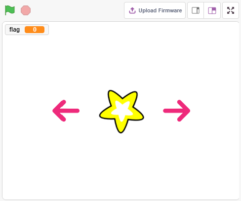
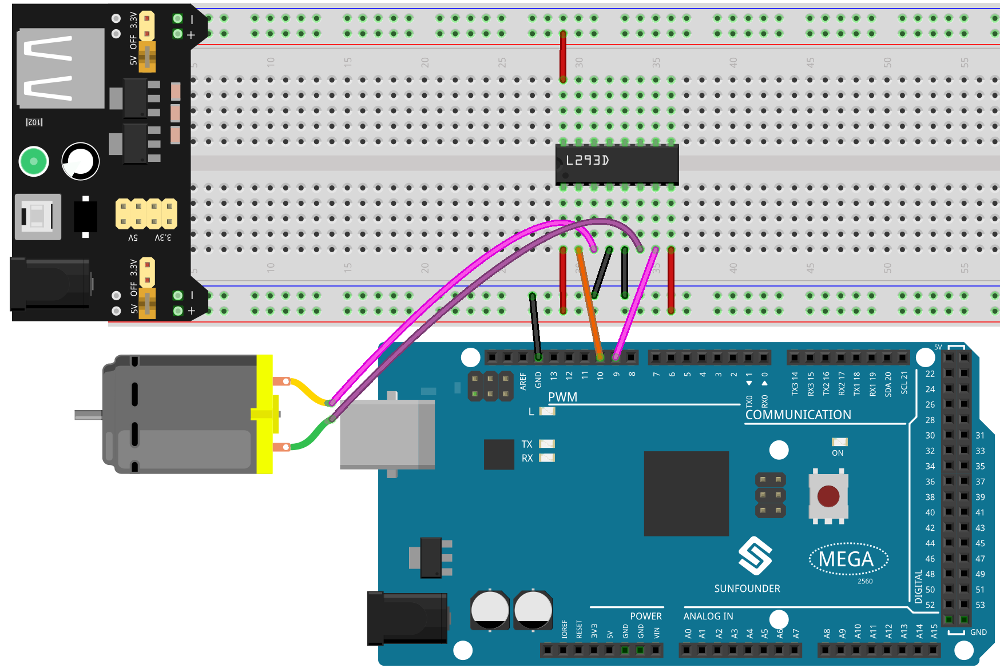
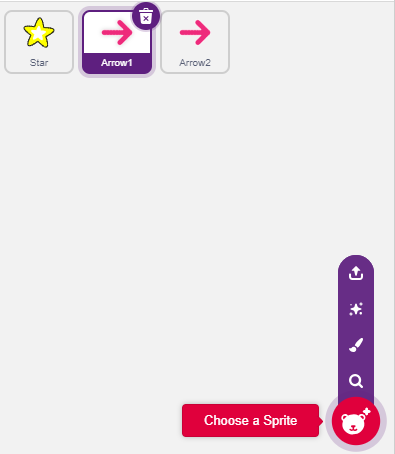
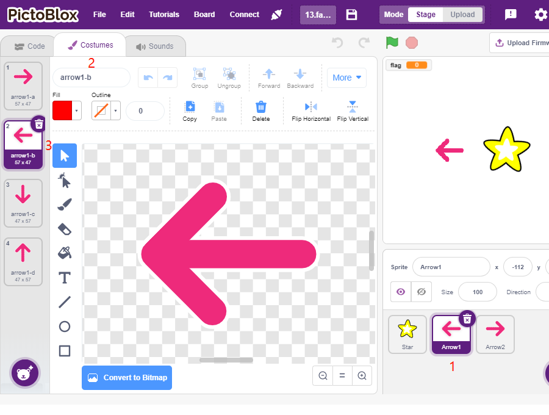
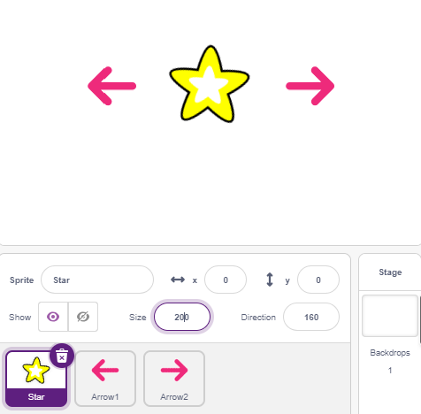
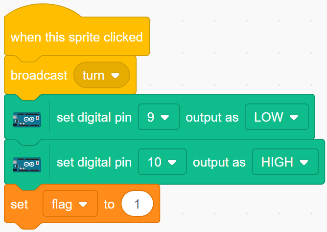
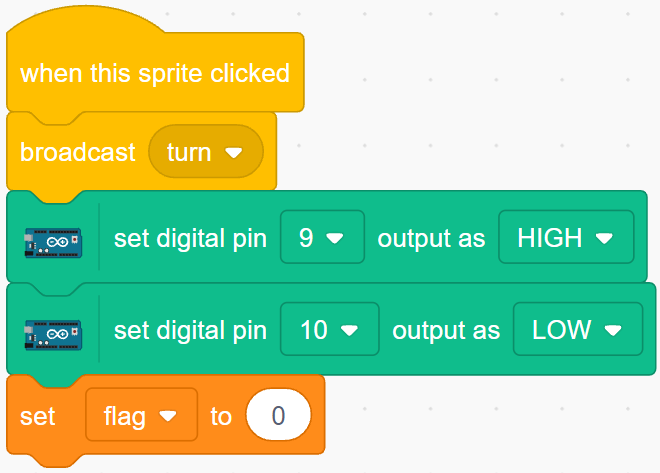
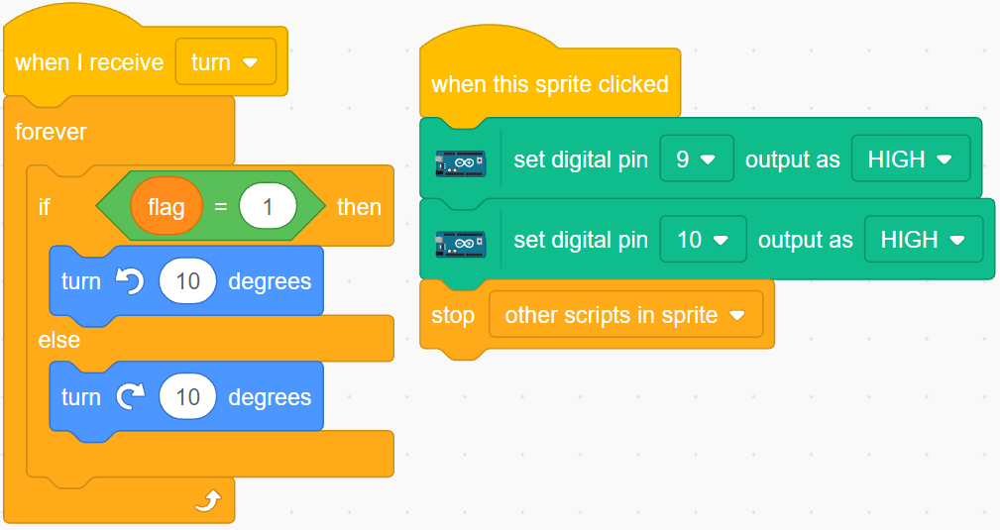

.. note:: 

    Bonjour et bienvenue dans la communauté des passionnés de SunFounder Raspberry Pi, Arduino et ESP32 sur Facebook ! Rejoignez d'autres passionnés pour explorer en profondeur les plateformes Raspberry Pi, Arduino et ESP32.

    **Pourquoi nous rejoindre ?**

    - **Support d'experts** : Résolvez vos problèmes après-vente et vos défis techniques avec l'aide de notre communauté et de notre équipe.
    - **Apprenez et partagez** : Échangez des astuces et des tutoriels pour perfectionner vos compétences.
    - **Aperçus exclusifs** : Accédez en avant-première aux annonces de nouveaux produits et aux exclusivités.
    - **Réductions spéciales** : Profitez de réductions exclusives sur nos derniers produits.
    - **Promotions et concours festifs** : Participez à des concours et des promotions spéciales.

    👉 Prêt à explorer et à créer avec nous ? Cliquez sur [|link_sf_facebook|] et rejoignez-nous dès aujourd'hui !

.. _rotating_fan:

2.11 Ventilateur Rotatif
===========================

Dans ce projet, nous allons créer un sprite en forme d'étoile qui tourne ainsi qu’un ventilateur.

En cliquant sur les flèches gauche et droite sur la scène, vous contrôlez la rotation dans le sens horaire et antihoraire du moteur et du sprite en étoile. Cliquez sur le sprite étoile pour arrêter la rotation.

Vous Apprendrez
------------------------

- Principe de fonctionnement du moteur
- Fonction de diffusion
- Bloquer les autres scripts dans le sprite

Construire le Circuit
-----------------------

Dans ce projet, le circuit utilise le pilote de moteur :ref:`cpn_l293d` pour faire tourner le moteur.

Le L293D est un pilote de moteur à 4 canaux avec une haute tension et un courant élevé.

Le schéma des broches est le suivant :

La broche **EN** est une broche d’activation qui fonctionne uniquement avec un signal de haut niveau ; **A** représente l’entrée et **Y** la sortie. Lorsque la broche **EN** est à un niveau haut, si **A** est haut, **Y** envoie un niveau haut ; si **A** est bas, **Y** envoie un niveau bas. Lorsque la broche **EN** est en niveau bas, le L293D est désactivé.

.. image:: img/13_l293d.png

Construisez le circuit en suivant le schéma ci-dessous.

* La broche Enable 1,2EN du L293D est déjà connectée à 3,3V, donc le L293D est toujours actif.
* Connectez les broches 1A et 2A aux broches 9 et 10 de la carte de contrôle, respectivement.
* Les deux broches du moteur sont reliées aux broches 1Y et 2Y respectivement.
* Lorsque la broche 10 est à un niveau haut et la broche 9 à un niveau bas, le moteur tourne dans un sens.
* Lorsque la broche 10 est bas et la broche 9 est haut, il tourne dans le sens inverse.

* :ref:`cpn_breadboard`
* :ref:`cpn_motor`
* :ref:`cpn_l293d` 

Programmation
------------------
L’effet recherché est d’utiliser deux sprites en forme de flèche pour contrôler la rotation horaire et antihoraire du moteur et de l'étoile. En cliquant sur le sprite étoile, le moteur s'arrête.

**1. Ajouter les sprites**

Supprimez le sprite par défaut, sélectionnez ensuite le sprite **Étoile** et le sprite **Flèche1**, puis copiez **Flèche1** une fois.

Dans l’option **Costumes**, changez la direction du sprite **Flèche1** en sélectionnant un costume différent.

Ajustez la taille et la position du sprite de manière appropriée.

**2. Sprite de la flèche gauche**

Quand ce sprite est cliqué, il diffuse un message - tourner, puis règle la broche numérique 9 à bas et la broche 10 à haut, en réglant la variable **flag** à 1. Si vous cliquez sur la flèche gauche, le moteur tournera dans le sens antihoraire ; si le mouvement est horaire, inversez les broches 9 et 10.

Deux points importants :

* `[broadcast <https://en.scratch-wiki.info/wiki/Broadcast>`_]: depuis la palette **Événements**, utilisée pour envoyer un message aux autres sprites. Lorsqu’ils reçoivent ce message, ils exécutent une action spécifique. Par exemple, ici, c’est **tourner** ; lorsque le sprite **étoile** reçoit ce message, il exécute le script de rotation.
* variable flag : La direction de rotation du sprite étoile dépend de la valeur de flag. En créant la variable **flag**, appliquez-la à tous les sprites.

**3. Sprite de la flèche droite**

Quand ce sprite est cliqué, il diffuse le message tourner, puis règle la broche numérique 9 à haut et la broche 10 à bas pour faire tourner le moteur dans le sens horaire et définit la variable **flag** à 0.

**4. Sprite étoile**

Ce script comporte deux événements :

* Quand le sprite **étoile** reçoit le message diffusé tourner, il vérifie la valeur de flag ; si flag est à 1, il tourne de 10 degrés à gauche, sinon il tourne dans l’autre sens. Puisqu’il est dans [FOREVER], il continuera de tourner.
* Quand on clique sur ce sprite, les deux broches du moteur sont réglées à haut pour l’arrêter, et il arrête les autres scripts dans ce sprite.

