.. note:: 

    Hola, bienvenido a la comunidad de entusiastas de SunFounder Raspberry Pi, Arduino y ESP32 en Facebook. Profundiza en Raspberry Pi, Arduino y ESP32 junto a otros entusiastas.

    **¿Por qué unirse?**

    - **Soporte experto**: Resuelve problemas posventa y desafíos técnicos con ayuda de nuestra comunidad y equipo.
    - **Aprende y comparte**: Intercambia consejos y tutoriales para mejorar tus habilidades.
    - **Avances exclusivos**: Accede anticipadamente a anuncios de nuevos productos y adelantos.
    - **Descuentos especiales**: Disfruta de descuentos exclusivos en nuestros productos más recientes.
    - **Promociones y sorteos festivos**: Participa en sorteos y promociones especiales por festividades.

    👉 ¿Listo para explorar y crear con nosotros? Haz clic en [|link_sf_facebook|] y únete hoy mismo.

.. _blow_ball:

2.12 Soplar la Pelota
=======================

En este proyecto, utilizaremos un sensor de sonido para hacer que la pelota en el escenario suba. Al soplar en el módulo del sensor de sonido, cuanto más vibración detecte, más alto volará la pelota. Cuando la pelota toque la cuerda, emitirá un agradable sonido acompañado de un destello de estrellas.

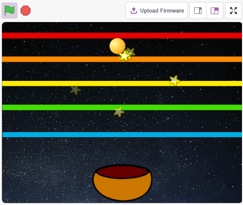

Lo que aprenderás
--------------------

- Cómo funciona el módulo de sonido y el rango de ángulo.
- Rellenar el sprite con colores.
- Detectar colisiones entre sprites.

Construir el Circuito
-------------------------

Un sensor de sonido se define como un módulo que detecta ondas sonoras mediante su intensidad y las convierte en señales eléctricas.

Este módulo tiene dos salidas:

* **AO**: salida analógica, señal de voltaje en tiempo real del micrófono.
* **DO**: cuando la intensidad del sonido alcanza un cierto umbral, la salida es una señal de nivel alto o bajo. La sensibilidad del umbral se puede ajustar con el potenciómetro.

Aquí utilizamos solo el pin AO. Ahora construye el circuito según el siguiente diagrama.

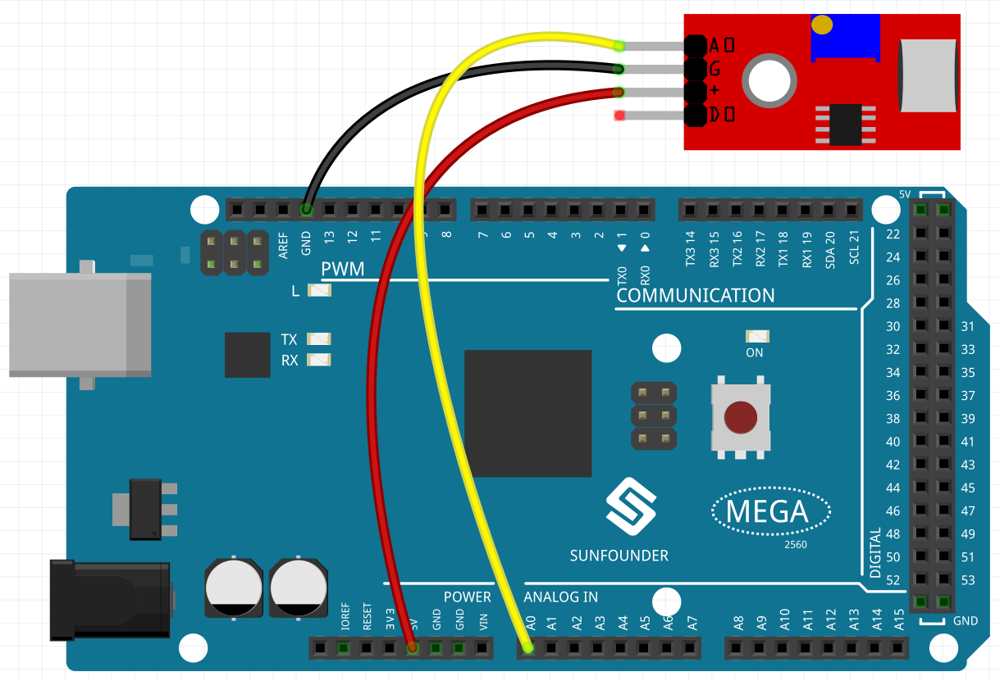

* :ref:`cpn_breadboard`
* :ref:`cpn_sound`

Programación
----------------

El efecto que queremos lograr es que al soplar en el sensor de sonido, el sprite de la pelota en el escenario suba, y si dejas de soplar, caerá sobre el sprite del cuenco. Si toca el sprite de la línea mientras sube o baja, emitirá un sonido musical y lanzará sprites de estrellas en todas direcciones.

**1. Selecciona el sprite y el fondo**

Elimina el sprite predeterminado, selecciona los sprites **Ball**, **Bowl** y **Star**.

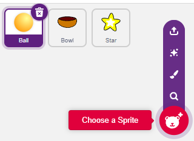

Mueve el sprite **Bowl** al centro inferior del escenario y aumenta su tamaño.

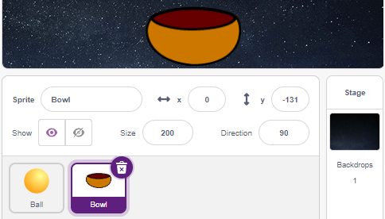

Dado que necesitamos moverlo hacia arriba, establece la dirección del sprite **Ball** en 0.

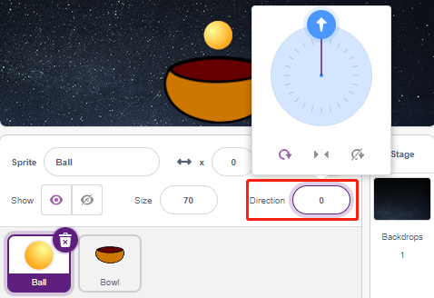

Establece el tamaño y la dirección del sprite **Star** en 180 porque necesitamos que caiga, o puedes cambiarlo a otro ángulo.

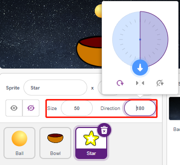

Ahora añade el fondo **Stars**.

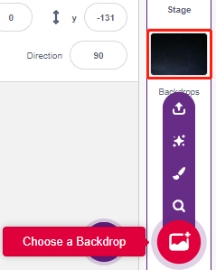

**2. Dibuja un sprite de línea**

Añade un sprite de línea.

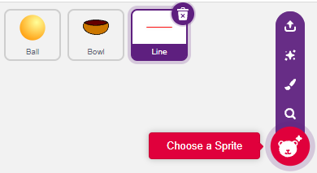

Ve a la página **Costumes** del sprite **Line**, reduce un poco el ancho de la línea roja en el lienzo, luego cópiala 5 veces y alinea las líneas.

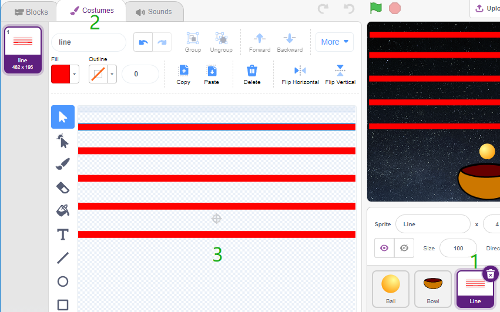

Rellena las líneas con diferentes colores. Primero elige un color, luego haz clic en la herramienta **Fill** y mueve el mouse sobre la línea para rellenarla.

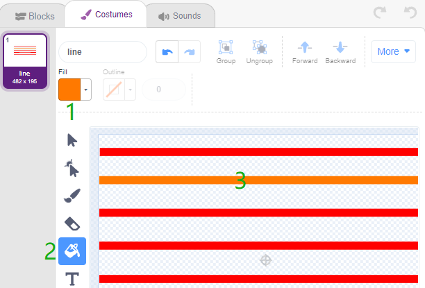

Sigue el mismo método para cambiar el color de las otras líneas.

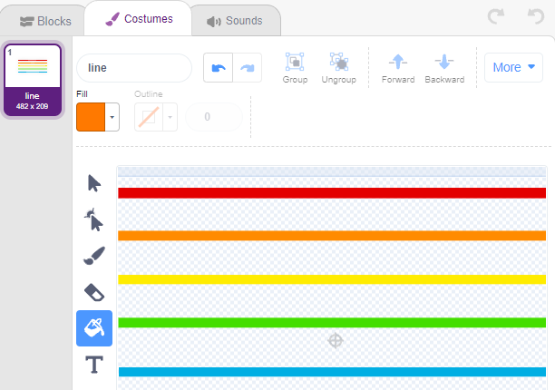

**3. Crear el script del sprite Ball**

Establece la posición inicial del sprite **Ball**, luego, cuando el valor del sensor de sonido sea mayor a 100 (puede ser otro valor dependiendo del entorno), haz que la pelota suba.

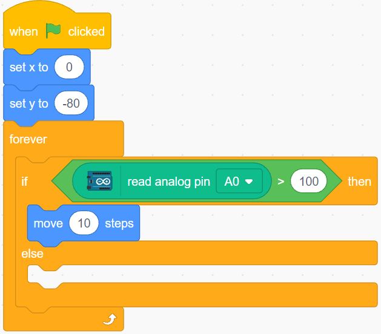

De lo contrario, el sprite **Ball** caerá y limita su coordenada Y a un mínimo de -100. Esto se puede modificar para que parezca que está cayendo sobre el sprite **Bowl**.

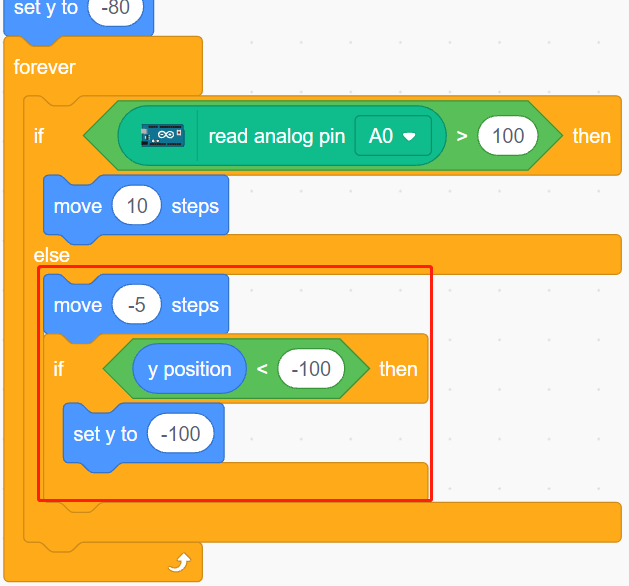

Cuando el sprite **Line** sea tocado, guarda la coordenada Y actual en la variable **ball_coor** y transmite un mensaje **Bling**.

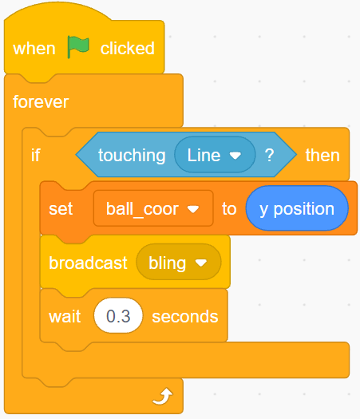

**4. Crear el script del sprite Star**

Cuando se inicie el script, primero oculta el sprite **Star**. Cuando reciba el mensaje **Bling**, clona el sprite **Star**.

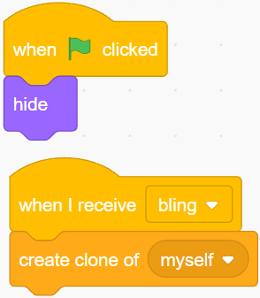

Cuando el sprite **Star** aparezca como un clon, reproduce el efecto de sonido y ajusta sus coordenadas para sincronizarlo con el sprite **Ball**.

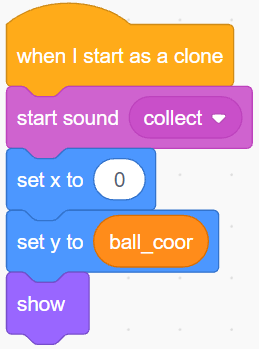

Crea el efecto del sprite **Star** apareciendo y ajusta según sea necesario.

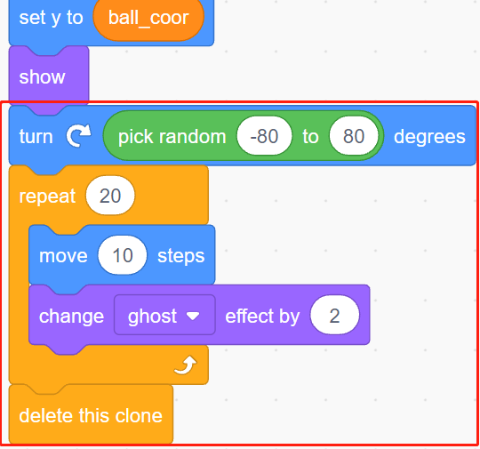