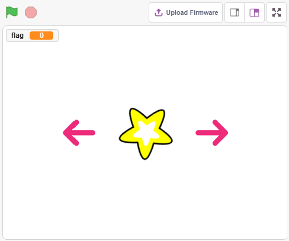
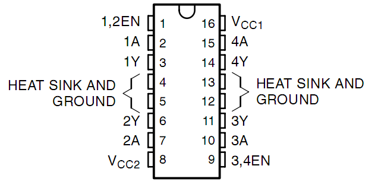
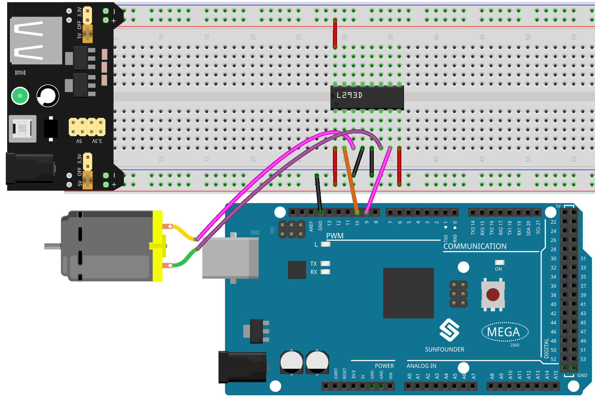
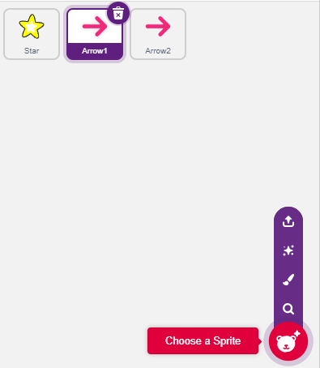
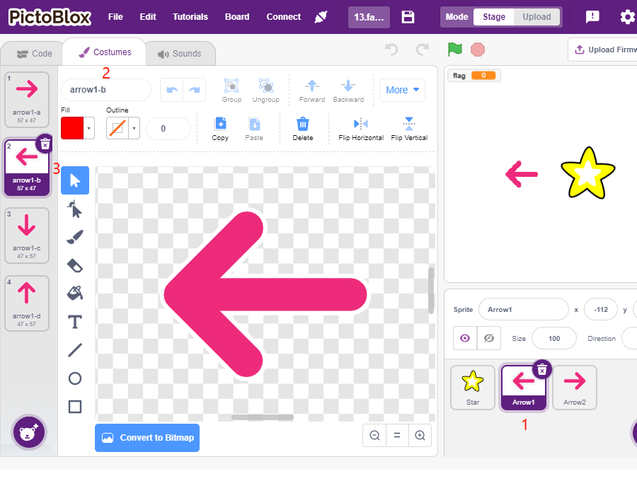
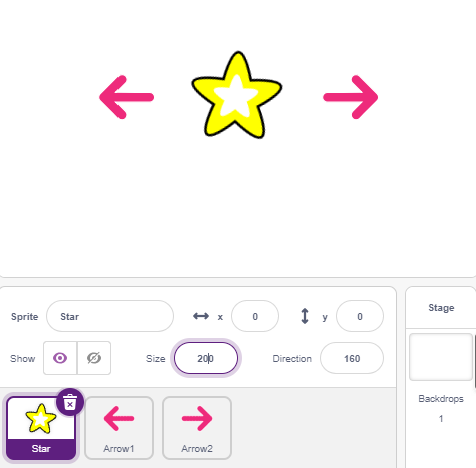
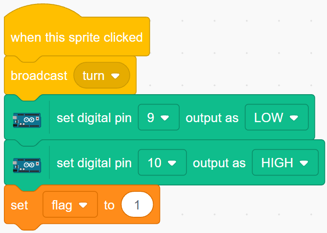
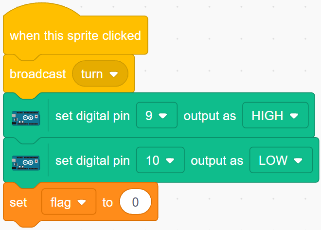
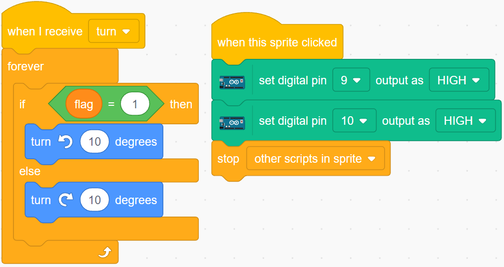

.. _rotating_fan:

2.12 Rotating Fan
========================

In this project, we will make a spinning star sprite and fan.

Clicking on the left and right arrow sprites on the stage will control the clockwise and counterclockwise rotation of the motor and star sprite, click on the star sprite to stop the rotation.

You Will Learn
---------------------

- Motor working principle
- Broadcast function
- Stop other script in sprite block

Build the Circuit
-----------------------

In this project, the motor driver chip :ref:`cpn_l293d` is used to make the motor rotate.

L293D is a 4-channel motor driver integrated by chip with high voltage and high current. 

Its pinouts are shown below: 

Pin **EN** is an enable pin and only works with high level; **A** stands for input and **Y** for output. When pin **EN** is High level, if **A** is High, **Y** outputs high level; if **A** is Low, **Y** outputs Low level. When pin **EN** is Low level, the L293D does not work.

Now build the circuit according to the following diagram.

* The Enable pin 1,2EN of the L293D are connected to 3.3V already, so L293D is always in the working state. 
* Connect pin 1A and 2A to pin 9 and 10 of the control board respectively. 
* The two pins of the motor are connected to pin 1Y and 2Y respectively. 
* When pin 10 is set as High level and pin 9 as Low, the motor will start to rotate towards one direction. 
* When the pin 10 is Low and pin 9 is High, it rotates in the opposite direction.

* :ref:`cpn_breadboard`
* :ref:`cpn_motor`
* :ref:`cpn_l293d` 

Programming
------------------
The effect we want to achieve is to use 2 arrow sprites to control the clockwise and counterclockwise rotation of the motor and the star sprite respectively, clicking on the star sprite will stop the motor from rotating.

**1. Add sprites**

Delete the default sprite, then select the **Star** sprite and the **Arrow1** sprite, and copy **Arrow1** once.

In the **Costumes** option, change the **Arrow1** sprite to a different direction costume.

Adjust the size and position of the sprite appropriately.

**2. Left arrow sprite**

When this sprite is clicked, it broadcasts a message - turn, then sets digital pin 9 to low and pin 10 to high, and sets the variable **flag** to 1. If you click the left arrow sprite, you will find that the motor turns counterclockwise, if your turn is clockwise, then you swap the positions of pin 9 and pin 10.

There are 2 points to note here.

* `[broadcast <https://en.scratch-wiki.info/wiki/Broadcast>`_]: from the **Events** palette, used to broadcast a message to the other sprites, when the other sprites receive this message, it will perform a specific event. For example, here is **turn**, when the **star** sprite receives this message, it executes the rotation script.
* variable flag: The direction of rotation of the star sprite is determined by the value of flag. So when you create the **flag** variable, you need to make it apply to all sprites.

**3. right-arrow sprite**

When this sprite is clicked, broadcast a message turn, then set digital pin 9 high and pin 10 low to make the motor turn clockwise and set the **flag** variable to 0.

**4. star sprite**

There are 2 events included here.

* When the **star** sprite receives the broadcasted message turn, it determines the value of flag; if flag is 1, it turns 10 degrees to the left, otherwise it reverses. Since it is in [FOREVER], it will keep turning.
* When this sprite is clicked, set both pins of the motor to high to make it stop rotating and stop the other scripts in this sprite.

