.. _blow_ball:

2.13 Pusteblume
==============================

In diesem Projekt verwenden wir einen Klangsensor, um den Ball auf der Bühne nach oben fliegen zu lassen. Puste in das Klangsensormodul, je mehr Vibration es spürt, desto höher kann der Ball fliegen. Wenn der Ball die Schnur berührt, gibt er ein schönes Geräusch und ein glitzerndes Sternenlicht ab.

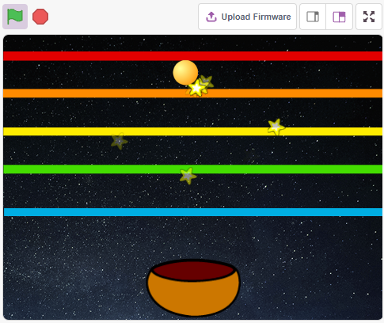

Du wirst lernen
---------------------

- Wie das Soundmodul funktioniert und den Winkelbereich
- Fülle das Figur mit Farben
- Berührung zwischen den Figurs

Den Schaltkreis aufbauen
------------------------------

Ein Schallsensor ist definiert als ein Modul, das Schallwellen anhand ihrer Intensität erkennt und in elektrische Signale umwandelt.

Dieses Modul hat zwei Ausgänge:

* **AO**: analoger Ausgang, Echtzeit-Ausgangsspannungssignal des Mikrofons.
* **DO**: wenn die Intensität des Schalls einen bestimmten Schwellenwert erreicht, wird ein Signal mit hohem oder niedrigem Pegel ausgegeben. Die Schwellenempfindlichkeit kann mit dem Potentiometer eingestellt werden.

Hier haben wir nur den AO-Pin verwendet, bauen Sie nun die Schaltung nach dem folgenden Schema auf.

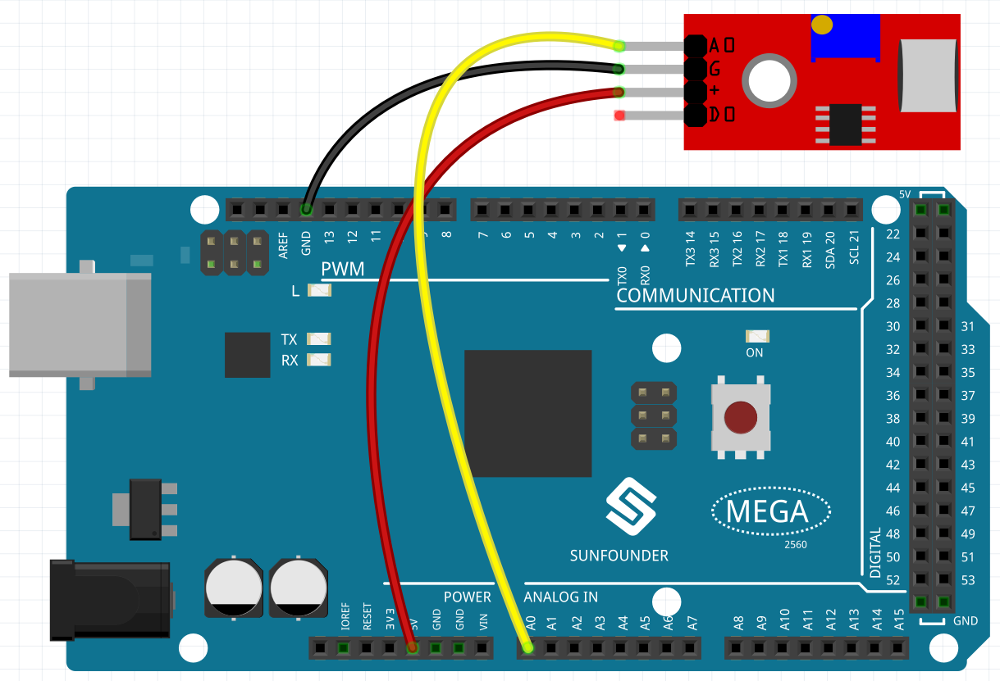

* :ref:`cpn_breadboard`
* :ref:`cpn_sound` 

Programmierung
------------------

Der Effekt, den wir erreichen wollen, ist, dass, wenn man in den Klangsensor pustet, das Ball-Figur auf der Bühne weiter nach oben geht, und wenn man aufhört zu pusten, fällt es auf das Schüssel-Figur. Wenn er das Linien-Figur berührt, während er aufsteigt oder herunterfällt, gibt er einen musikalischen Ton von sich und sendet **Star**-Figurs in alle Richtungen aus.

**1. Figur und Kulisse auswählen**

Löschen Sie das Standard-Figur, wählen Sie das **Ball**, **Bowl** und **Star** Figurs.

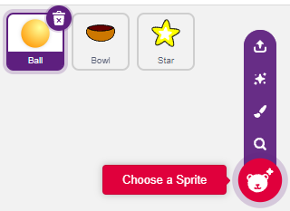

Verschiebe das Figur **Bowl** in die untere Mitte der Bühne und vergrößere es.

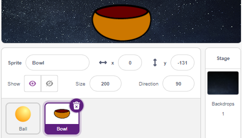

Weil wir ihn nach oben bewegen müssen, setzen wir die Richtung des **Ball**-Figur auf 0.

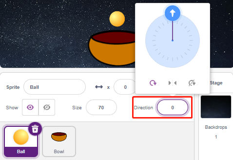

Setze die Größe und die Richtung des **Star**-Figur auf 180, weil er nach unten fallen soll, oder ändere den Winkel.

.. image:: img/18_ball12.png

Füge nun den **Stars**-Hintergrund hinzu.

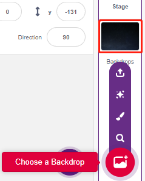

**2. Zeichne ein Linien-Figur**

Füge ein **Line**-Figur hinzu.

.. image:: img/18_ball7.png

Gehe auf die Seite **Costumes** des **Line**-Figur, verkleinere die Breite der roten Linie auf der Leinwand etwas, kopiere sie dann 5 Mal und richte die Linien aus.

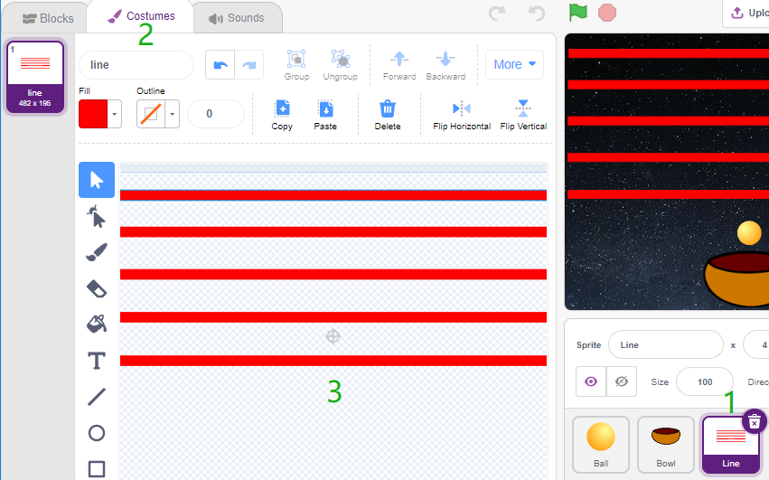

Fülle nun die Linien mit verschiedenen Farben. Wähle zunächst eine Farbe aus, die dir gefällt, klicke dann auf das Werkzeug **Fülleimer** und bewege die Maus über die Linie, um sie mit Farbe zu füllen.

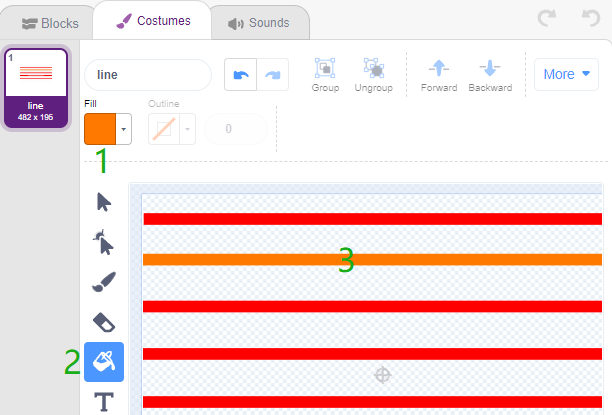

Gehen Sie genauso vor, um die Farbe der anderen Linien zu ändern.

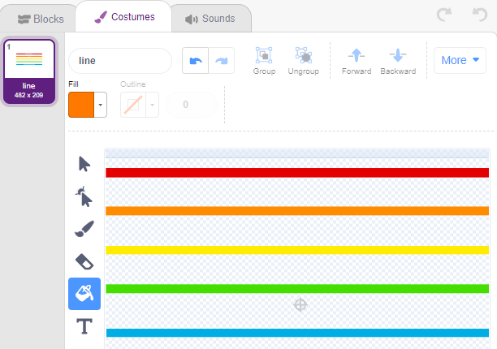

**3. Scripting des Ball-Figur**

Legen Sie die Anfangsposition des **Ball**-Figur fest. Wenn der Wert des Geräuschsensors größer als 100 ist (es kann auch ein anderer Wert sein, je nach der aktuellen Umgebung), lassen Sie den Ball nach oben fliegen.

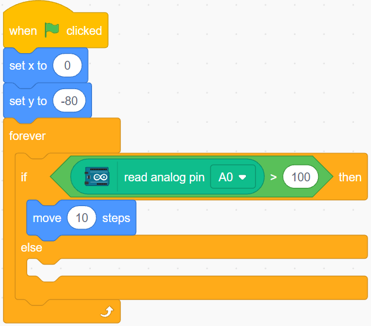

Andernfalls wird das Figur **Ball** fallen und seine Y-Koordinate auf ein Minimum von -100 begrenzen. Dies kann geändert werden, damit es so aussieht, als würde es auf das **Bowl**-Figur fallen.

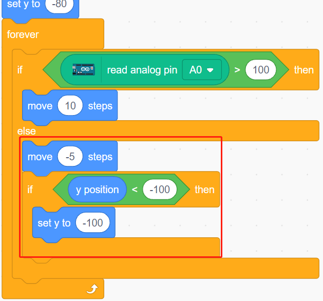

Wenn das Figur **Line** getroffen wird, wird die aktuelle Y-Koordinate in der Variablen **ball_coor** gespeichert und eine **Bling**-Nachricht gesendet.

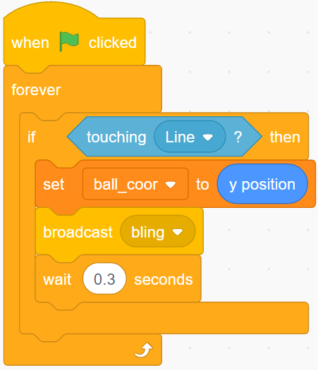

**4. Scripting des Star-Figur**

Wenn das Skript startet, verstecken Sie zunächst das **Star**-Figur. Wenn die Nachricht **Bling** empfangen wird, klone das **Star**-Figur.

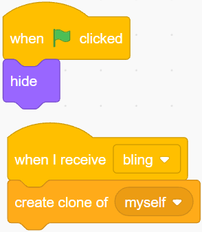

Wenn das **Star**-Figur als Klon erscheint, spiele den Soundeffekt ab und stelle seine Koordinaten so ein, dass sie mit dem **Ball**-Figur übereinstimmen.

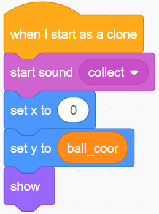

Erzeugen Sie den Effekt, dass das **Star**-Figur erscheint, und passen Sie ihn nach Bedarf an.

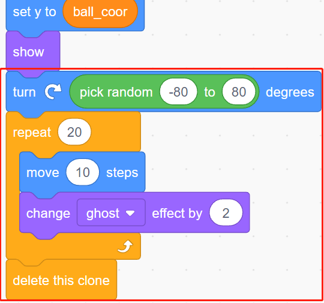