.. note:: 

    Hola, bienvenido a la comunidad de entusiastas de SunFounder Raspberry Pi, Arduino y ESP32 en Facebook. Profundiza en Raspberry Pi, Arduino y ESP32 junto a otros entusiastas.

    **¿Por qué unirse?**

    - **Soporte experto**: Resuelve problemas posventa y desafíos técnicos con ayuda de nuestra comunidad y equipo.
    - **Aprende y comparte**: Intercambia consejos y tutoriales para mejorar tus habilidades.
    - **Avances exclusivos**: Accede anticipadamente a anuncios de nuevos productos y adelantos.
    - **Descuentos especiales**: Disfruta de descuentos exclusivos en nuestros productos más recientes.
    - **Promociones y sorteos festivos**: Participa en sorteos y promociones especiales por festividades.

    👉 ¿Listo para explorar y crear con nosotros? Haz clic en [|link_sf_facebook|] y únete hoy mismo.

.. _shooting:

2.13 JUEGO - Disparos
========================

¿Has visto esos juegos de disparos en televisión? Cuanto más cerca esté el concursante de disparar al blanco central, mayor será su puntuación.

Hoy también haremos un juego de disparos en Scratch. En el juego, permite que la mira dispare lo más cerca posible al centro del blanco para obtener una mayor puntuación.

Haz clic en la bandera verde para comenzar. Usa el módulo de evitación de obstáculos para disparar una bala.

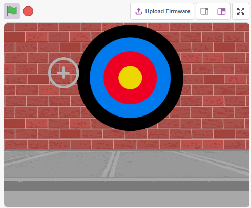

Lo que aprenderás
--------------------

- Cómo funciona el módulo de evitación de obstáculos y el rango de ángulo.
- Pintar diferentes sprites.
- Detectar colores.

Construir el Circuito
------------------------

El módulo de evitación de obstáculos es un sensor de proximidad por infrarrojos ajustable cuya salida es normalmente alta y baja cuando se detecta un obstáculo.

Construye el circuito según el diagrama siguiente.

.. image:: img/circuit/avoid_circuit.png

* :ref:`cpn_breadboard`
* :ref:`cpn_avoid`

Programación
--------------

**1. Pintar el sprite Crosshair**

Elimina el sprite predeterminado, selecciona el botón **Sprite** y haz clic en **Paint**, aparecerá un sprite en blanco llamado **Sprite1**, cámbiale el nombre a **Crosshair**.

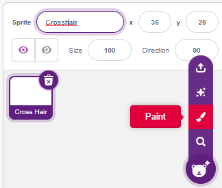

Ve a la página **Costumes** del sprite **Crosshair**. Haz clic en la herramienta **Circle**, elimina el color de relleno y establece el color y el ancho del contorno.

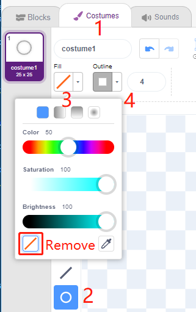

Ahora dibuja un círculo con la herramienta **Circle**. Después de dibujar, puedes hacer clic en la herramienta **Select** y mover el círculo para que el punto de origen se alinee con el centro del lienzo.

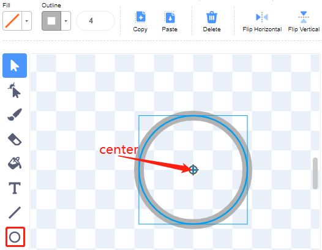

Usando la herramienta **Line**, dibuja una cruz dentro del círculo.

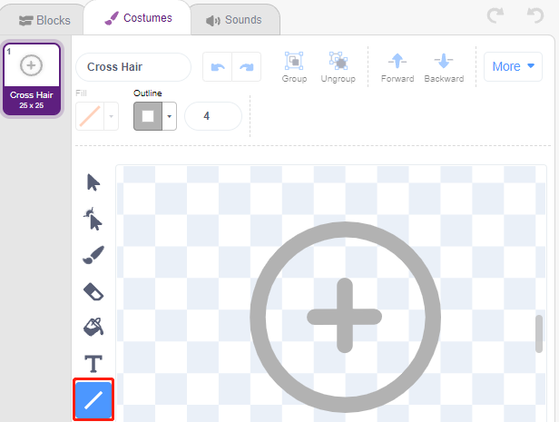

**Pintar el sprite Target**

Crea un nuevo sprite llamado **Target**.

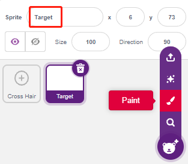

Ve a la página **Costumes** del sprite **Target**, haz clic en la herramienta **Circle**, selecciona un color de relleno y elimina el contorno. Dibuja un círculo grande.

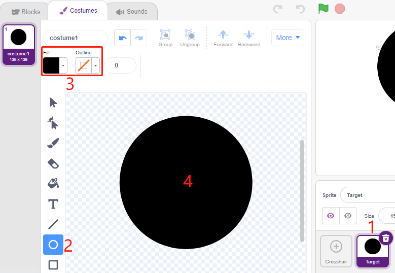

Usa el mismo método para dibujar círculos adicionales, cada uno con un color diferente. Puedes usar la herramienta **Forward** o **Backward** para cambiar la posición de los círculos superpuestos. Asegúrate de alinear el origen de todos los círculos con el centro del lienzo.

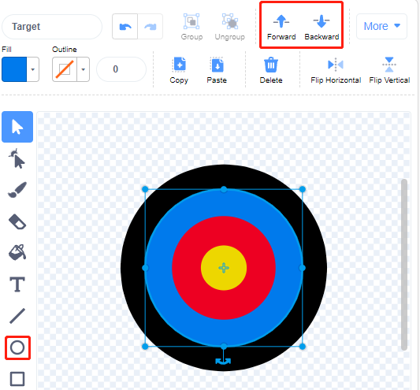

**3. Añadir un fondo**

Agrega un fondo adecuado que, preferiblemente, no tenga demasiados colores y no coincida con los colores del sprite **Target**. Aquí he elegido el fondo **Wall1**.

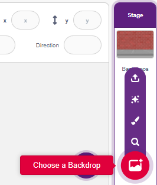

**4. Crear el script del sprite Crosshair**

Establece la posición y el tamaño aleatorios del sprite **Crosshair** y haz que se mueva de manera aleatoria.

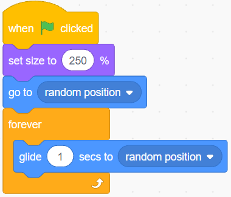

Cuando una mano se coloca frente al módulo de evitación de obstáculos, este emitirá un nivel bajo como señal de disparo.

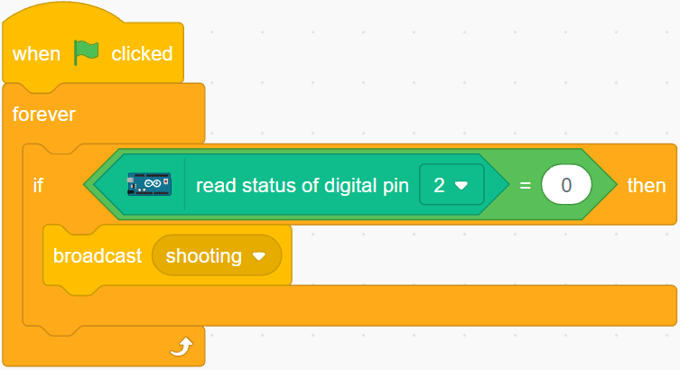

Cuando se reciba el mensaje **shooting**, el sprite dejará de moverse y se encogerá lentamente, simulando el efecto de una bala siendo disparada.

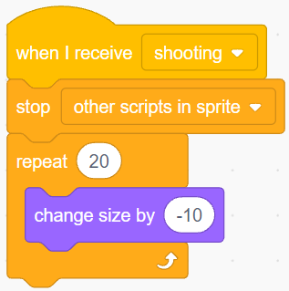

Usa el bloque [Touch color ()] para determinar la posición del disparo.

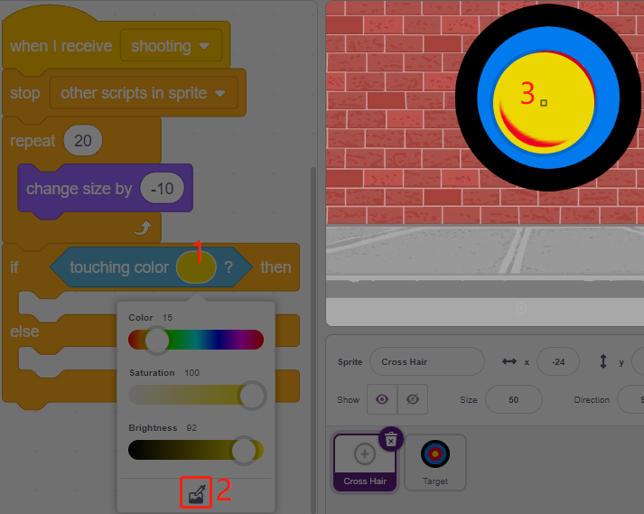

Cuando el disparo esté dentro del círculo amarillo, se reportarán 10 puntos.

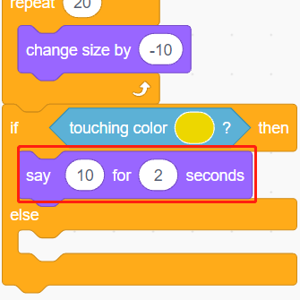

Usa el mismo método para determinar la posición del disparo. Si no se establece en el sprite **Target**, significa que está fuera del círculo.

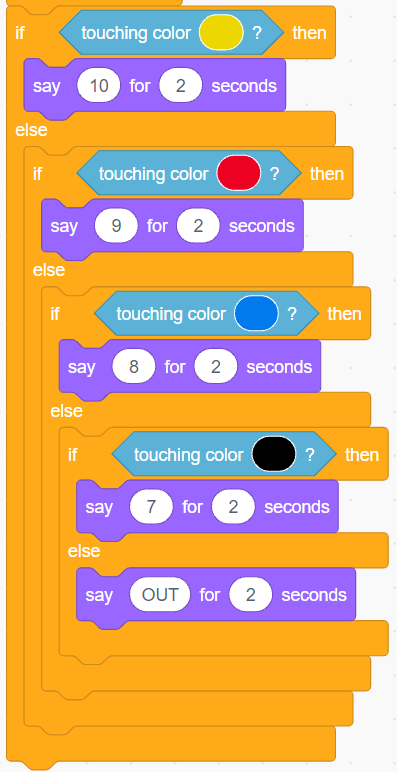