.. note::

    Ciao, benvenuto nella SunFounder Raspberry Pi & Arduino & ESP32 Enthusiasts Community su Facebook! Approfondisci Raspberry Pi, Arduino ed ESP32 con altri appassionati.

    **Perché unirti?**

    - **Supporto esperto**: Risolvi problemi post-vendita e sfide tecniche con l'aiuto della nostra comunità e del nostro team.
    - **Impara e condividi**: Scambia consigli e tutorial per migliorare le tue competenze.
    - **Anteprime esclusive**: Accedi in anteprima agli annunci di nuovi prodotti.
    - **Sconti speciali**: Approfitta di sconti esclusivi sui nostri prodotti più recenti.
    - **Promozioni festive e giveaway**: Partecipa a giveaway e promozioni festive.

    👉 Pronto a esplorare e creare con noi? Clicca [|link_sf_facebook|] e unisciti oggi!

.. _balloon:

2.14 GIOCO - Gonfiare il Palloncino
=========================================

Qui giocheremo a un gioco di gonfiaggio del palloncino.

Dopo aver cliccato sulla bandiera verde, il palloncino diventerà sempre più grande. Se il palloncino è troppo grande, esploderà; se è troppo piccolo, cadrà; devi giudicare quando toccare il modulo touch per farlo volare verso l'alto.

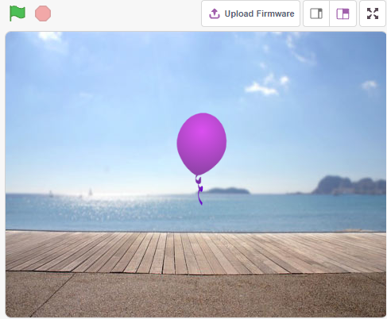

Cosa Imparerai
---------------------

- Come funziona il modulo touch e il range di angoli
- Disegnare costumi per lo sprite

Costruire il Circuito
-----------------------

Questo modulo è un modulo touch capacitivo basato su un sensore touch IC (TTP223B). In stato normale, il modulo emette un livello basso con basso consumo energetico; quando un dito tocca la posizione corrispondente, il modulo emette un livello alto e ritorna a livello basso quando il dito viene rilasciato.

Ora costruisci il circuito seguendo il diagramma sottostante.

.. image:: img/circuit/touch_circuit.png

* :ref:`cpn_breadboard`
* :ref:`cpn_touch` 

Programmazione
---------------

**1. Aggiungere uno sprite e uno sfondo**

Elimina lo sprite predefinito, clicca sul pulsante **Scegli uno Sprite** nell'angolo in basso a destra dell'area sprite, quindi seleziona lo sprite **Balloon1**.

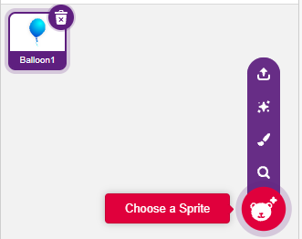

Aggiungi uno sfondo **Boardwalk** tramite il pulsante **Scegli uno sfondo**, o altri sfondi che preferisci.

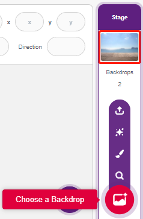

**2. Disegnare un costume per lo sprite Balloon1**

Ora disegniamo un effetto esplosione per lo sprite palloncino.

Vai alla pagina **Costumi** dello sprite **Balloon1**, clicca sul pulsante **Scegli un Costume** nell'angolo in basso a sinistra e seleziona **Disegna** per creare un **Costume** vuoto.

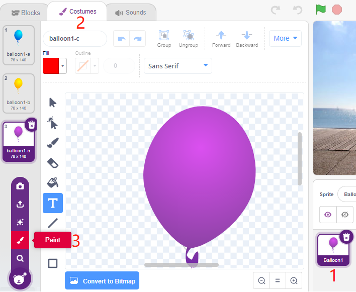

Seleziona un colore e usa lo strumento **Pennello** per disegnare un motivo.

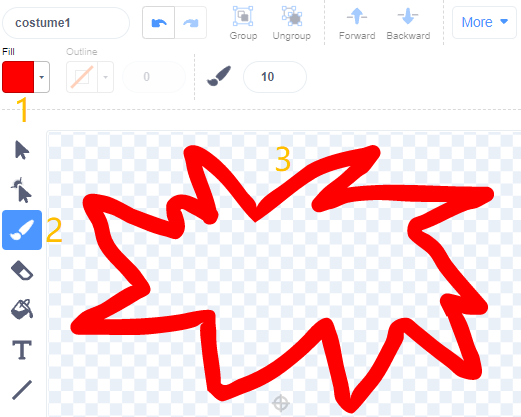

Seleziona nuovamente un colore, clicca sullo strumento Riempimento e sposta il mouse all'interno del motivo per riempirlo con un colore.

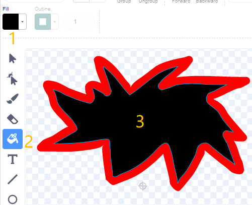

Infine, scrivi il testo BOOM, così il costume dell'effetto esplosione è completo.

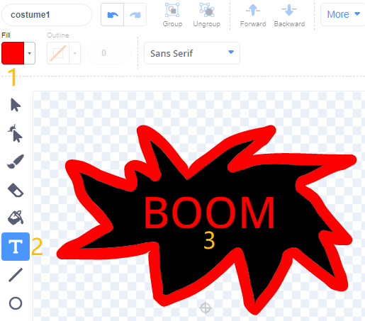

**3. Script dello sprite Balloon**

Imposta la posizione iniziale e la dimensione dello sprite **Balloon1**.

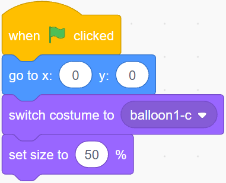

Poi lascia che lo sprite **Balloon** cresca lentamente.

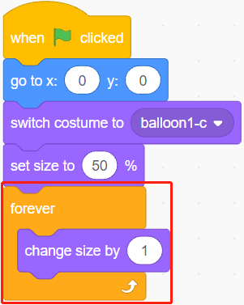

Quando il modulo touch viene toccato (valore uguale a 1), la dimensione dello sprite **Balloon1** smette di crescere.

* Quando la dimensione è inferiore a 90, cadrà (la coordinata y diminuisce).
* Quando la dimensione è maggiore di 90 e inferiore a 120, volerà verso l'alto (la coordinata y aumenta).

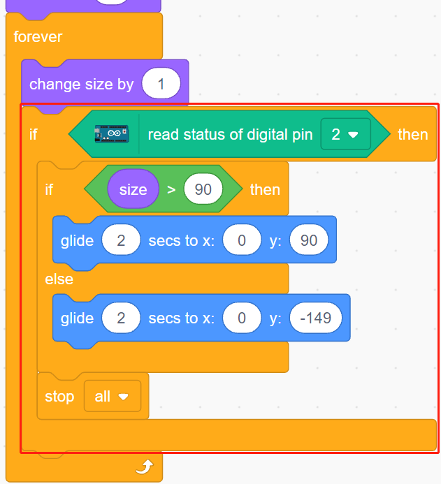

Se il modulo touch non viene toccato, il palloncino crescerà lentamente e quando la dimensione supera 120, esploderà (passando al costume dell'effetto esplosione).

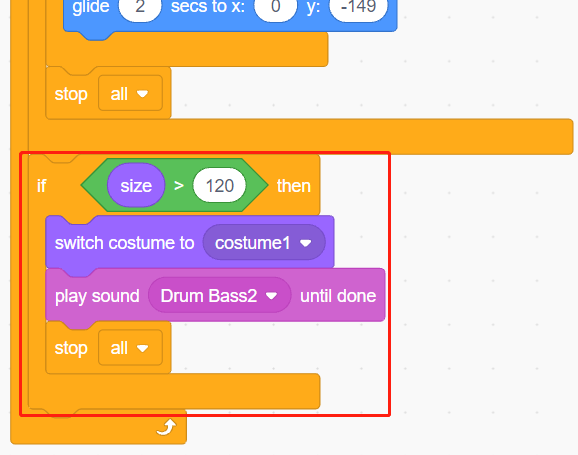
