.. _shooting:

2.14 GAME - Shooting
====================================

Have you seen those shooting games on TV? The closer a contestant shoots a bullet on the target to the bullseye, the higher his score.

Today we are also doing a shooting game in Scratch. In the game, let the Crosshair shoot as far as possible to the bullseye to get a higher score.

Click on the green flag to start. Use the Obstacle Avoidance module to shoot an bullet.

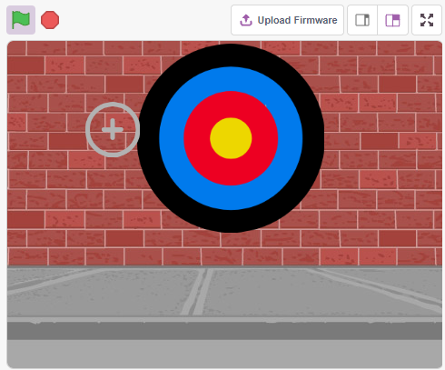

You Will Learn
---------------------

- How the Obstacle Avoidance module works and the angle range
- Paint different sprites
- Touch colors

Build the Circuit
-----------------------

The obstacle avoidance module is a distance-adjustable infrared proximity sensor whose output is normally high and low when an obstacle is detected.

Now build the circuit according to the diagram below.

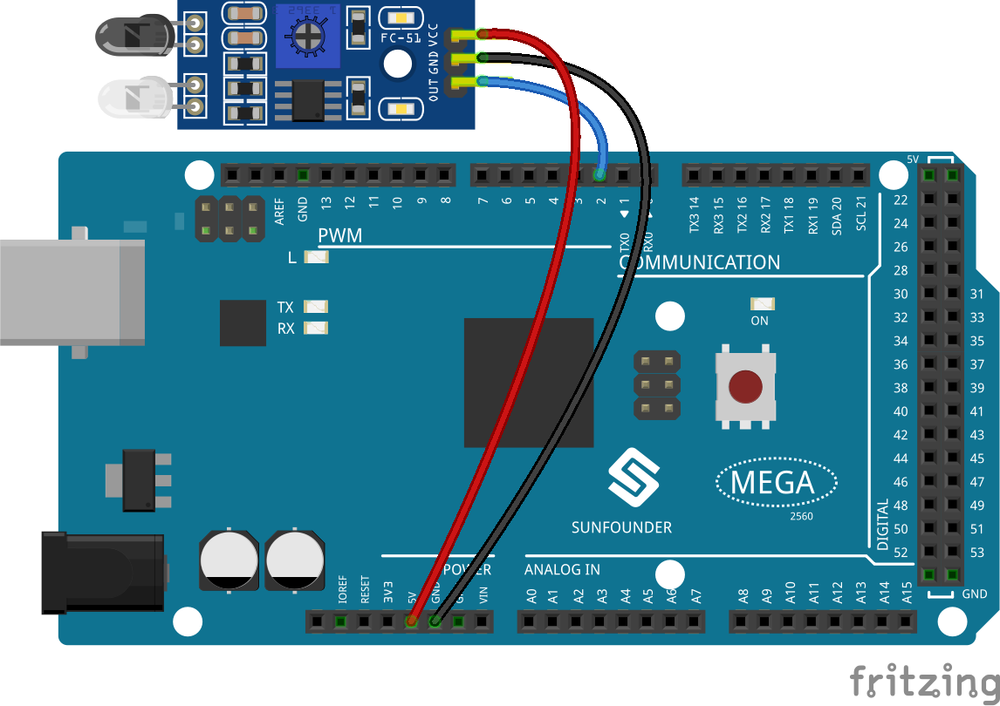

* :ref:`cpn_breadboard`
* :ref:`cpn_avoid` 

Programming
------------------

**1. Paint the Crosshair sprite**

Delete the default sprite, select the **Sprite** button and click **Paint**, a blank sprite **Sprite1** will appear and name it **Crosshair**.

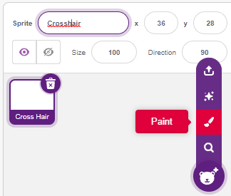

Go to the **Crosshair** sprite's **Costumes** page. Click on the **Circle** tool, remove the fill color, and set the color and width of the outline.

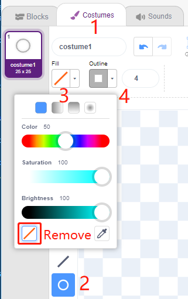

Now draw a circle with the **Circle** tool. After drawing, you can click to the **Select** tool and move the circle so that the original point is aligned with the center of the canvas.

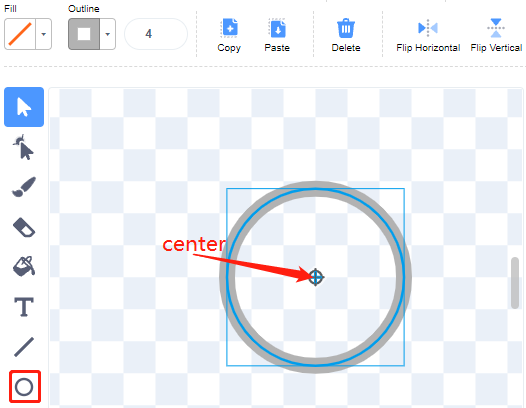

Using the **Line** tool, draw a cross inside the circle.

.. image:: img/14_shooting033.png

**Paint the Target sprite**

Create a new sprite called **Target** sprite.

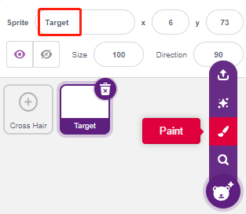

Go to the Costumes page of the **Target** sprite, click on the **Circle** tool, select a fill color and remove the Outline and paint a large circle.

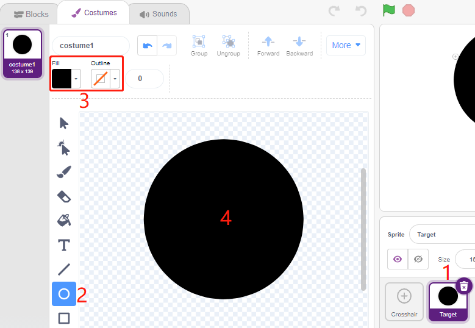

Use the same method to draw additional circles, each with a different color, and you can use the **Forward** or **Backbard** tool to change the position of the overlapping circles. Note that you also need to select the tool to move the circles, so that the origin of all the circles and the center of the canvas are aligned.

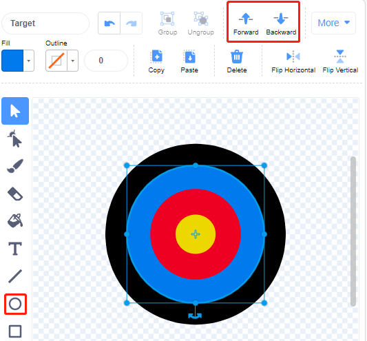

**3. Add a backdrop**

Add a suitable background which preferably does not have too many colors and does not match the colors in the **Target** sprite. Here I have chosen **Wall1** backdrop.

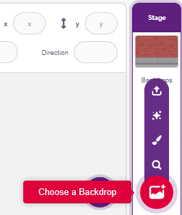

**4. Script the Crosshair sprite**

Set the random position and size of the **Crosshair** sprite, and let it move randomly.

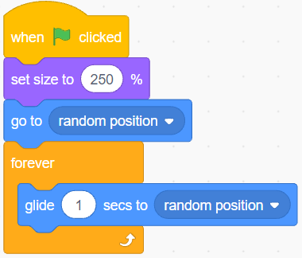

When a hand is placed in front of the obstacle avoidance module, it will output a low level as a transmit signal.

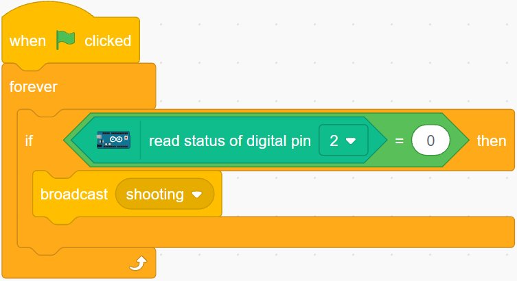

When the **shooting** message is received, the sprite stops moving and slowly shrinks, thus simulating the effect of a bullet being shot.

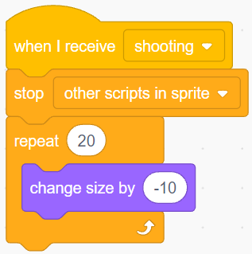

Use the [Touch color ()] block to determine the position of the shot.

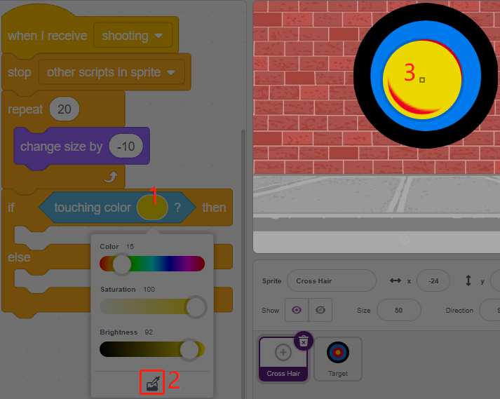

When the shot is inside the yellow circle, 10 is reported.

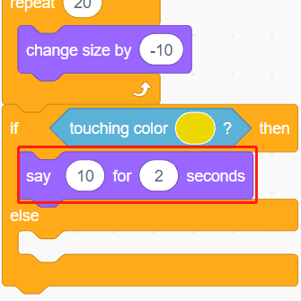

Use the same method to determine the position of the bullet shot, if it is not set on the **Target** sprite, it means it is out of the circle.

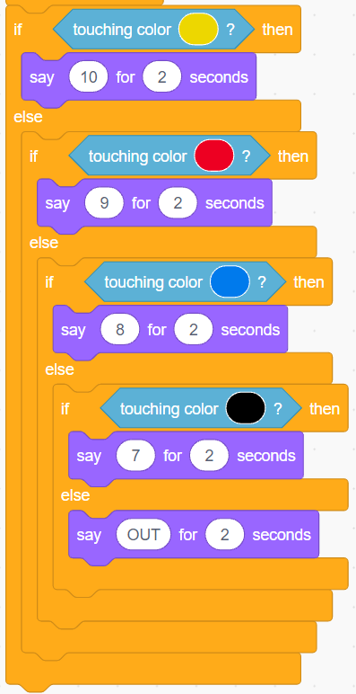