.. _balloon:

2.15 GAME - Inflating the Balloon
=========================================

Here, we will play a game of ballooning.

After clicking the green flag, the balloon will become bigger and bigger. If the balloon is too big, it will be blown up; if the balloon is too small, it will fall down; you need to judge when to touch on the touch module to make it fly upwards.

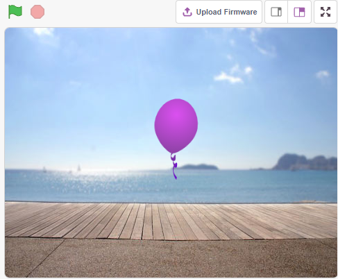

You Will Learn
---------------------

- How the Touch module works and the angle range
- Paint costume for the sprite

Build the Circuit
-----------------------

This module is a capacitive touch switch module based on a touch sensor IC (TTP223B). In the normal state, the module outputs a low level with low power consumption; when a finger touches the corresponding position, the module outputs a high level and becomes low level again after the finger is released.

Now build the circuit according to the diagram below.

.. image:: img/circuit/touch_circuit.png

* :ref:`cpn_breadboard`
* :ref:`cpn_touch` 

Programming
------------------

**1. Add a sprite and a backdrop**

Delete the default sprite, click the **Choose a Sprite** button in the lower right corner of the sprite area, then select the **Balloon1** sprite.

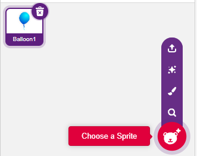

Add a **Boardwalk** backdrop via the **Choose a backdrop** button, or other backbackdrops you like.

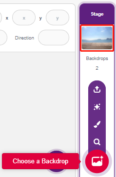

**2. Paint a costume for the Balloon1 sprite**

Now let's draw an exploding effect costume for the balloon sprite.

Go to the **Costumes** page for the **Balloon1** sprite, click the **Choose a Costume** button in the bottom left corner, and select **Paint** to bring up a blank **Costume**.

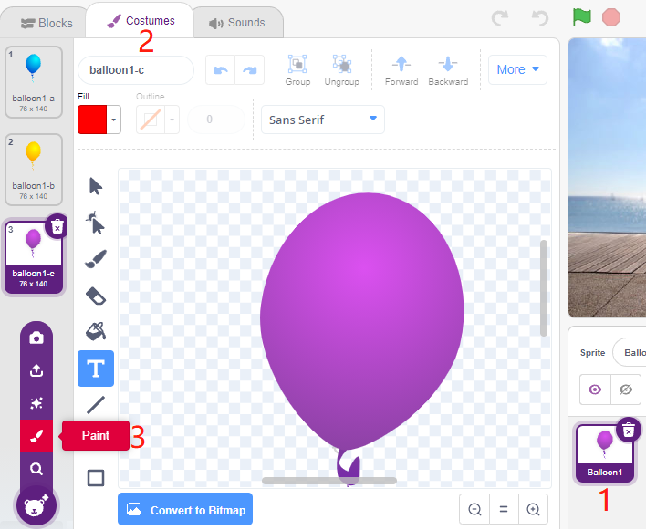

Select a color and then use the **Brush** tool to draw a pattern.

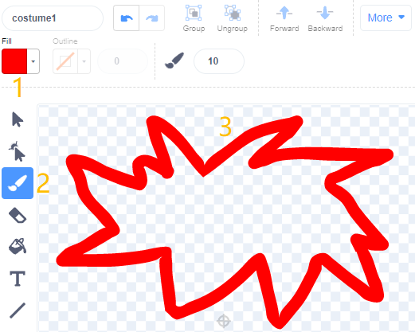

Select a color again, click the Fill tool, and move the mouse inside the pattern to fill it with a color.

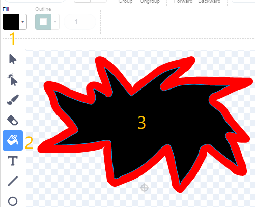

Finally, write the text BOOM, so that an explosion effect costume is complete.

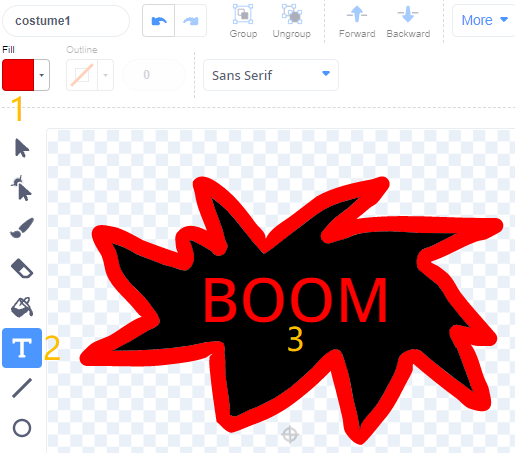

**3. Scripting the Balloon sprite**

Set the initial position and size of the **Balloon1** sprite.

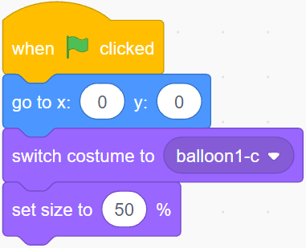

Then let the **Balloon** sprite slowly get bigger.

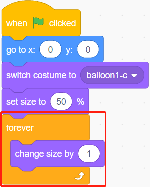

When the touch module is touched (value is 1), the size of the **Balloon1** sprite stops getting bigger.

* When the size is less than 90, it will fall (y coordinate decreases).
* When the size is bigger than 90 and smaller than 120, it will fly to the sky (y coordinate increases).

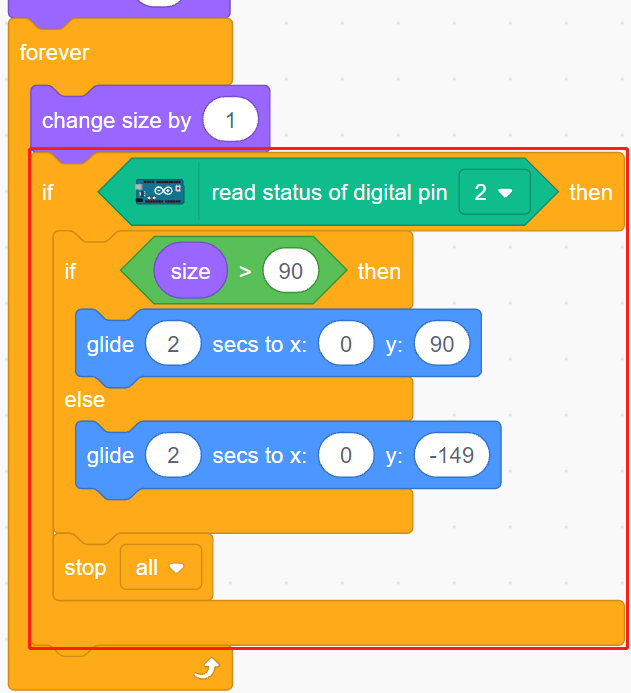

If the touch module has not been touched, the balloon slowly gets bigger and when the size is bigger than 120, it will explode (switch to the explode effect costume).

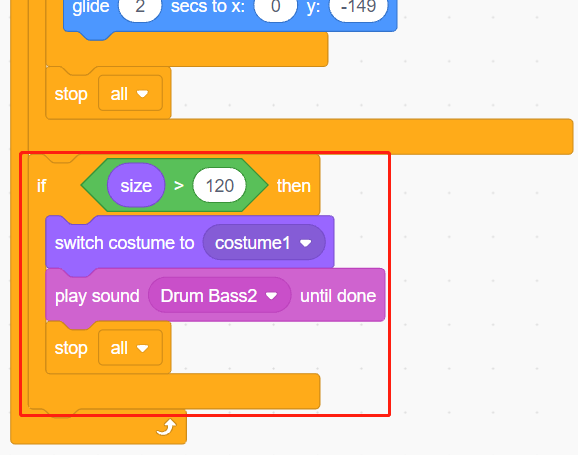

