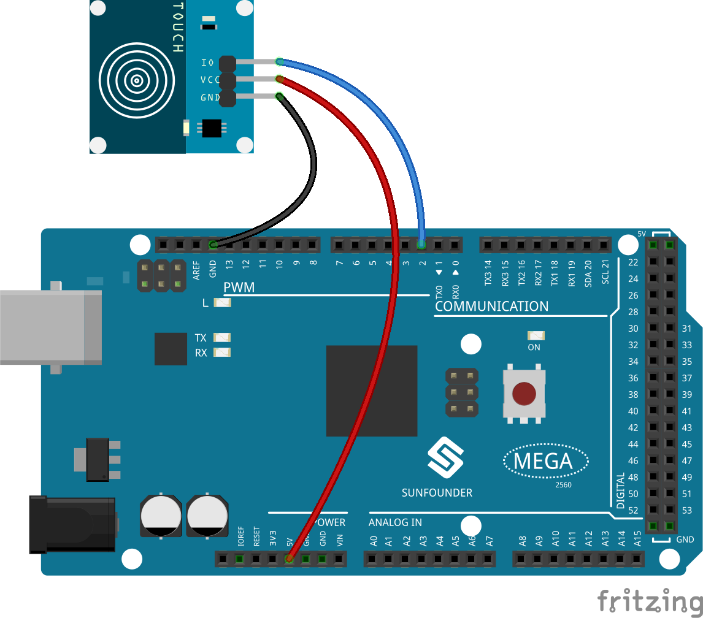

.. _balloon:

2.15 SPIEL - Aufblasen des Ballons
=========================================

Hier spielen wir ein Spiel mit einem Luftballon.

Nachdem du auf die grüne Flagge geklickt hast, wird der Ballon immer größer. Wenn der Ballon zu groß ist, wird er aufgeblasen; wenn er zu klein ist, fällt er herunter; du musst einschätzen, wann du das Touchmodul berühren musst, damit er nach oben fliegt.

Sie werden lernen
---------------------

- Wie das Berührungsmodul funktioniert und den Winkelbereich
- Bemalen des Kostüms für den Figur

Den Schaltkreis aufbauen
-----------------------------

Dieses Modul ist ein kapazitiver Berührungsschalter, der auf einem Berührungssensor-IC (TTP223B) basiert. Im Normalzustand gibt das Modul einen niedrigen Pegel mit geringem Stromverbrauch aus; wenn ein Finger die entsprechende Stelle berührt, gibt das Modul einen hohen Pegel aus und wird wieder zu einem niedrigen Pegel, wenn der Finger losgelassen wird.

Bauen Sie nun die Schaltung nach dem untenstehenden Schema auf.

* :ref:`cpn_breadboard`
* :ref:`cpn_touch` 

Programmierung
------------------

**1. Hinzufügen eines Figurs und eines Hintergrundes**

Löschen Sie das Standard-Figur, klicken Sie auf die Schaltfläche **Choose a Sprite** in der unteren rechten Ecke des Figur-Bereichs und wählen Sie dann das Figur **Ballon1**.

.. image:: img/13_balloon1.png

Füge einen **Boardwalk**-Hintergrund über die Schaltfläche **Choose a Backdrop** hinzu, oder andere Hintergrundbilder, die du magst.

.. image:: img/13_balloon2.png

**2. Male ein Kostüm für den Ballon1-Figur**

Zeichnen wir nun ein Kostüm mit Explosionseffekt für das Ballon-Figur.

Gehen Sie auf die Seite **(Costumes)Kostüme** für das Figur **Ballon1**, klicken Sie auf die Schaltfläche **Wählen ein Kostüm** in der unteren linken Ecke und wählen Sie **Paint(Malen)**, um ein leeres **Constume1(Kostüm)** zu erstellen.

.. image:: img/13_balloon7.png

Wähle eine Farbe und verwende dann das **Pinsel**-Werkzeug, um ein Muster zu zeichnen.

.. image:: img/13_balloon3.png

Wählen Sie erneut eine Farbe aus, klicken Sie auf das Werkzeug **Fülleimer** und bewegen Sie die Maus innerhalb des Musters, um es mit einer Farbe zu füllen.

.. image:: img/13_balloon4.png

Zum Schluss schreiben Sie den Text **BOOM**, damit das Kostüm mit dem Explosionseffekt fertig ist.

.. image:: img/13_balloon5.png

**3. Scripting des Ballon-Figur**

Legen Sie die Anfangsposition und Größe des Figur **Ballon1** fest.

.. image:: img/13_balloon6.png

Dann lass das **Ballon**-Figur langsam größer werden.

.. image:: img/13_balloon8.png

Wenn das Touch-Modul berührt wird (Wert ist 1), wird das Figur **Ballon1** nicht mehr größer.

* Wenn die Größe kleiner als 90 ist, fällt es (die y-Koordinate sinkt).
* Wenn die Größe größer als 90 und kleiner als 120 ist, fliegt er in den Himmel (y-Koordinate erhöht sich).

.. image:: img/13_balloon9.png

Wenn das Berührungsmodul nicht berührt wurde, wird der Ballon langsam größer und wenn er größer als 120 ist, explodiert er (Wechsel zum Kostüm mit Explosionseffekt).

.. image:: img/13_balloon10.png

