.. note:: 

    Hola, bienvenido a la comunidad de entusiastas de SunFounder Raspberry Pi, Arduino y ESP32 en Facebook. Profundiza en Raspberry Pi, Arduino y ESP32 junto a otros entusiastas.

    **¿Por qué unirse?**

    - **Soporte experto**: Resuelve problemas posventa y desafíos técnicos con ayuda de nuestra comunidad y equipo.
    - **Aprende y comparte**: Intercambia consejos y tutoriales para mejorar tus habilidades.
    - **Avances exclusivos**: Accede anticipadamente a anuncios de nuevos productos y adelantos.
    - **Descuentos especiales**: Disfruta de descuentos exclusivos en nuestros productos más recientes.
    - **Promociones y sorteos festivos**: Participa en sorteos y promociones especiales por festividades.

    👉 ¿Listo para explorar y crear con nosotros? Haz clic en [|link_sf_facebook|] y únete hoy mismo.

.. _star_crossed:

2.15 JUEGO - Cruzando Estrellas
=================================

En los próximos proyectos, jugaremos algunos mini-juegos divertidos en PictoBlox.

Aquí utilizamos el módulo de Joystick para jugar un juego llamado "Cruzando Estrellas".

Después de iniciar el guion, aparecerán estrellas aleatoriamente en el escenario. Necesitarás usar el Joystick para controlar la nave espacial **Rocketship** y evitar las estrellas. Si la tocas, el juego terminará.

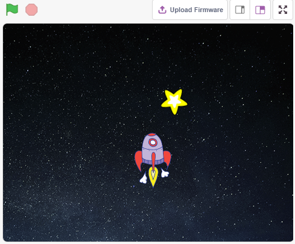

Lo que aprenderás
--------------------

- Cómo funciona el módulo Joystick.
- Configurar las coordenadas x e y de un sprite.

Construir el Circuito
------------------------

Un joystick es un dispositivo de entrada que consiste en una palanca que pivota sobre una base y reporta su ángulo o dirección al dispositivo que controla. Los joysticks a menudo se utilizan para controlar videojuegos y robots.

Para comunicar un rango completo de movimiento a la computadora, un joystick necesita medir la posición de la palanca en dos ejes: el eje X (izquierda a derecha) y el eje Y (arriba a abajo).

Las coordenadas de movimiento del joystick se muestran en la siguiente figura.

.. note::

    * La coordenada x va de izquierda a derecha, con un rango de 0-1023.
    * La coordenada y va de arriba a abajo, con un rango de 0-1023.

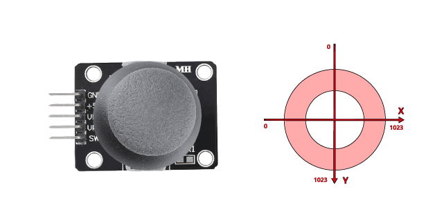

Construye el circuito según el siguiente diagrama.

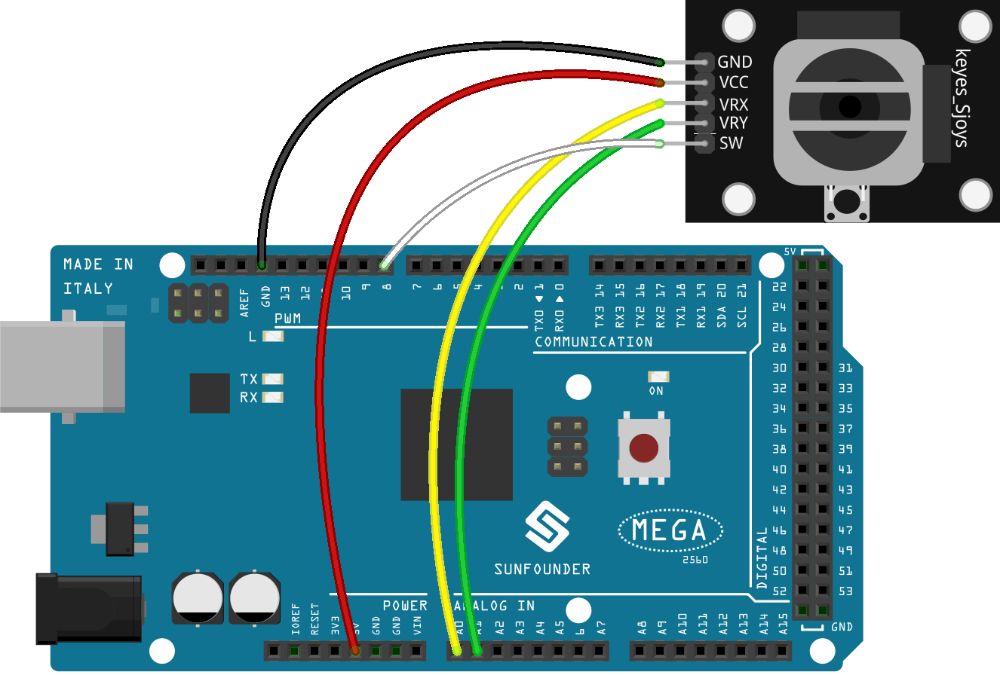

* :ref:`cpn_breadboard`
* :ref:`cpn_joystick`

Programación
---------------

El objetivo del guion es lograr que, al hacer clic en la bandera verde, el sprite **Stars** se mueva en una curva en el escenario y puedas usar el joystick para mover el sprite **Rocketship**, evitando tocar el sprite **Stars**.

**1. Agregar sprites y fondos**

Elimina el sprite predeterminado y utiliza el botón **Choose a Sprite** para agregar los sprites **Rocketship** y **Star**. Nota que el tamaño del sprite **Rocketship** debe establecerse en 50%.

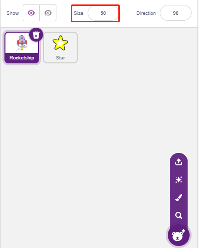

Ahora agrega el fondo **Stars** mediante el botón **Choose a Backdrop**.

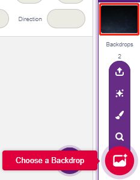

**2. Guion para Rocketship**

El sprite **Rocketship** debe aparecer en una posición aleatoria y luego ser controlado por el joystick para moverse hacia arriba, abajo, izquierda y derecha.

Flujo de trabajo:

* Al hacer clic en la bandera verde, el sprite se posiciona aleatoriamente y se crean dos variables, **x** y **y**, que almacenan los valores leídos de A0 (VRX del joystick) y A1 (VRY del joystick), respectivamente. Ejecuta el guion, mueve el joystick y observa el rango de valores para x e y.

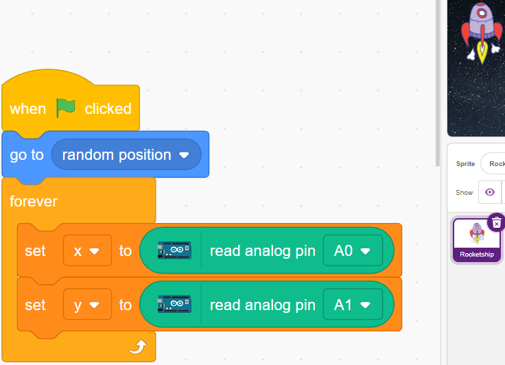

* El valor de A0 está en el rango 0-1023 (el centro es aproximadamente 512). Usa ``x-512>200`` para determinar si el joystick se mueve hacia la derecha; si es así, aumenta la coordenada x del sprite en 30 (para moverlo hacia la derecha).

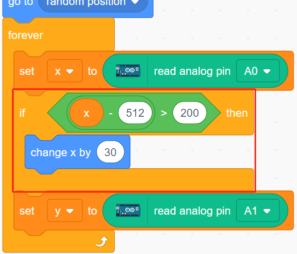

* Si el joystick se mueve hacia la izquierda (``x-512<-200``), reduce la coordenada x del sprite en 30 (para moverlo hacia la izquierda).

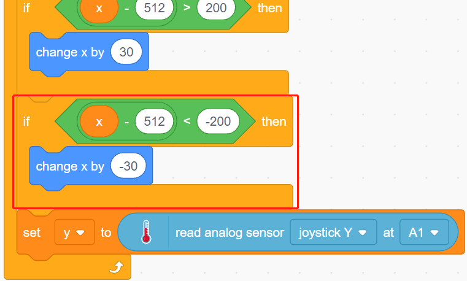

* Dado que la coordenada y del joystick va de arriba (0) a abajo (1023) y la coordenada y del sprite va de abajo hacia arriba, para mover el joystick hacia arriba y el sprite hacia arriba, la coordenada y debe reducirse en 30 en el guion.

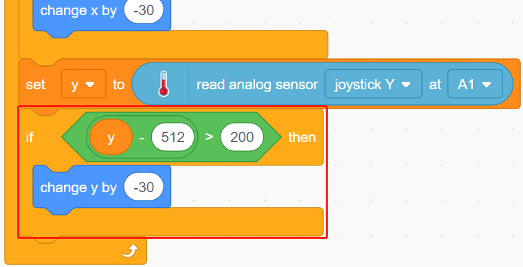

* Si el joystick se mueve hacia abajo, la coordenada y del sprite aumenta en 30.

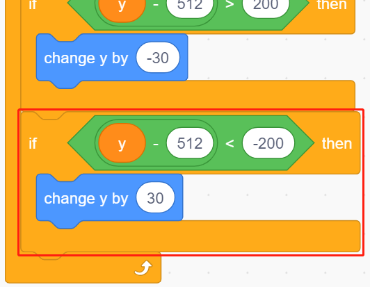

**3. Guion para Star**

El efecto que se desea lograr con el sprite **Star** es que aparezca en una ubicación aleatoria y, si toca el sprite **Rocketship**, el guion se detenga y el juego termine.

* Al hacer clic en la bandera verde, el sprite se posiciona aleatoriamente. El bloque [turn degrees] hace que el sprite **Star** avance con un pequeño cambio de ángulo, creando un movimiento curvado. Si llega al borde, rebota.

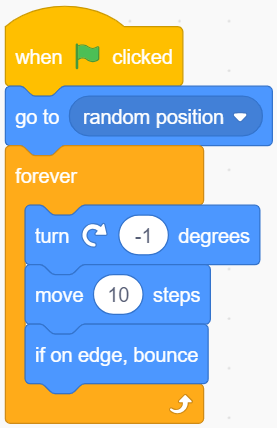

* Si el sprite toca el sprite **Rocketship** mientras se mueve, el guion se detiene.

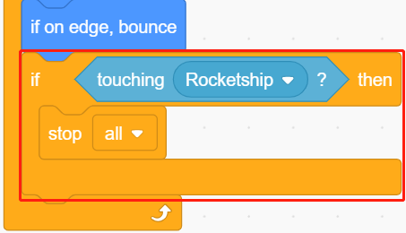