.. note:: 

    Bonjour et bienvenue dans la communauté SunFounder Raspberry Pi & Arduino & ESP32 Enthusiasts sur Facebook ! Plongez dans l’univers de Raspberry Pi, Arduino et ESP32 avec d’autres passionnés.

    **Pourquoi nous rejoindre ?**

    - **Support d'experts** : Résolvez les problèmes post-achat et les défis techniques avec l'aide de notre communauté et de notre équipe.
    - **Apprenez et partagez** : Échangez des conseils et des tutoriels pour perfectionner vos compétences.
    - **Aperçus exclusifs** : Accédez en avant-première aux annonces de nouveaux produits.
    - **Réductions spéciales** : Profitez de remises exclusives sur nos derniers produits.
    - **Promotions et cadeaux festifs** : Participez à des concours et des promotions festives.

    👉 Prêt à explorer et créer avec nous ? Cliquez sur [|link_sf_facebook|] et rejoignez-nous dès aujourd'hui !

.. _eat_apple:

2.16 JEU - Manger la Pomme
==============================

Dans ce projet, nous jouons à un jeu où un bouton contrôle le scarabée pour manger la pomme.

Lorsque vous cliquez sur le drapeau vert, appuyez sur le bouton pour que le scarabée tourne, appuyez à nouveau pour qu’il s’arrête et avance dans cette direction. Vous devez contrôler l'angle du scarabée pour qu'il avance sans toucher la ligne noire du labyrinthe jusqu'à ce qu'il mange la pomme. S'il touche la ligne noire, le jeu est terminé.

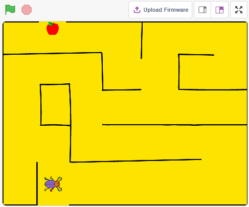

Construire le Circuit
-----------------------

Le bouton est un dispositif à 4 broches ; la broche 1 est connectée à la broche 2, et la broche 3 à la broche 4. Lorsque le bouton est pressé, les 4 broches se connectent, fermant ainsi le circuit.

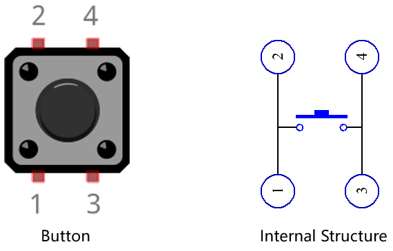

Montez le circuit en suivant le schéma ci-dessous.

* Connectez une des broches à gauche du bouton à la broche 12, elle-même connectée à une résistance de tirage et à un condensateur de 0,1µF (104) pour éliminer les interférences et obtenir un niveau stable lorsque le bouton fonctionne.
* Connectez l'autre extrémité de la résistance et du condensateur à la masse (GND) et une des broches de droite à 5V.

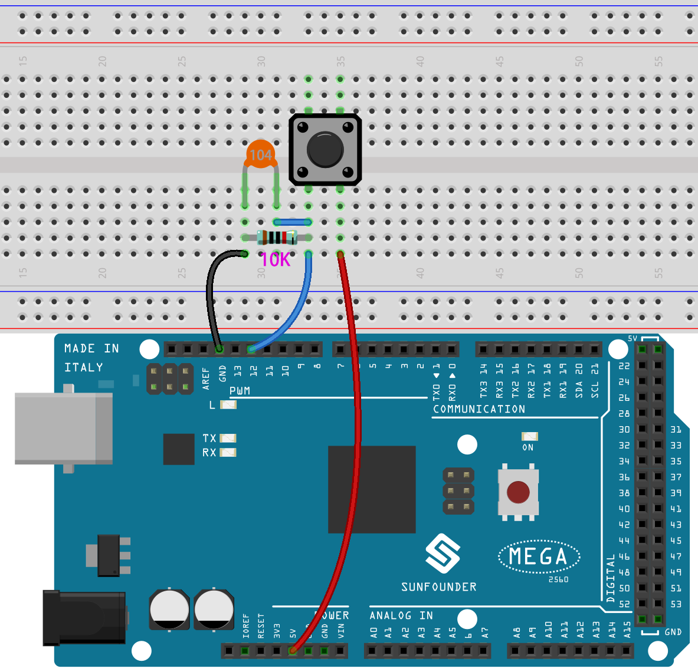

* :ref:`cpn_breadboard`
* :ref:`cpn_button`
* :ref:`cpn_resistor`
* :ref:`cpn_capacitor`

Programmation
------------------
Nous voulons permettre au bouton de contrôler la direction du sprite **Beetle** pour qu'il avance et mange la pomme sans toucher la ligne noire sur le fond **Maze** ; en mangeant la pomme, le fond changera.

Ajoutez les arrière-plans et les sprites nécessaires.

**1. Ajout d'arrière-plans et de sprites**

Ajoutez le fond **Maze** via le bouton **Choisir un arrière-plan**.

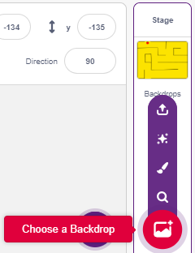

Supprimez le sprite par défaut, puis sélectionnez le sprite **Beetle**.

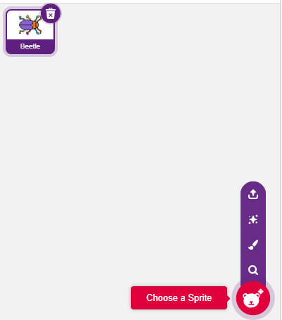

Placez le sprite **Beetle** à l'entrée du labyrinthe **Maze**, en notant les coordonnées x, y, et redimensionnez le sprite à 40 %.

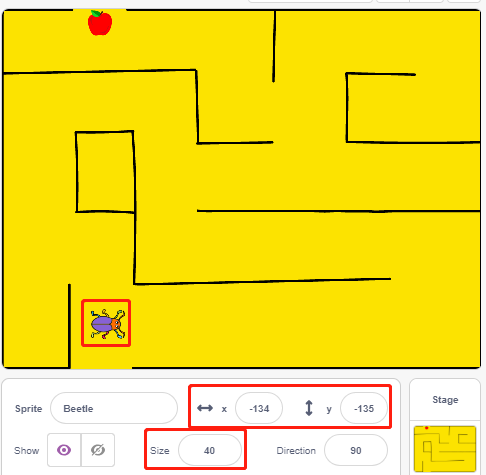

**2. Créer un arrière-plan**

Il est temps de dessiner un arrière-plan où apparaîtra le message GAGNÉ ! (WIN!).

Cliquez sur la vignette de l’arrière-plan pour accéder à la page **Arrière-plans** et cliquez sur le fond vierge **backdrop1**.

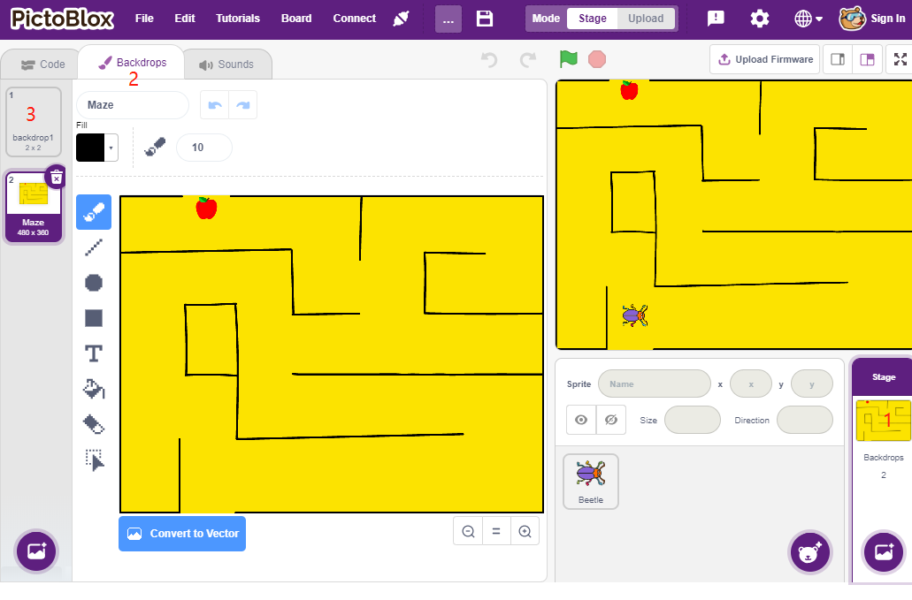

Commencez le dessin en vous inspirant de l'image ci-dessous, ou créez votre propre fond illustrant la victoire.

* Utilisez l’outil **Ellipse** pour dessiner une ellipse rouge sans contour.
* Utilisez l’outil **Texte** pour écrire « GAGNÉ ! », réglez la couleur du texte en noir, puis ajustez sa taille et sa position.
* Nommez cet arrière-plan **Win**.

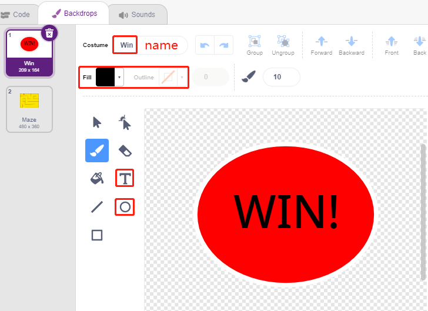

**3. Script pour l'arrière-plan**

À chaque démarrage du jeu, changez l’arrière-plan en **Maze**.

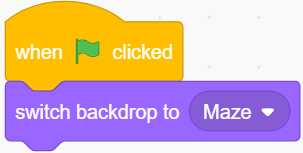

**4. Script pour le sprite Beetle**

Programmez le sprite **Beetle** pour qu'il puisse avancer et changer de direction sous le contrôle du bouton. Les étapes sont les suivantes :

* Au clic sur le drapeau vert, réglez l’angle de **Beetle** à 90 et positionnez-le aux coordonnées (-134, -134), ou remplacez-les par les coordonnées que vous avez notées. Créez la variable **flag** et définissez sa valeur initiale à -1.

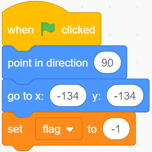

Dans le bloc [forever], utilisez quatre blocs [if] pour gérer les différents scénarios.

* Si la touche est à 1 (appuyée), utilisez le bloc [`mod <https://en.scratch-wiki.info/wiki/Boolean_Block>`_] pour alterner la valeur de **flag** entre 0 et 1 (alternant entre 0 pour cet appui et 1 pour l'appui suivant).

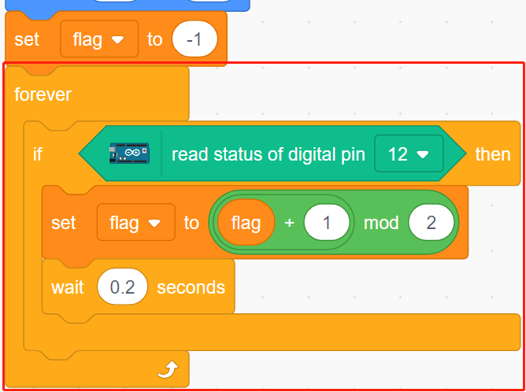

* Si flag=0 (ce clic), faites tourner le sprite **Beetle** dans le sens horaire. Si flag=1 (clic suivant), faites avancer **Beetle**. Sinon, continuez la rotation horaire.

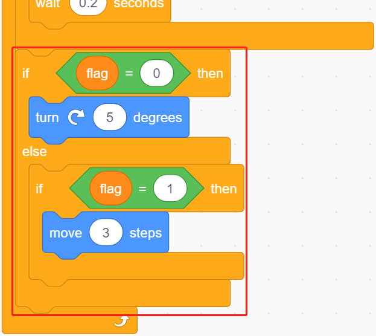

* Si **Beetle** touche le noir (la ligne noire du fond **Maze**), le jeu se termine et le script s'arrête.

.. note::
    
    Cliquez sur la zone de couleur dans le bloc [Touch color] et utilisez l'outil pipette pour capturer la couleur noire de la ligne sur la scène. Une couleur noire au hasard ne fonctionnera pas avec le bloc [Touch color].

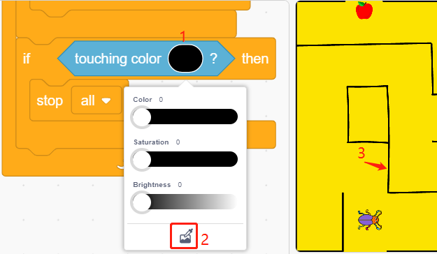

* Si **Beetle** touche le rouge (utilisez également l'outil pipette pour capturer la couleur de la pomme), l'arrière-plan passe à **Win**, indiquant la victoire et arrêtant le script.

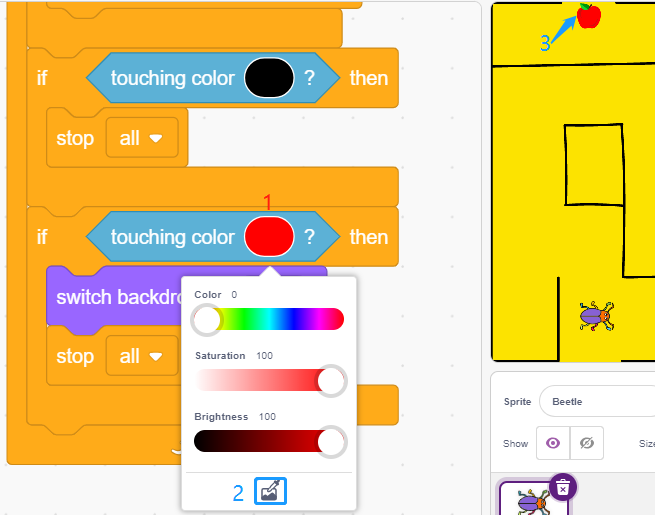

