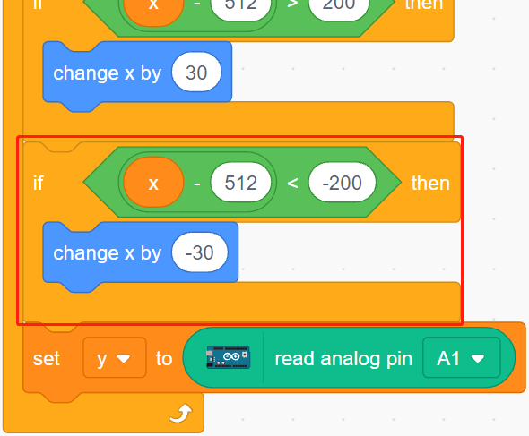

.. _star_crossed:

2.16 GAME - Star-Crossed
==========================

In the next projects, we will play some fun mini-games in PictoBlox.

Here we use Joystick module to play a Star-Crossed game.

After the script is run, stars will appear randomly on the stage, you need to use Joystick to control Rocketship to avoid the stars, if you touch it, the game will be over.

.. image:: img/16_rocket.png

You Will Learn
---------------------

- How Joystick module works
- Set the x and y coordinates of the sprite

Build the Circuit
-----------------------

A joystick is an input device consisting of a stick that pivots on a base and reports its angle or direction to the device it is controlling. Joysticks are often used to control video games and robots.

In order to communicate a full range of motion to the computer, a joystick needs to measure the stick’s position on two axes – the X-axis (left to right) and the Y-axis (up and down).

The motion coordinates of the joystick are shown in the following figure.

.. note::

    * The x coordinate is from left to right, the range is 0-1023.
    * y coordinate is from top to bottom, range is 0-1023.

Now build the circuit according to the following diagram.

.. image:: img/circuit/joystick_circuit.png

* :ref:`cpn_breadboard`
* :ref:`cpn_joystick`

Programming
------------------
The whole script is to achieve the effect that when the green flag is clicked, the **Stars** sprite moves in a curve on the stage and you need to use the joystick to move the **Rocketship**, so that it will not be touched by the **Star** sprite.

**1. Add sprites and backdrops**

Delete the default sprite, and use the **Choose a Sprite** button to add the **Rocketship** sprite and the **Star** sprite. Note that the **Rocket** sprite size is set to 50%.

.. image:: img/16_sprite.png

Now add the **Stars** backdrop by **Choose a Backdrop**.

.. image:: img/16_sprite1.png

**2. Scripting for Rocketship**

The **Rocketship** sprite is to achieve the effect that it will appear at a random position and then be controlled by the joystick to move it up, down, left, and right.

The workflow is as follows.

* When the green flag is clicked, have the sprite go to a random location and create 2 variables **x** and **y**, which store the values read from A0 (VRX of Joystick) and A1 (VRY of Joystick), respectively. You can let the script run, toggling the joystick up and down, left and right, to see the range of values for x and y.

.. image:: img/16_roc2.png

* The value of A0 is in the range 0-1023 (the middle is about 512). Use ``x-512>200`` to determine if Joystick is toggling to the right, and if so, make the x coordinate of the sprite +30 (to move the sprite to the right).

* If the Joystick is toggled to the left (``x-512<-200``), let the x coordinate of the sprite be -30 (let the sprite move to the left).

* Since the Joystick's y coordinate is from up (0) to down (1023), and the sprite's y coordinate is from down to up. So in order to move the Joystick upwards and the sprite upwards, the y-coordinate must be -30 in the script.

* If the joystick is flicked down, the y-coordinate of the sprite is +30.

.. image:: img/16_roc6.png

**3. Scripting for Star**

The effect to be achieved by the **Star** sprite is to appear at a random location, and if it hits **Rocketship**, the script stops running and the game ends.

* When the green flag is clicked and the sprite goes to a random location, the [turn degrees] block is to make the **Star** sprite move forward with a bit of an angle change so you can see that it is moving in a curve and if on edge, bounce.

.. image:: img/16_star1.png

* If the sprite touches the **Rocketship** sprite while it's moving, stop the script from running.

.. image:: img/16_star2.png