.. _eat_apple:

2.17 SPIEL - Apfel essen
==============================

In diesem Projekt spielen wir ein Spiel, bei dem der Beetle mit Hilfe von Tasten gesteuert wird, um einen Apfel zu essen.

Wenn die grüne Fahne angeklickt wird, drückt man die Taste und der Beetle dreht sich. Drückt man die Taste erneut, hört der **Beetle** auf zu laufen und bewegt sich in diesem Winkel vorwärts. Ihr müsst den Winkel des Beetles so steuern, dass er sich vorwärts bewegt, ohne die schwarze Linie auf der Karte zu berühren, bis er den Apfel isst. Wenn er die schwarze Linie berührt, ist das Spiel vorbei.

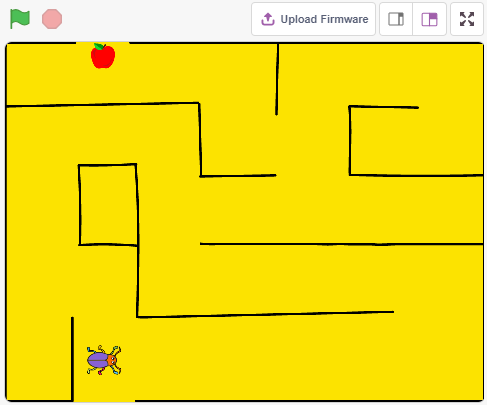

Baue den Kreislauf
-----------------------

Der Knopf ist ein 4-Pin-Bauteil, da Pin 1 mit Pin 2 und Pin 3 mit Pin 4 verbunden ist. Wenn der Knopf gedrückt wird, werden die 4 Pins verbunden, wodurch der Stromkreis geschlossen wird.

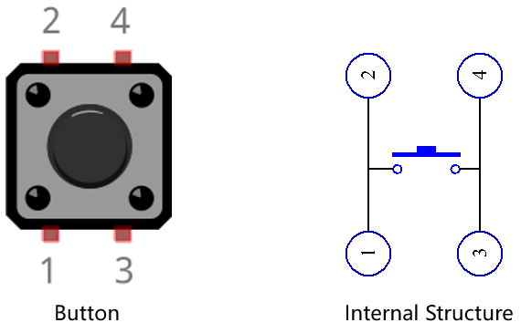

Baue die Schaltung nach dem folgenden Schema auf.

* Verbinde einen der Stifte auf der linken Seite des Knopfes mit Pin 12, der mit einem Pull-Down-Widerstand und einem 0,1uF (104) Kondensator verbunden ist (um Jitter zu eliminieren und einen stabilen Pegel auszugeben, wenn der Knopf funktioniert).
* Verbinden Sie das andere Ende des Widerstands und des Kondensators mit GND und einen der Pins auf der rechten Seite des Tasters mit 5 V.

.. image:: img/circuit/button_circuit.png

* :ref:`cpn_breadboard`
* :ref:`cpn_button`
* :ref:`cpn_water`
* :ref:`cpn_capacitor`

Programmierung
------------------
Der Effekt, den wir erreichen wollen, besteht darin, mit dem Knopf die Richtung des **Beetle**-Figur zu steuern, damit er sich vorwärts bewegt und den Apfel isst, ohne die schwarze Linie auf dem **Maze**-Hintergrund zu berühren, die den Hintergrund wechselt, wenn er gegessen wird.

Füge nun die entsprechenden Kulissen und  hinzu.

**1. Hinzufügen von Kulissen und Figurs**

Füge eine **Maze**-Kulisse über die Schaltfläche **Bühnenbild wählen** hinzu.

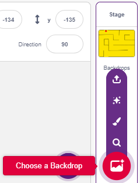

Lösche das Standard-Figur und wähle dann das **Beetle**-Figur aus.

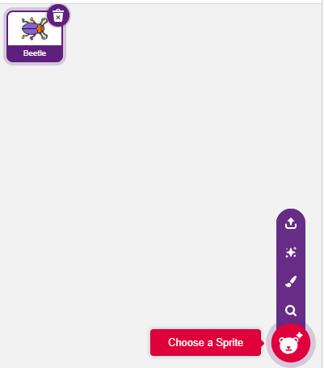

Platziere das **Beetle**-Figur am Eingang des **Maze**-Bühnenbild, merke dir die x,y-Koordinatenwerte an diesem Punkt und verändere die Größe des Figur auf 40%.

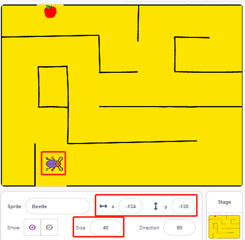

**2. Zeichnen Sie eine Kulisse**

Nun ist es an der Zeit, eine Kulisse zu zeichnen, auf der die Figur WIN! erscheint.

Klicken Sie zunächst auf die Miniaturansicht des Hintergrunds, um die Seite **Bühnenbilder** aufzurufen, und klicken Sie auf den leeren Hintergrund1.

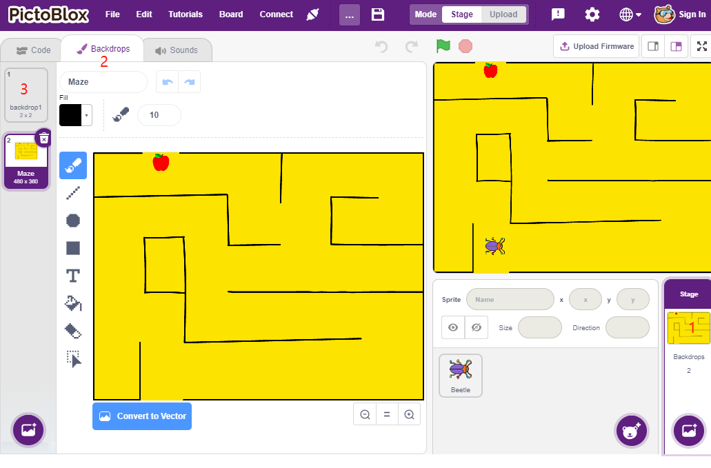

Nun kannst du mit dem Zeichnen beginnen. Du kannst dich auf das Bild unten beziehen, um zu zeichnen, oder du kannst selbst eine Kulisse zeichnen, solange der Ausdruck gewinnt.

* Zeichnen Sie mit dem Werkzeug **Kreis** eine Ellipse mit der Farbe Rot und ohne Umriss.
* Verwenden Sie dann das Werkzeug **Text**, schreiben Sie das Zeichen \"WIN!\", setzen Sie die Zeichenfarbe auf Schwarz und passen Sie die Größe und Position des Zeichens an.
* Benennen Sie den Hintergrund als **Win**.

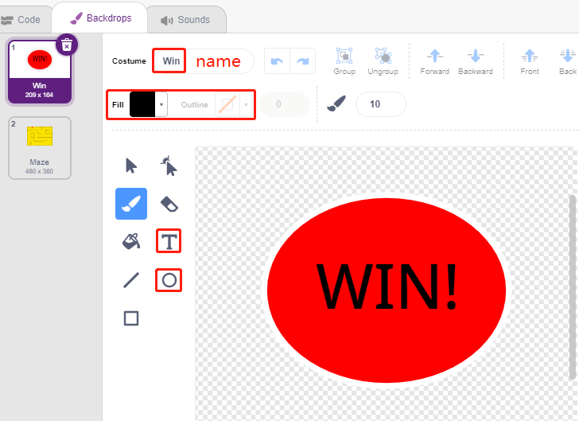

**3. Skripting für die Kulisse**

Der Hintergrund muss jedes Mal, wenn das Spiel startet, auf **Maze** umgestellt werden.

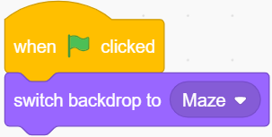

**4. Schreiben von Skripten für den Figur Beetle**

Schreibe nun ein Skript für den Figur **Beetle**, damit er sich vorwärts bewegen und die Richtung unter der Kontrolle eines Knopfes ändern kann. Der Ablauf ist wie folgt.

* Wenn die grüne Flagge angeklickt wird, setze den **Beetle** auf einen Winkel von 90, und die Position auf (-134, -134), oder ersetze sie durch den Koordinatenwert deiner eigenen Position. Erstellen Sie die Variable **Flag** und setzen Sie den Anfangswert auf -1.

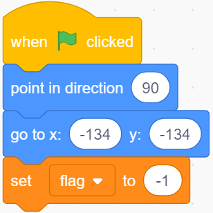

Als nächstes werden im [forever]-Block vier [if]-Blöcke verwendet, um verschiedene mögliche Szenarien zu bestimmen.

* Wenn die Taste 1 (gedrückt) ist, verwenden Sie den [mod <https://en.scratch-wiki.info/wiki/Boolean_Block>`_]-Block, um den Wert der Variablen **flag** zwischen 0 und 1 umzuschalten (abwechselnd 0 für diesen Druck und 1 für den nächsten Druck).

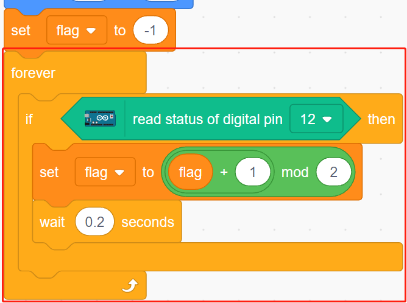

* Wenn flag=0 (bei diesem Tastendruck), lass den **Beetle** im Uhrzeigersinn drehen. Wenn flag gleich 1 ist (erneuter Tastendruck), bewegt sich das **Beetle**-Figur vorwärts. Andernfalls dreht er sich weiter im Uhrzeigersinn.

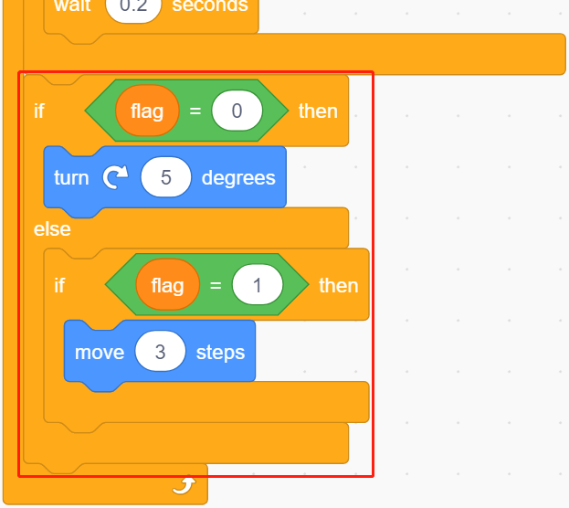

* Wenn der Beetle-Figur schwarz berührt (die schwarze Linie auf dem **Maze**-Hintergrund), endet das Spiel und das Skript hört auf zu laufen.

.. note::
    
    Du musst auf den Farbbereich im Block [Farbe berühren] klicken und dann das Pipettenwerkzeug auswählen, um die Farbe der schwarzen Linie auf der Bühne zu wählen. Wenn Sie willkürlich ein Schwarz wählen, funktioniert dieser [Touch color]-Block nicht.

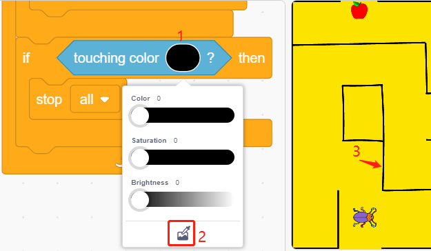

* Wenn Beetle rot berührt (verwenden Sie auch das Strohhalm-Werkzeug, um die rote Farbe des Apfels aufzunehmen), wird der Hintergrund auf **Win** umgeschaltet, was bedeutet, dass das Spiel erfolgreich ist und das Skript nicht weiterläuft.

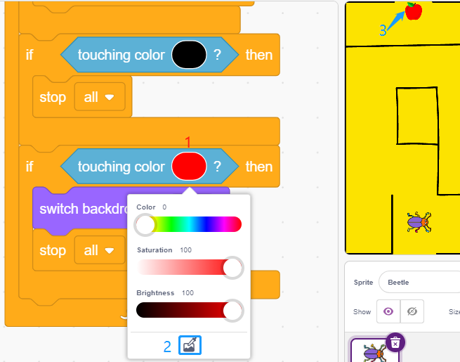

