.. note::

    Ciao, benvenuto nella SunFounder Raspberry Pi & Arduino & ESP32 Enthusiasts Community su Facebook! Approfondisci Raspberry Pi, Arduino ed ESP32 con altri appassionati.

    **Perché unirti?**

    - **Supporto esperto**: Risolvi problemi post-vendita e sfide tecniche con l'aiuto della nostra comunità e del nostro team.
    - **Impara e condividi**: Scambia consigli e tutorial per migliorare le tue competenze.
    - **Anteprime esclusive**: Accedi in anteprima agli annunci di nuovi prodotti.
    - **Sconti speciali**: Approfitta di sconti esclusivi sui nostri prodotti più recenti.
    - **Promozioni festive e giveaway**: Partecipa a giveaway e promozioni festive.

    👉 Pronto a esplorare e creare con noi? Clicca [|link_sf_facebook|] e unisciti oggi!

.. _parrot:

2.17 GIOCO - Pappagallo Volante
===================================

In questo progetto utilizziamo il modulo ultrasonico per giocare a un gioco con un pappagallo volante.

Dopo aver eseguito lo script, il bambù verde si muoverà lentamente da destra a sinistra a un'altezza casuale. Posiziona la mano sopra il modulo ultrasonico; se la distanza tra la mano e il modulo ultrasonico è inferiore a 10, il pappagallo volerà verso l'alto, altrimenti cadrà verso il basso. Devi controllare la distanza tra la mano e il modulo ultrasonico affinché il Pappagallo possa evitare il bambù verde (**Paddle**); se lo tocca, il gioco termina.

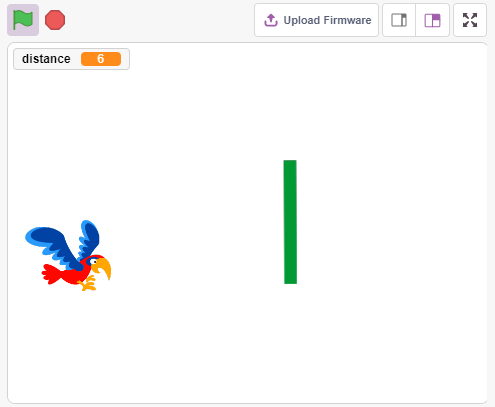

Costruire il Circuito
-----------------------

Un modulo sensore ultrasonico è uno strumento che misura la distanza di un 
oggetto utilizzando onde sonore ultrasoniche. Ha due sonde: una invia le 
onde ultrasoniche e l'altra le riceve, trasformando il tempo di invio e 
ricezione in una distanza, rilevando così la distanza tra il dispositivo 
e un ostacolo.

Costruisci il circuito seguendo il diagramma sottostante.

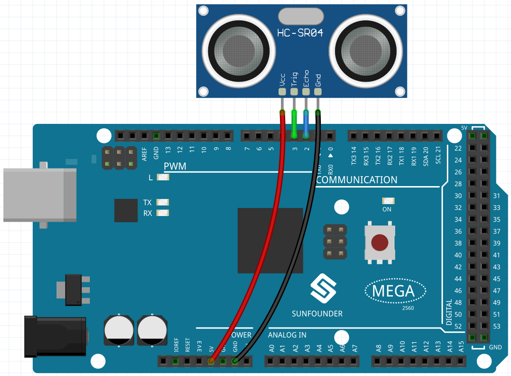

* :ref:`cpn_breadboard`
* :ref:`cpn_ultrasonic`

Programmazione
-----------------

L'obiettivo è utilizzare il modulo ultrasonico per controllare l'altezza di volo dello sprite **Pappagallo**, evitando al contempo lo sprite **Paddle**.

**1. Aggiungere uno sprite**

Elimina lo sprite predefinito e utilizza il pulsante **Scegli uno Sprite** per aggiungere lo sprite **Pappagallo**. Imposta la sua dimensione al 50% e posizionalo al centro a sinistra.

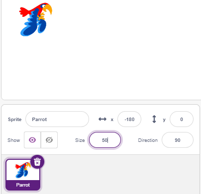

Ora aggiungi lo sprite **Paddle**, impostane la dimensione al 150%, l'angolo a 180 e posizionalo inizialmente nell'angolo in alto a destra.

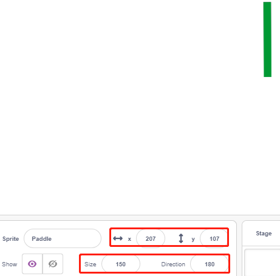

Accedi alla pagina **Costumi** dello sprite **Paddle** e rimuovi il contorno.

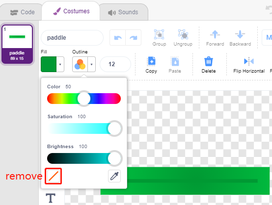

**2. Script per lo sprite Pappagallo**

Ora scrivi lo script per lo sprite **Pappagallo**, che sarà in volo e la cui altitudine sarà determinata dalla distanza rilevata dal modulo ultrasonico.

* Quando si clicca sulla bandiera verde, cambia il costume ogni 0,2s in modo che sembri sempre in volo.

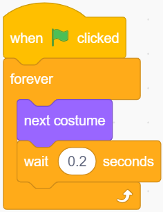

* Leggi il valore del modulo ultrasonico e memorizzalo nella variabile **distance**, arrotondandolo con il blocco [round].

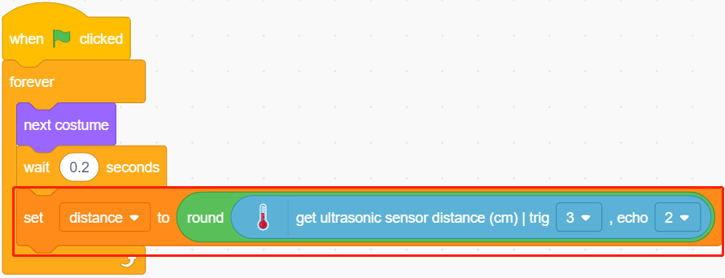

* Se la distanza rilevata è inferiore a 10 cm, aumenta la coordinata y di 50, facendo volare il **Pappagallo** verso l'alto. Altrimenti, diminuisci la coordinata y di 40, facendolo cadere.

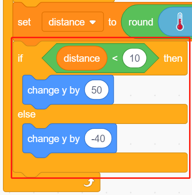

* Se lo sprite **Pappagallo** tocca lo sprite **Paddle**, il gioco termina e lo script si interrompe.

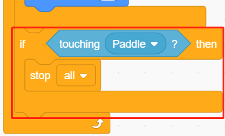

**3. Script per lo sprite Paddle**

Ora scrivi lo script per lo sprite **Paddle**, che deve apparire casualmente sul palco.

* Nascondi lo sprite **Paddle** quando si clicca sulla bandiera verde e clona lo sprite contemporaneamente. Il blocco  [`create clone of <https://en.scratch-wiki.info/wiki/Create_Clone_of_()_(block)>`_] è un blocco di controllo che crea un clone dello sprite indicato.

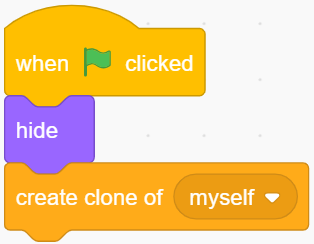

* Quando **Paddle** si presenta come clone, la sua posizione x è 220 (più a destra) e la posizione y è casuale tra -125 e 125 (altezza casuale).

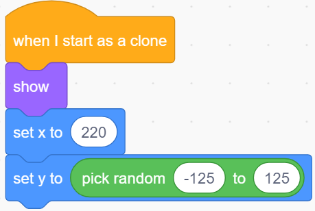

* Utilizza il blocco [ripeti] per diminuire lentamente il valore della coordinata x, in modo che il clone dello sprite **Paddle** si muova lentamente da destra a sinistra fino a scomparire.

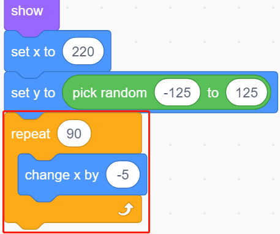

* Crea un nuovo clone dello sprite **Paddle** e cancella il clone precedente.

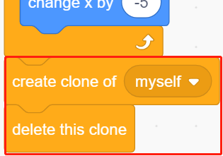