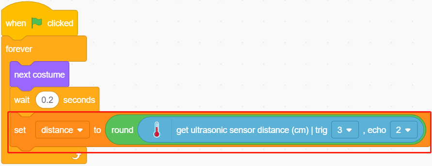
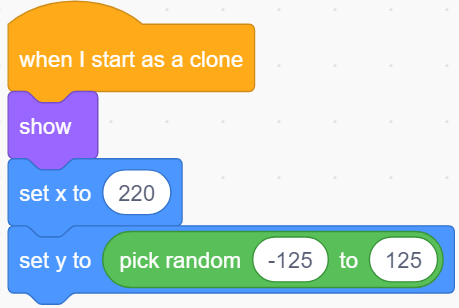

.. _parrot:

2.17 GAME - Flappy Parrot
==============================

Here we use the ultrasonic module to play a flappy parrot game.

After the script runs, the green bamboo will slowly move from the right to the left at a random height. Now place your hand on top of the ultrasonic module, if the distance between your hand and the ultrasonic module is less than 10, the parrot will fly upwards, otherwise it will fall downwards.
You need to control the distance between your hand and the ultrasonic module so that the Parrot can avoid the green bamboo (Paddle), if it touches it, the game is over.

.. image:: img/15_parrot.png

Build the Circuit
-----------------------

An ultrasonic sensor module is an instrument that measures the distance to an object using ultrasonic sound waves. 
It has two probes. One is to send ultrasonic waves and the other is to receive the waves and transform the time of sending and receiving into a distance, thus detecting the distance between the device and an obstacle.

Now build the circuit according to the following diagram.

.. image:: img/circuit/ultrasonic_circuit.png

* :ref:`cpn_breadboard`
* :ref:`cpn_ultrasonic`

Programming
------------------

The effect we want to achieve is to use the ultrasonic module to control the flight height of the sprite **Parrot**, while avoiding the **Paddle** sprite.

**1. Add a sprite**

Delete the default sprite, and use the **Choose a Sprite** button to add the **Parrot** sprite. Set its size to 50%, and move its position to the left center.

.. image:: img/15_sprite.png

Now add the **Paddle** sprite, set its size to 150%, set its angle to 180, and move its initial position to the top right corner.

.. image:: img/15_sprite1.png

Go to the **Costumes** page of the **Paddle** sprite and remove the Outline.

.. image:: img/15_sprite2.png

**2. Scripting for the Parrot Sprite**

Now script the **Parrot** sprite, which is in flight and the flight altitude is determined by the detection distance of the ultrasonic module.

* When the green flag is clicked, switch the costume every 0.2s so that it is always in flight.

.. image:: img/15_parr1.png

* Read the value of the ultrasonic module and store it in the variable **distance** after rounding it with the [round] block.

* If the ultrasonic detection distance is less than 10cm, let the y coordinate increase by 50, the **Parrot** sprite will fly upwards. Otherwise, the y-coordinate value is decreased by 40, **Parrot** will fall down.

.. image:: img/15_parr3.png

* If the **Parrot** sprite touches the **Paddle** sprite, the game ends and the script stops running.

.. image:: img/15_parr4.png

**3. Scripting for the Paddle sprite**

Now write the script for the **Paddle** sprite, which needs to appear randomly on the stage.

* Hide the sprite **Paddle** when the green flag is clicked, and clone itself at the same time. The [`create clone of <https://en.scratch-wiki.info/wiki/Create_Clone_of_()_(block)>`_] block is a control block and a stack block. It creates a clone of the sprite in the argument. It can also clone the sprite it is running in, creating clones of clones, recursively.

.. image:: img/15_padd.png

* When **Paddle** is presented as a clone, its position is 220 (rightmost) for the x-coordinate and its y-coordinate at (-125 to 125) random (height random).

* Use the [repeat] block to make its x coordinate value slowly decrease, so you can see the clone of the **Paddle** sprite slowly move from the right to the left until it disappears.

.. image:: img/15_padd2.png

* Re-clone a new **Paddle** sprite and delete the previous clone.

.. image:: img/15_padd3.png